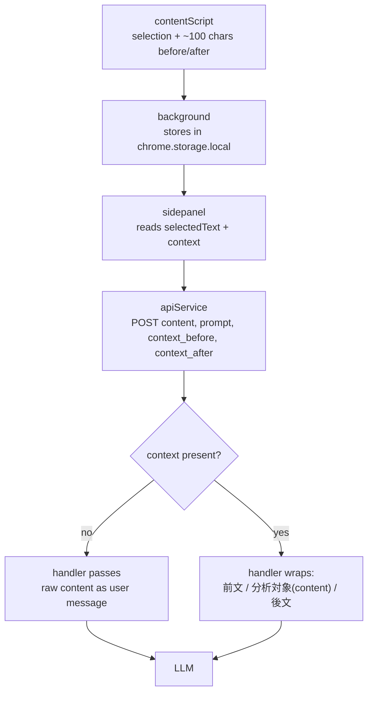

# feat: Send Surrounding Sentence Context from the Page

## Summary

Capture a bounded window of page text immediately around the user's selection and route it to the LLM as disambiguation-only context, wired through the content script, the `chrome.storage.local` transport, the sidepanel, the API request body, both backend handlers, and the V1/V2 system prompts. The selected text stays the sole analysis target; surrounding text only helps resolve homograph readings, grammar patterns, and word sense.

## Problem Frame

Japanese is highly context-dependent, yet `contentScript.js` sends only `window.getSelection().toString()` — the bare selection with zero surrounding text. The LLM is blind to the text the user is actually reading, so it guesses on readings (生/上 homographs), word sense, and grammar boundaries it could otherwise resolve from a few adjacent characters. `STRATEGY.md`'s approach — "ground every explanation in the real text the user is actually reading" — is undercut at the first hop. The content script already has DOM access, so capturing a small context window is high impact for negligible token cost. *(Origin: ideation idea #2, `docs/ideation/2026-06-09-llm-prompt-quality-ideation.md`.)*

---

## High-Level Technical Design

Context joins the existing selection as an optional sibling field and rides the same transport, then meets a conditional-wrapping gate at the backend that decides whether the LLM receives raw content or a delimited message.

The no-context branch is deliberately identical to today: an old extension build or a selection with no neighbors produces an unchanged user message, so behavior, the golden-dataset harness (which sends raw input), and the V1/V2 A/B comparison all stay valid.

---

## Requirements

**Capture and transport**

R1. The content script captures a bounded window of page text immediately before and after the selection (default ~100 characters per side), collapsing inter-element whitespace.
R2. Surrounding context travels with the selection from the content script, through the background service worker, into `chrome.storage.local`, and out to the sidepanel.
R3. Context is optional end-to-end: a selection with no surrounding text (or an older extension build that sends none) yields empty/absent context and behaves exactly as today.

**Request contract**

R4. The API request carries `context_before` and `context_after` only when non-empty.
R5. Both the streaming endpoint (`explainStream`) and the callable endpoint (`explain`) accept the context fields.

**Backend and prompt**

R6. When context is present, the backend builds a delimited user message marking the analysis target and the before/after context; when context is absent, it passes the content unchanged.
R7. The selected text remains the sole analysis target. Context is used only for disambiguation (readings, grammar, word sense) and must not appear in the vocabulary or grammar output.
R8. The disambiguation instruction is added to both the V1 and V2 system prompts.

**Caching**

R9. The sidepanel's result cache invalidates when the surrounding context changes for the same selection.

---

## Key Technical Decisions

**KTD1. Capture in the content script — the only component with DOM access.** The sidepanel, background, and backend see only serialized messages. Surrounding text must be extracted where the live document exists, then carried as plain strings the rest of the way.

**KTD2. Configurable context window, default ~100 characters per side.** Ideation idea #2 names ~100; Japanese is dense so this is a few clauses of disambiguation signal at trivial token cost. Exposed as a named constant (not hardcoded inline) so it can be tuned without touching extraction logic. Over-long captured text is clamped to the bound, not rejected.

**KTD3. Conditional wrapping of the user message at the backend.** When context is absent the LLM receives raw `content` exactly as today; when present it receives a delimited message (`【前文】… 【分析対象】{content} 【後文】…`, omitting empty sides). This keeps the no-context path byte-identical — preserving backward compatibility with older extension builds, keeping the golden-dataset Tier 2 harness (which sends raw input) representative of production, and leaving the V1/V2 A/B baseline uncontaminated.

**KTD4. Context is ephemeral — not persisted.** Idea #2 is disambiguation input. Saving context for spaced review belongs to the separate review track (`STRATEGY.md` track 2) and would force webapp and `saveItems` schema changes outside this scope. `saveItems` keeps saving only `source_text`.

**KTD5. Both V1 and V2 prompts receive the disambiguation instruction.** Both handlers carry context, and adding the clause to both keeps the existing V1/V2 A/B comparison fair. V1 and V2 differ only in grammar depth, not in how they should treat context.

**KTD6. Testable split matching the repo's existing posture.** The extension currently unit-tests only pure functions (`tests/promptVariant.test.js`, `tests/formatAnalysisResult.test.js`); the imperative modules (content script, sidepanel, apiService, background) are verified manually. New logic follows the same split: pure transforms (the extraction core, the cache-key builder, the request-body builder, the backend message builder) are unit-tested; DOM/expression/wiring glue is verified manually with documented steps.

---

## Implementation Units

### U1. Surrounding-context extraction and storage transport

**Goal:** Extract before/after text from a DOM selection in a testable module, wire it into the content-script message, and persist it through the background into `chrome.storage.local`.

**Requirements:** R1, R2, R3

**Dependencies:** None

**Files:**
- `japanese-alchemy-chrome-extension/src/scripts/surroundingContext.js` (new — extraction + pure helpers)
- `japanese-alchemy-chrome-extension/src/scripts/contentScript.js` (modify)
- `japanese-alchemy-chrome-extension/src/scripts/background.js` (modify)
- `japanese-alchemy-chrome-extension/tests/surroundingContext.test.js` (new)

**Approach:** Add `extractSurroundingContext(selection, { maxChars })` returning `{ before, after }`. Derive the window from the selection's anchor/focus text nodes: text preceding the start offset (walking earlier siblings up to a block boundary) forms `before`; text following the end offset forms `after`; collapse whitespace and clamp each side to `maxChars`. When start and end share one text node, slice that node's content around the offsets. The `mouseup` handler sends `{ action: "textSelected", data, contextBefore, contextAfter }`. The background's `textSelected` branch stores `{ selectedText, contextBefore, contextAfter }` alongside the existing `selectedText` key. Failure to extract (non-text anchor, empty document) yields empty strings rather than throwing.

**Patterns to follow:** Module-and-export shape of `japanese-alchemy-chrome-extension/src/scripts/promptVariant.js`; test style of `japanese-alchemy-chrome-extension/tests/promptVariant.test.js`.

**Execution note:** Extraction touches the DOM (`Selection`/`Range`/text nodes); configure a jsdom test environment for this file (per-file via a `@jest-environment jsdom` docblock, adding `jest-environment-jsdom` to devDependencies if the extension does not already pull it).

**Test scenarios:**
- Same-node selection: within one text node, returns the immediately adjacent text on each side, bounded by the offsets.
- Multi-node selection: `before` comes from the node preceding the start, `after` from the node following the end.
- Boundary — selection at the start of available text returns `before: ''`; at the end returns `after: ''`.
- Truncation: long surrounding text is clamped to `maxChars`, keeping the portion closest to the selection.
- Whitespace: HTML newlines/tabs collapse to single spaces; no leading/trailing whitespace in either field.
- Non-text anchor (e.g., image inside selection): returns available adjacent text without throwing.
- Null/empty selection returns `{ before: '', after: '' }`.

**Verification:** `npm test` in the extension runs the new suite; manual check on a Japanese news page confirms `contextBefore`/`contextAfter` land in `chrome.storage.local` (DevTools → service worker → Application → Storage).

---

### U2. Sidepanel: read context, pass through, invalidate cache

**Goal:** The sidepanel reads context from storage, threads it to the API call, and treats changed context for the same selection as a cache miss.

**Requirements:** R2, R3, R9

**Dependencies:** U1 (storage shape)

**Files:**
- `japanese-alchemy-chrome-extension/src/sidepanel/sidepanel.js` (modify)
- `japanese-alchemy-chrome-extension/tests/sidepanel.context.test.js` (new — pure helper only)

**Approach:** `loadSelectedText`, the `chrome.storage.onChanged` handler, and the `textSelectedChanged` message handler carry `{ contextBefore, contextAfter }` into `analizingSelectedText`, which forwards them to `generateResponseStream`. Extract a pure `buildContextCacheKey({ selectedText, context })` (exported from `surroundingContext.js`) and use it in place of the bare `lastSelectedText` comparison so a re-selection of the same text with different neighbors refetches. The 2–500 character validation stays on `selectedText` only; context is separately bounded by its window.

**Patterns to follow:** Existing `chrome.storage.local` reads and `localStorage` cache pattern already in `sidepanel.js`; pure-function test style of `tests/formatAnalysisResult.test.js`.

**Test scenarios:**
- `buildContextCacheKey` is equal for identical selection + context and differs when either `before` or `after` changes.
- `buildContextCacheKey` with empty/absent context reduces to a key derived from `selectedText` alone (cache behaves as today for the no-context case).
- Manual: selecting the same phrase in two different paragraphs refetches rather than serving the cached response.

**Verification:** New pure-helper unit tests pass; manual selection test confirms cache invalidation across contexts.

---

### U3. API service: forward context in the request body

**Goal:** Both API methods accept optional context and include the fields only when non-empty.

**Requirements:** R4, R5

**Dependencies:** U2 (sidepanel passes context through)

**Files:**
- `japanese-alchemy-chrome-extension/src/scripts/jaAlchemyApiService.js` (modify)
- `japanese-alchemy-chrome-extension/tests/jaAlchemyApiService.body.test.js` (new — pure builder only)

**Approach:** `generateResponseStream` and `generateResponse` gain an optional `context` (`{ before, after }`). Extract a pure `buildStreamRequestBody(content, promptVersion, context)` that returns `{ content, prompt }` unchanged when context is absent/empty, and adds `context_before`/`context_after` only for non-empty sides. The stream POST body and the callable args both use the builder. This keeps the no-context request body identical to today.

**Patterns to follow:** Existing `fetch` body construction in `jaAlchemyApiService.js`; pure-export-then-test pattern used by `formatAnalysisResult` in `sidepanel.js`.

**Test scenarios:**
- No context → body is exactly `{ content, prompt }` (no `context_*` keys).
- Both sides present → body includes `context_before` and `context_after` with the provided values.
- Only `before` non-empty → body includes `context_before` and omits `context_after`.
- Empty-string sides are treated as absent (omitted).
- `prompt` defaulting to `'v2'` when falsy is preserved.

**Verification:** Builder unit tests pass; manual run against the deployed `explainStream` confirms the body shape (network panel).

---

### U4. Backend: request types, handlers, and the message builder

**Goal:** `ExplainRequest` gains optional context fields; both handlers read, validate, and build the delimited user message via a shared pure builder; the no-context path is byte-identical to today.

**Requirements:** R3, R5, R6

**Dependencies:** U3 (request-body contract); can proceed in parallel with U1–U3 once field names are fixed.

**Files:**
- `japanese-alchemy-hosting/functions/src/models/types.ts` (modify — `ExplainRequest`)
- `japanese-alchemy-hosting/functions/src/models/analysisMessage.ts` (new — `buildAnalysisMessage`)
- `japanese-alchemy-hosting/functions/src/v1/explainStreamHandler.ts` (modify)
- `japanese-alchemy-hosting/functions/src/v1/explainCallable.ts` (modify)
- `japanese-alchemy-hosting/functions/test/models/analysisMessage.test.ts` (new)
- `japanese-alchemy-hosting/functions/test/v1/explainStreamHandler.test.ts` (modify — add context cases)
- `japanese-alchemy-hosting/functions/test/v1/explainCallable.test.ts` (modify — add context cases)

**Approach:** Add `context_before?: string` and `context_after?: string` to `ExplainRequest`. Both handlers destructure them, coerce to string-or-empty, and clamp to a safety bound (a few multiples of `maxChars`) so a malformed client cannot inflate the prompt. The second argument to `streamCompletion`/`chatCompletion` becomes `buildAnalysisMessage(content, { before, after })`: returns `content` verbatim when both sides are empty, otherwise `【前文】{before}\n【分析対象】{content}\n【後文】{after}` with empty sides omitted. Log only context presence and clamped length, never the context content. The stream handler's existing `mockStreamCompletion.toHaveBeenCalledWith(systemPrompt, message)` assertion pattern extends naturally.

**Patterns to follow:** Existing handler validation/logging structure; existing handler test mocking (`functions/test/v1/explainStreamHandler.test.ts`).

**Test scenarios:**
- `buildAnalysisMessage` with empty context returns the raw content unchanged.
- With both sides → output contains `【前文】`/`【分析対象】`/`【後文】` blocks and preserves `content` verbatim inside the target block. *(Delimiter names finalize in implementation; the contract is: a clearly-marked target block plus optional before/after blocks.)*
- Only `before` non-empty → output omits the `after` block.
- Handler, no-context request → `streamCompletion`/`chatCompletion` called with `(SYSTEM_PROMPT_V2, content)` exactly (backward-compat assertion).
- Handler, with-context request → second arg is the wrapped message; `content` substring preserved.
- Handler clamps oversized context to the safety bound before wrapping.
- Callable handler mirrors the stream handler's wrapping (parity).

**Verification:** `npm test` in `functions/` passes the new and updated suites; a local emulator request with context shows the wrapped message in logs.

---

### U5. System prompts: disambiguation instruction (V1 + V2)

**Goal:** Both prompts tell the model that optional context blocks may appear, are for disambiguation only, and that the analysis target is the marked/raw input.

**Requirements:** R7, R8

**Dependencies:** U4 (the prompts must describe the delimiters U4 emits — they are a contract pair)

**Files:**
- `japanese-alchemy-hosting/functions/src/models/systemPromptV1.ts` (modify)
- `japanese-alchemy-hosting/functions/src/models/systemPromptV2.ts` (modify)
- `japanese-alchemy-hosting/functions/test/models/systemPromptV1.test.ts` (modify — add assertions)
- `japanese-alchemy-hosting/functions/test/models/systemPromptV2.test.ts` (modify — add assertions)

**Approach:** Add a short script rule to both prompts (Traditional Chinese, matching the existing rule voice) stating: the input may include optional `【前文】`/`【後文】` context blocks for disambiguation only (同形漢字讀音、文法判斷、詞義); the analysis target is always the `【分析対象】` text, or the raw input when no blocks are present; context text must not appear in the vocabulary or grammar output. Leave the existing role/action/example structure intact.

**Patterns to follow:** Existing `# 脚本` rule style and Traditional-Chinese voice in `systemPromptV2.ts`.

**Test scenarios:**
- V1 and V2 prompts contain the disambiguation instruction referencing the context blocks and the analysis-target block.
- Both prompts state that context is for disambiguation only and must not enter the vocabulary/grammar output.
- Prompt delta is modest (length sanity check — does not materially grow the token budget).
- Golden-dataset Tier 1 regression: the existing structural suite still passes on the no-context path (fixtures send raw input).

**Verification:** Prompt unit tests pass; `npm test` golden suite is green; a Tier 2 spot-check on a homograph fixture (e.g., `homograph-sei-shou-nama-ue`) with added context confirms readings still disambiguate and context words do not leak into output.

---

## Scope Boundaries

### In scope

- Context capture, storage transport, sidepanel pass-through and cache invalidation
- Request-body fields on both endpoints
- Backend validation and conditional message wrapping
- Disambiguation instruction in both V1 and V2 prompts

### Deferred to follow-up work

- Persisting context to Firestore / surfacing it in the webapp review track (`STRATEGY.md` track 2)
- Sidepanel UI that shows the captured context to the user
- Structured page context (heading/paragraph hierarchy) rather than flat surrounding text
- Dedicated context-disambiguation cases in the golden-dataset Tier 2 fixtures
- Per-page or per-DOM-structure tuning of the context window

---

## Risks & Dependencies

- **DOM extraction edge cases.** Multi-node selections, block boundaries, and non-text anchors are the trickiest part. Mitigated by the bounded window, graceful empty-on-failure, and the U1 jsdom suite.
- **Prompt adherence.** The model may still pull context words into the vocabulary/grammar output despite the instruction. Mitigated by the explicit R7 instruction and the Tier 2 spot-check; treat residual leakage as a tuning follow-up, not a blocker.
- **Privacy.** Marginally more page content leaves the device. Bounded (~100 chars/side), not persisted, and dwarfed by the `source_url` already stored on save. No additional consent surface beyond today's behavior.
- **Backward compatibility.** Older extension builds send no context; handlers treat absence as the no-context path (KTD3), so a mixed-version rollout is safe.

---

## Sources / Research

- Ideation origin (idea #2): `docs/ideation/2026-06-09-llm-prompt-quality-ideation.md`
- Product strategy: `STRATEGY.md` (approach + tracks)
- Current selection→backend chain: `japanese-alchemy-chrome-extension/src/scripts/contentScript.js`, `background.js`, `jaAlchemyApiService.js`; `japanese-alchemy-chrome-extension/src/sidepanel/sidepanel.js`; `japanese-alchemy-hosting/functions/src/v1/explainStreamHandler.ts`, `explainCallable.ts`
- Prompts: `japanese-alchemy-hosting/functions/src/models/systemPromptV1.ts`, `systemPromptV2.ts`; request types `models/types.ts`
- Test patterns: `japanese-alchemy-chrome-extension/tests/promptVariant.test.js`, `formatAnalysisResult.test.js`; `japanese-alchemy-hosting/functions/test/v1/explainStreamHandler.test.ts`
- Compatibility dependency: plan #1's golden dataset and V1/V2 A/B harness (`docs/plans/2026-06-09-001-feat-prompt-evaluation-harness-plan.md`) — the no-context path must stay representative of production.
