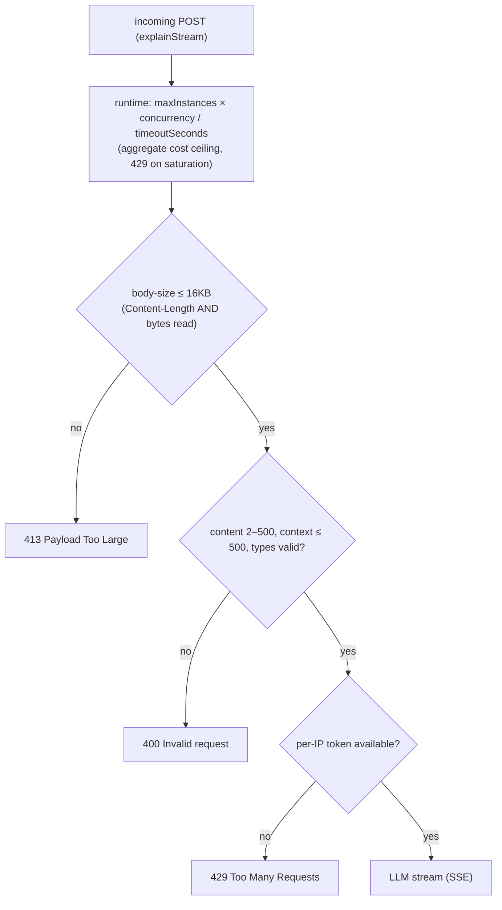

# fix: Harden the unauthenticated explainStream endpoint against abuse and cost amplification

## Summary

Close the abuse and denial-of-wallet surface on `explainStream` (and apply shared input caps to `explain`) by layering a deploy-level cost ceiling (`maxInstances`/`concurrency`/`timeoutSeconds`), server-authoritative input validation (content/context/body-size/type), and a per-client rate limit checked before the LLM call. All of it ships via `firebase deploy`.

## Problem Frame

`explainStream` is a 2nd-gen `onRequest` function registered with only `{ secrets, cors: true, timeoutSeconds: 120 }` — unauthenticated, no `maxInstances`, no rate limiting, no App Check. Every request triggers a real Gemini call (with thinking, non-trivial token cost) and streams the response. The handler reads `req.body.content` with no server-side length cap. Any internet user can POST arbitrarily large content or flood requests to drive unbounded LLM spend — a cost-amplification / denial-of-wallet vector.

**Threat model (explicit, so the limits of this plan are visible):** the realistic denial-of-wallet vector is an attacker rotating across many IPs (botnet, residential proxy pool, cloud egress). A per-IP rate limit caps a *single* source; it does not stop distributed abuse. The only layer that bounds *aggregate* spend under distributed attack is `maxInstances` (× `concurrency`). This plan therefore treats `maxInstances` as the hard cost ceiling and the per-IP limiter as a single-source / slow-drip fairness brake — and defers true distributed-IP throttling (Cloud Armor) as an escalation.

*(Origin: the P0 residual recorded in PR #3's Known Residuals. Research: the Firebase Functions v2 + abuse-protection brief in Sources.)*

---

## High-Level Technical Design

Requests pass through a layered guard pipeline; each layer rejects before the expensive LLM call. Layers 1–2 are deploy/runtime config; layers 3–4 are in-handler code.

Each guard runs before `createLlmService()`, so rejected requests cost at most a cheap function invocation plus (for the rate-limit check) one Firestore op — never LLM spend.

---

## Requirements

**Cost ceiling**

R1. `explainStream` sets `maxInstances`, `concurrency`, `memory`, `cpu`, and a lowered `timeoutSeconds`. The values are derived from an explicit worst-case daily-spend budget, and the **true concurrent-stream ceiling is `maxInstances × concurrency`** (each SSE request holds a concurrency slot for the whole stream), not `maxInstances` alone.
R2. The same runtime options apply to the `explain` callable for cost parity. (The body-size guard in R5 is an HTTP-handler check specific to `explainStream`, not a runtime option.)

**Input validation**

R3. The server enforces the analysis-text contract authoritatively: `content` is a string of 2–500 characters; non-conforming requests are rejected with 400 before any LLM call. Applied to both endpoints.
R4. `context_before`/`context_after`, when present, are validated as strings capped at the context bound; oversized values are rejected (not silently truncated) so the contract is explicit.
R5. `explainStream` rejects request bodies above a fixed size ceiling with 413 — enforced on **both** the `Content-Length` header and the bytes actually read, so chunked or under-reported bodies cannot bypass it.

**Rate limiting**

R6. `explainStream` enforces a per-client rate limit, checked after validation and before the LLM call; over-limit requests return 429.
R7. The limiter's state is shared across function instances (durable via Firestore), so instance autoscaling does not defeat it.
R8. The limiter **fails open only for an unparseable client IP** (availability for legitimate unusual proxies); on a **Firestore error it fails closed** (reject, or circuit-break) and emits an alert, because this layer's function is spend protection, not availability.
R9. The at-rest and logged client identifier is an **HMAC-SHA256 of the client IP keyed by a server-held secret** (not a bare hash, which is trivially reversible over the IPv4 space); limiter documents carry a TTL so per-client identifiers do not accumulate indefinitely.
R10. A Firestore security-rules **deny rule** explicitly locks the rate-limiter collection to client writes, so the invariant survives future rule edits (defense-in-depth — the Admin SDK bypasses rules today, but that is safety-by-default, not a committed invariant).

**Observability**

R11. Each rejection path emits a structured log with a reason code and the HMAC'd client identifier (never request content); limiter fail-closed/error events are alertable.

---

## Key Technical Decisions

**KTD1. `maxInstances × concurrency` is the aggregate cost ceiling — derive both from a spend budget.** `maxInstances` converts unbounded denial-of-wallet into a bounded cost ceiling, but for an SSE endpoint the true concurrent-stream ceiling is `maxInstances × concurrency` (one request occupies a slot for the whole stream). Both numbers are chosen against an explicit worst-case daily-spend budget, and the chosen product is stated in the config. For a long-lived stream, `concurrency: 1` makes `maxInstances` a literal concurrent-stream cap; a higher `concurrency` is acceptable only if the resulting product is still within budget. `maxInstances` does not stop slow-drip or distributed abuse — that is what rate limiting (and, at scale, Cloud Armor) is for.

**KTD2. Input validation is server-authoritative and applied to both endpoints.** The 2–500 character limit currently lives only in the client; the server never trusts it. A shared pure validator handles both `explainStream` and `explain` so the contract cannot drift between surfaces.

**KTD3. Rate limiting uses a hand-rolled sharded Firestore token bucket keyed by client IP.** A community library (`firebase-functions-rate-limiter`) was evaluated and **ruled out** — it pins `firebase-functions@^3`/`firebase-admin@^10` (last published 2022) and would pull a duplicate v3 SDK into the v7/v13 runtime. The sharded counter is the primary implementation; shard count is sized to keep the per-document write ceiling (~1 write/sec/doc) from binding. State lives in a dedicated top-level collection written via the Admin SDK (bypasses Firestore rules), with an explicit deny rule (R10). This ships via `firebase deploy` with no monthly load-balancer cost; Cloud Armor is the deferred escalation for distributed/rotating-IP abuse.

**KTD4. The limiter keys on client IP via `req.ip` (Cloud Functions trusts the proxy by default, so no `trust proxy` code is needed), with explicit failure posture and keying.** Fail-open *only* for an unparseable IP (legitimate unusual proxies); fail-*closed* on Firestore errors (spend protection). The IP identifier is HMAC-SHA256 keyed by a server secret (R9), never a bare hash. Header-spoofing is a named threat: if a future change broke the GCLB proxy trust, a client could rotate `X-Forwarded-For` to get a fresh bucket per request — a test asserts `req.ip` resolves through the proxy. Accepted limitations: NAT/shared-IP over-blocking, and that per-IP keying does not stop distributed abuse (KTD1/Problem Frame).

**KTD5. App Check and `invoker` are ruled out for this endpoint.** App Check's web providers (reCAPTCHA Enterprise) will not attest `chrome-extension://` origins and the App Check web SDK needs a DOM the MV3 service worker lacks — a hard blocker for the extension client. `invoker` (IAM-gating) requires Google credentials the extension's plain `fetch` does not carry. Requiring user auth is a product decision outside this plan.

---

## Implementation Units

### U1. explainStream runtime options (cost ceiling)

**Goal:** Bound concurrent executions and per-request stream duration so a flood cannot drive unbounded aggregate spend.

**Requirements:** R1, R2

**Dependencies:** None

**Files:**
- `japanese-alchemy-hosting/functions/src/index.ts` (modify — `explainStream` and `explain` options)

**Approach:** Add `maxInstances`, `concurrency`, `memory` (`"512MiB"`), `cpu` (1), and lower `timeoutSeconds` (120 → ~60) to both functions via a shared runtime-options object. Derive `maxInstances` and `concurrency` from an explicit worst-case daily-spend budget; state the **product** (`maxInstances × concurrency`) as the true concurrent-stream ceiling in a comment. Do not set `minInstances` (raises idle cost). Either set `concurrency: 1` (literal stream cap) or justify a higher value against the budget. Consider `setGlobalOptions` for project-wide application, but note `saveItems` would then inherit the ceiling — an explicit decision (the shared object scoped to the two explain functions is the default).

**Patterns to follow:** Existing `onRequest`/`onCall` options shape in `index.ts`; Firebase v2 `GlobalOptions`.

**Test scenarios:**
- Config: the shared options set a `maxInstances` and `timeoutSeconds` ≤ 60; the comment states the `maxInstances × concurrency` ceiling; `minInstances` is unset/0.
- Config: both `explainStream` and `explain` reference the shared options (parity).
- *Test expectation for deploy-time values:* runtime options are not unit-testable at runtime; verification is deploy + console inspection.

**Verification:** Deploys cleanly; GCP console shows the configured options for both functions; the documented concurrent-stream ceiling cannot be exceeded.

---

### U2. Server-side request validation

**Goal:** Reject oversized and malformed payloads before any LLM work, server-authoritatively, on both endpoints.

**Requirements:** R3, R4, R5

**Dependencies:** None (parallel with U1)

**Files:**
- `japanese-alchemy-hosting/functions/src/v1/requestValidation.ts` (new — pure validators + guard helper)
- `japanese-alchemy-hosting/functions/src/v1/explainStreamHandler.ts` (modify — call validation early; add body-size guard on Content-Length AND bytes read)
- `japanese-alchemy-hosting/functions/src/v1/explainCallable.ts` (modify — call validation early)
- `japanese-alchemy-hosting/functions/test/v1/requestValidation.test.ts` (new)
- `japanese-alchemy-hosting/functions/test/v1/explainStreamHandler.test.ts` (modify — add rejection cases)
- `japanese-alchemy-hosting/functions/test/v1/explainCallable.test.ts` (modify — add rejection cases)

**Approach:** Extract a pure `validateExplainRequest(body)` returning `{ ok, error, status }` covering: `content` is a string of 2–500 chars; `context_before`/`context_after`, when present, are strings ≤ the context bound (`MAX_CONTEXT_CHARS` from `analysisMessage.ts`); `prompt` is `"v1"`/`"v2"` or absent. Both handlers call it immediately after destructuring and reject on failure (stream: 400 JSON before SSE headers; callable: throw `invalid-argument`). Add a body-size guard to `explainStreamHandler` (~16KB ceiling → 413) enforced on **both** Content-Length and bytes read. The context bound constant is shared, not redefined.

**Patterns to follow:** Existing handler validation style; pure-helper-then-wire pattern established by `analysisMessage.ts`.

**Test scenarios:**
- `validateExplainRequest`: valid body ok; `content` <2 or >500 → 400; non-string `content` → 400; `context_before` over the bound → error; non-string context → error; missing `content` → 400; valid with context passes.
- Handler, stream: oversized Content-Length → 413 and the LLM service is never constructed.
- Handler, stream: a body that under-reports Content-Length but streams more bytes → 413.
- Handler, stream: `content` of 501 chars → 400 before SSE headers; mock LLM not called.
- Handler, callable: `content` of 1 char → throws `invalid-argument`; mock LLM not called.
- Parity: both handlers reject the same invalid body shapes identically.

**Verification:** New + updated handler tests pass; `tsc --noEmit` clean; a deployed probe with an oversized body returns 413 and never reaches the LLM.

---

### U3. Per-IP rate limiting (hand-rolled sharded Firestore token bucket)

**Goal:** Bound per-client request rate to protect LLM spend from a single abuser, checked before the LLM call.

**Requirements:** R6, R7, R8, R9, R10

**Dependencies:** U2 (validation runs first so malformed requests never consume rate-limit budget)

**Files:**
- `japanese-alchemy-hosting/functions/src/v1/rateLimiter.ts` (new — sharded token-bucket check + HMAC'd IP keying + IP extraction)
- `japanese-alchemy-hosting/functions/src/v1/explainStreamHandler.ts` (modify — call limiter after validation, before LLM)
- `japanese-alchemy-hosting/firestore.rules` (modify — add explicit deny rule for the rate-limiter collection)
- `japanese-alchemy-hosting/functions/test/v1/rateLimiter.test.ts` (new)

**Approach:** A sharded token bucket per client IP (hand-rolled — see KTD3), shared across instances via Firestore. Configurable threshold derived from a conservative estimate of legitimate extension usage (defer the exact number to implementation). Extract IP via `req.ip` (Cloud Functions trusts the GCLB proxy by default — no `trust proxy` code). On limit exceeded → 429 before the LLM call. The collection path is locked by a deny rule in `firestore.rules` (R10). Key the bucket and logs on **HMAC-SHA256(client IP, serverSecret)**, with document TTL for retention. **Fail-open only on unparseable IP; fail-closed (reject) + alert on Firestore errors** (R8).

**Technical design (directional):** the limiter exposes `checkRateLimit(ip): Promise<{ allowed: boolean }>`; bucket state lives at a top-level path keyed by the HMAC'd IP, sharded to stay under the per-document write ceiling; a TTL cleanup or Firestore TTL policy bounds retention.

**Test scenarios:**
- Bucket logic (mocked Firestore): under-limit allowed; Nth+1 within the window denied; after the window elapses, allowed again.
- Sharding/concurrency: two near-simultaneous requests both decrement correctly (no over-admission).
- Handler: a burst over the threshold yields 429 and the mock LLM is not called for rejected requests.
- IP extraction: `req.ip` resolves through the proxy; a test asserts the helper reads `req.ip` (the proxy-trust invariant).
- Fail-open (unparseable IP): allowed with a log.
- Fail-closed (Firestore error): rejected (429/503) with an alert-worthy error log — the fairness layer does NOT silently disable.
- HMAC keying: the stored/logged identifier is the HMAC, not the raw or bare-hashed IP.

**Verification:** Bucket unit tests pass; a deployed burst probe returns 429 after the threshold; Functions logs show the 429 reason code; the deny rule blocks a simulated client write to the collection; fail-closed behavior is confirmed under an induced Firestore error.

---

### U4. Observability, alerting, and deploy verification

**Goal:** Make every guard observable, alert on limiter disablement, and verify the layered pipeline end-to-end after deploy.

**Requirements:** R11

**Dependencies:** U1, U2, U3

**Files:**
- `japanese-alchemy-hosting/functions/src/v1/explainStreamHandler.ts` (modify — consistent rejection logging)
- `japanese-alchemy-hosting/functions/src/v1/explainCallable.ts` (modify — consistent rejection logging)

**Approach:** Standardize rejection logs across all guard paths (413/400/429 + callable invalid-argument) to carry a reason code and the HMAC'd client identifier, never request content. Surface limiter fail-closed/error events as alertable (a sustained limiter-error rate is the signal that the fairness layer is down). Add a short post-deploy verification runbook (curl probes: oversized body → 413; bad content → 400; burst → 429; confirm `maxInstances × concurrency` in console; confirm a legitimate analysis still streams).

**Patterns to follow:** Existing `logger.info`/`logger.error` usage in the handlers.

**Test scenarios:**
- Unit: each rejection path emits a log line with the correct reason code; the identifier is the HMAC, not raw content or raw IP.
- Integration (deployed): the runbook probes confirm each layer fires in order and a valid request still succeeds end-to-end.

**Verification:** Runbook probes pass against the deployed function; logs distinguish 400/413/429 by reason code; a valid request returns a streamed analysis unchanged.

---

## Scope Boundaries

### In scope

- `explainStream` and `explain` runtime options (cost ceiling)
- Server-side input validation (content/context/body-size/type) on both endpoints
- Per-IP rate limiting on `explainStream` (sharded Firestore token bucket, HMAC keying, deny rule)
- Rejection observability, limiter-failure alerting, and a deploy-verification runbook

### Deferred to follow-up work

- **Cloud Armor / Global External ALB + serverless NEG per-IP/subnet throttling** — the layer that resists distributed/rotating-IP abuse (which per-IP Firestore limiting cannot stop); escalated when distributed DoW is observed in logs (requires Terraform/gcloud, monthly LB cost)
- **Firebase App Check** — ruled out for the extension client (reCAPTCHA will not attest `chrome-extension://` origins; see KTD5)
- **Requiring user auth (Google sign-in) to call `explainStream`** — a product change for `ce-brainstorm`
- **`firebase-functions-rate-limiter` library** — ruled out (incompatible with `firebase-functions@^7`/`admin@^13`; see KTD3)

---

## Open Questions

- **Rate-limit the `explain` callable too?** It is also an unauthenticated path to a Gemini call (reachable via the webapp's Firebase client). This plan rate-limits `explainStream` only and relies on `explain`'s `maxInstances` cap. Decision: extend the limiter to `explain` in this plan, or leave it as a documented residual until it becomes an abuse surface?
- **Worst-case daily-spend budget?** The `maxInstances`/`concurrency`/rate thresholds must be derived from one. The owner should state the acceptable worst-case daily LLM spend so U1/U3 pick defensible numbers rather than guesses.

---

## Risks & Dependencies

- **Per-IP limiting does not stop distributed/rotating-IP abuse.** A botnet/proxy pool gets N× the per-IP budget; `maxInstances` is the only aggregate brake. Cloud Armor (deferred) is the real fix for distributed DoW.
- **Firestore sharded-counter shard count.** Under-provisioned shards re-introduce the ~1 write/sec/document hotspot the sharding avoids; shard count is sized against expected traffic at implementation time.
- **Added per-request latency (~50–200ms)** from the Firestore read/write on every request that reaches the rate-limit check; flagged for monitoring on the SSE path.
- **Rejected requests still cost a function invocation (+ one Firestore op at the rate-limit layer).** Bounded by `maxInstances` and the rate limit; never LLM spend.
- **`maxInstances` saturation starves legitimate users (429).** It is a cost cap, not an availability or fairness guarantee — rate limiting (U3) is the fairness layer.
- **Fail-closed on Firestore errors trades availability for spend protection.** Deliberate (KTD4/R8); mitigated by alerting so the failure is visible and recoverable, not silent.
- **IP-based keying is coarse** (NAT, shared IPs, mobile carriers) and spoofable if the GCLB proxy trust is ever broken (test asserts the invariant).

---

## Sources / Research

- Origin: PR #3 Known Residuals (P0) — `docs/plans/2026-06-14-001-feat-surrounding-sentence-context-plan.md` review
- Current registration: `japanese-alchemy-hosting/functions/src/index.ts` (`explainStream`/`explain` v2 options)
- Firebase Functions v2 runtime options — `maxInstances`/`concurrency`/`memory`/`cpu`/`timeoutSeconds`/`invoker`/`enforceAppCheck`: https://firebase.google.com/docs/functions/manage-functions , https://firebase.google.com/docs/functions/quotas
- No native `rateLimits` on `onRequest` (TaskQueue-only) — `firebase-functions` v7 type defs
- App Check enforcement on `onRequest` is manual; auto-enforcement is `onCall`-only: https://firebase.google.com/docs/app-check/cloud-functions
- App Check web providers require a registered domain; `chrome-extension://` origins are rejected by reCAPTCHA — rules out App Check for the extension client
- `invoker` requires IAM credentials — not viable for the extension's unauthenticated `fetch`
- Firestore per-document write ceiling and counter sharding — https://firebase.google.com/docs/firestore/best-practices
- Cloud Armor rate limiting via Global External ALB + serverless NEG (Terraform/gcloud, not `firebase deploy`) — https://cloud.google.com/armor/docs/rate-limiting-overview
- `firebase-functions-rate-limiter` ruled out: pins `firebase-functions@^3`/`firebase-admin@^10` (last published 2022), incompatible with the repo's v7/v13
- `firestore.rules` (repo) currently has no match for the proposed rate-limiter collection — implicit deny today; R10 makes it explicit
