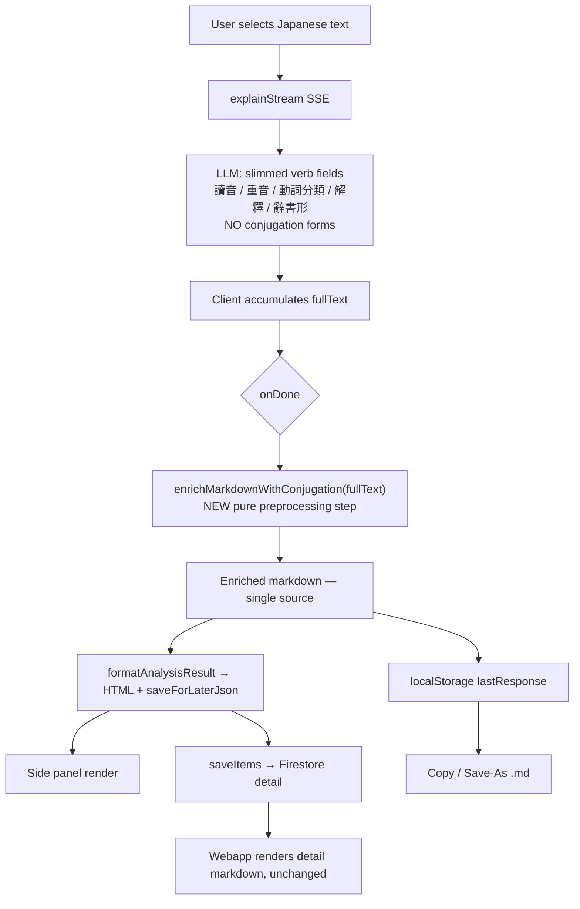
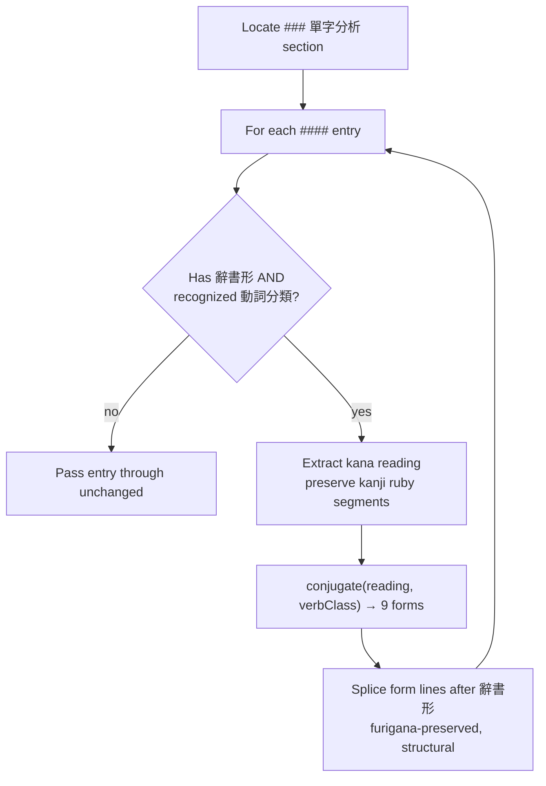

# feat: Replace LLM verb conjugation with a deterministic client-side engine

## Summary

Today the LLM generates ~10 verb conjugation forms per verb in its markdown output, but does so badly — the worked example in the prompt shows it copying generic template prose ("如「食べよう」") instead of conjugating the actual verb, wasting ~40% of output tokens while producing wrong results. This plan removes conjugation generation from the LLM and replaces it with a deterministic TypeScript conjugation engine that runs **client-side** in the Chrome extension. The LLM (V1 and V2 prompts) will emit only dictionary form + verb class for verbs; the engine generates the form table and splices it into the rendered output, the saved item, the webapp, the Copy output, and the Save-As export — all from one enriched-markdown pass.

---

## Problem Frame

Japanese verb conjugation is one of the most regular morphological systems in any language: exactly four verb classes (godan, ichidan, suru, kuru) with fully predictable rules. Using an LLM for it is like using an LLM to do arithmetic — slow, expensive, and wrong. The current prompts (`functions/src/models/systemPromptV1.ts:12`, `systemPromptV2.ts:12`) demand 辭書形, ます形, た形, ない形, て形, 意向形, 命令形, 使役形, 受身形, 使役受身形 per verb, and the worked examples (`systemPromptV2.ts:46-50, 62-66, 82-86`) demonstrate the model emitting placeholder descriptions of each form rather than the conjugated verb. The fix is to treat conjugation as the deterministic computation it is.

The architecture decision (confirmed with the user) is that the engine runs **client-side**, not in the backend. The streaming handler (`functions/src/v1/explainStreamHandler.ts`) is a dumb pipe that forwards raw LLM deltas without parsing; a backend engine would have to buffer the entire stream and re-parse markdown to place tables inline, defeating streaming and adding the very parsing fragility this project has flagged elsewhere. A client-side engine reuses the extension's existing markdown parsing, preserves streaming, and — because saved items carry the generated table in their `detail` — leaves the Next.js webapp untouched.

---

## Requirements

**Behavior and coverage**

- R1. Verb conjugation forms are produced by a deterministic engine, not the LLM.
- R2. The engine produces correct forms for all four verb classes (godan, ichidan, suru, kuru) across the form set (ます形, た形, ない形, て形, 意向形, 命令形, 使役形, 受身形, 使役受身形), including the documented anomalies.
- R3. Pitch accent (重音) remains LLM-provided; the engine never generates accent (it is lexical and not derivable by rule).

**Prompt contract**

- R4. The V1 and V2 prompts emit only 讀音, 重音, 動詞分類, 解釋, 辭書形 for verbs, and explicitly no longer emit conjugation forms. The grammar sections (V1 1–3, V2 1–5 and their structure) are unchanged.

**Integration and consistency**

- R5. Generated conjugation flows consistently into the side-panel render, the saved Firestore item, the webapp's rendering of saved items, the Copy output, and the Save-As export, sourced from a single enriched-markdown pass.
- R6. The engine degrades gracefully: non-verb entries are skipped; entries missing 辭書形 or a recognized verb class are skipped; a single entry's failure never aborts rendering or leaves stale save data.

**Compatibility**

- R7. Existing saved vocabulary renders unchanged; no data migration or backfill.
- R8. Upgraded clients invalidate stale analysis caches so users receive engine-generated conjugation rather than pre-engine cached output.

---

## Key Technical Decisions

- KTD1. **Engine runs client-side (locked with user).** It lives as a plain-JS ES module in the extension. Rationale: the streaming handler is a dumb pipe; a client engine reuses the extension's existing markdown parse, preserves streaming, and lets saved items carry the generated table so the webapp renders unchanged. The backend stays untouched except for the prompt text.
- KTD2. **Enrichment is a pure markdown preprocessor applied once, before the response is stored or rendered.** `enrichMarkdownWithConjugation(markdown) → markdown` runs in `onDone` against the raw `fullText`, and the enriched result is what gets written to `localStorage.lastResponse` and passed to `formatAnalysisResult`. Rationale: `formatAnalysisResult` builds both save data and rendered HTML, and `Copy`/`Save-As` read `lastResponse` — enriching the string once keeps render, save, copy, save-as, cache, and webapp all in sync without modifying `formatAnalysisResult`.
- KTD3. **Engine boundary: forms only; accent stays external.** The LLM supplies 讀音, 重音, 動詞分類, 解釋, 辭書形; the engine generates the nine inflected forms. Rationale: pitch accent is lexical, varies by word, dialect, and register, and is not derivable from conjugation rules (see Sources). Generating accent would mislead learners.
- KTD4. **Furigana is preserved, operating on the kana reading.** The engine reads the `辭書形` value (which may carry `{kanji|reading}` ruby), derives forms from the kana reading, and re-emits with the kanji ruby segment preserved byte-for-byte, appending the conjugational ending as bare kana. Output always uses `{kanji|reading}`. Rationale: both renderers (extension `convertToRuby`, webapp `parseFurigana`) consume this format; mangled furigana breaks rendering.
- KTD5. **Splice structurally, never by text search.** Enrichment iterates the same `#### ` split the existing parser uses and injects form lines immediately after the `辭書形` line within each entry block. Rationale: a verb term can also appear in a grammar example or another entry's explanation; text-search replacement would mis-target.
- KTD6. **Error containment and idempotency.** Enrichment wraps each entry in its own try/catch and never throws out of `formatAnalysisResult`/`onDone`; it detects already-present form lines and skips re-injection. Rationale: a single malformed entry or a partially-streamed verb must not abort rendering or leave `saveForLaterJson` holding stale data from a prior analysis.
- KTD7. **Cache-key namespace bump.** The analysis cache key gains a version segment so a `lastResponse` written before the engine shipped does not produce a stale hit on upgrade. Rationale: `buildContextCacheKey` keys only on selected text + context; without a bump, upgraded users keep seeing pre-engine cached output.
- KTD8. **Causative-passive godan form defaults to the contracted form.** For godan, 使役受身形 emits the contracted 〜される form (e.g. 書く → 書かされる), the everyday default; ichidan/suru/kuru use 〜させられる uncontracted. Rationale: both full and contracted are grammatical, but the contracted form is what native speakers actually produce.
- KTD9. **Engine is verbs only.** It triggers on a recognized verb-class value in a verb entry. Adjective and noun conjugation (the prompt's ambiguous "kanji word" line 14) is out of scope and remains LLM-side. Rationale: idea #3 is explicitly about the four verb classes; adjective conjugation is a different, non-overlapping rule set.

---

## High-Level Technical Design

The change is a pure preprocessing stage inserted into the streaming-finalize path; the backend contributes only a slimmer prompt, and the webapp contributes nothing.



Inside the engine, each word entry runs through a decision-and-generate loop that skips anything it cannot conjugate confidently:



Conjugation rule signature (directional, not implementation specification):

```
conjugate(reading: string, verbClass: "godan"|"ichidan"|"suru"|"kuru")
  → { masu, ta, nai, te, volitional, imperative, causative, passive, causativePassive }
```

Each returned form is a furigana-bearing string built from the reading via the per-class derivation rules (see Sources). Godan derivation keys off the dictionary-form final kana row; the two load-bearing anomalies (godan 〜う → 〜わ in the negative; 行く → 行って/行った in the te/ta form) and the honorific masu irregularity are handled as explicit cases, not inferred.

---

## Scope Boundaries

In scope: the conjugation engine module (extension), the prompt change (V1 + V2 verb parts), the client-side wiring and cache invalidation, and tests across all of the above.

Out of scope (non-goals): grammar analysis changes, ruby-annotation handling, the surrounding-context feature, the SSE/streaming protocol, and idea #4 (enforced JSON schema output).

### Deferred to Follow-Up Work

- Backfilling conjugation for already-saved vocabulary (R7 accepts legacy items as-is; a future backfill would regenerate engine forms for old items, but the webapp cannot run the engine today and no migration path exists).
- Sharing/porting the engine to the Next.js webapp or a TypeScript package (only needed if the webapp ever renders live analysis rather than saved `detail`).
- Adjective (い/な-adjective) conjugation — a separate rule set from the four verb classes.
- Wiring the engine into the batch `explain` path (currently unused for display; nothing renders its output).

---

## Risks & Dependencies

- RISK-1. **Conjugation correctness (high).** A confidently-wrong conjugation misleads learners — worse than the current bad-but-recognizably-broken LLM prose — and because engine output is written into saved items (see System-Wide Impact), a wrong form is sticky: it persists across sessions and devices until the item is re-saved rather than vanishing with the next render. Mitigation: the rule core is pure and fully unit-testable; tests enumerate all four classes × all nine forms with representative verbs per godan final-kana group, plus every documented anomaly. (See U1 test scenarios.)
- RISK-2. **Prompt regression (medium).** The LLM may still emit conjugation forms despite instructions, or drop 辭書形/動詞分類. Mitigation: prompt content tests plus the opt-in golden-example harness; the engine skips entries missing the required fields rather than emitting garbage.
- RISK-3. **Render/save desync (medium).** If conjugation reaches the panel but not `lastResponse`, Copy/Save-As silently drop it. Mitigation: KTD2 enriches the single source string before any consumer reads it.
- RISK-4. **Furigana boundary errors (medium).** Ruby segments could be malformed when the kanji boundary shifts under conjugation. Mitigation: KTD4 preserves the kanji-ruby segment byte-for-byte and transforms only the okurigana tail; unit-tested against real-shape fixtures.
- DEP-1. No external dependencies. The opt-in prompt-quality harness (`functions/test/prompts/promptQuality.test.ts`, idea #1) already exists and can validate the prompt change, but it is not a blocker — the engine is unit-testable independently.

---

## System-Wide Impact

- **Cross-component data contract.** The extension writes conjugation-bearing entry detail → `saveItems` → Firestore (`detail: JSON.stringify({term, detail})`) → the webapp unwraps via `renderVocabularyDetail` (`JSON.parse(detail).detail`) and renders it as markdown. The engine operates only on raw markdown before `formatAnalysisResult`, so it never touches the JSON envelope and there is no double-encoding risk. New saves carry engine conjugation; the webapp renders it unchanged.
- **Persistence amplifies correctness.** Engine output is written into saved items and reviewed later across sessions and devices. A wrong conjugation is sticky, not transient — it survives until the item is re-saved. This is the reason U1's test rigor is non-negotiable (RISK-1) and why graceful degradation (KTD6) skips a verb entirely rather than persisting a guess.
- **Cache lifecycle.** Upgraded clients must not serve pre-engine cached output. KTD7's cache-key namespace bump invalidates stale `lastResponse`; because enriched markdown is what gets stored, cache hits never re-run the engine, so there is no double-conjugation path.
- **Failure propagation across the seam.** Enrichment failures degrade per-entry (KTD6) and never abort the render or leave `saveForLaterJson` holding a prior analysis's data. A verb the engine cannot conjugate is omitted from that entry's detail rather than carrying fabricated forms into the saved record.

---

## Implementation Units

### U1. Conjugation rule core

**Goal:** A pure function that takes a verb's kana reading and class and returns correct inflected forms for all four verb classes, with anomalies handled explicitly.

**Requirements:** R1, R2, R3, R4 (boundary).

**Dependencies:** none.

**Files:**
- `japanese-alchemy-chrome-extension/src/scripts/conjugation.js` (new — the module hosts both U1's rule core and U2's enrichment layer)
- `japanese-alchemy-chrome-extension/tests/conjugation.test.js` (new)

**Approach:** Implement the per-class derivation rules as pure functions keyed on the dictionary-form final kana for godan, on ru-dropping for ichidan, and on the suppletive stems for suru/kuru. Hardcode the two anomalies and the honorific set as explicit cases. Normalize verb-class labels to a canonical enum so both `五段` and `五段動詞` (and theカ變/サ變 variants) are recognized. Accept a furigana-bearing dictionary reading; operate on kana. This is the highest-correctness-risk unit — implement test-first.

**Patterns to follow:** Pure-function unit tests in the style of `japanese-alchemy-chrome-extension/tests/formatAnalysisResult.test.js` (import from source, `describe`/`test`, `expect`).

**Execution note:** Write the rule tests first (godan × 9 forms, ichidan × 9, suru × 9, kuru × 9, anomalies), then implement until green.

**Test scenarios:**
- Godan × all 9 forms, one representative verb per final-kana group (書く/く, 泳ぐ/ぐ, 話す/す, 待つ/つ, 死ぬ/ぬ, 遊ぶ/ぶ, 読む/む, 買う/う, 走る/る).
- Ichidan (食べる, 見る) × all 9 forms.
- Suru (する, 省人化する) × all 9 forms; kanji-compound stem is invariant.
- Kuru (くる) × all 9 forms.
- Anomaly: godan 〜う negative uses 〜わ (買う → 買わない, 言う → 言わない).
- Anomaly: 行く te/ta → 行って/行った, not 行いて/行いた.
- Honorific masu: いらっしゃる/なさる/くださる/ござる → る becomes い (いらっしゃいます, なさいます, くださいます, ございます).
- Causative-passive godan contraction (書く → 書かされる; ichidan 食べる → 食べさせられる, uncontracted).
- Ruby-bearing input ({動|うご}く) → reading extracted as うごく, output ruby preserved ({動|うご}きます).
- Edge: unrecognized or missing verb class → returns a skip sentinel (no throw).
- Edge: empty or malformed reading → returns a skip sentinel (no throw).

**Verification:** `npm test` in `japanese-alchemy-chrome-extension` is green; every documented anomaly has a passing assertion; no conjugation call throws on malformed input.

---

### U2. Markdown enrichment layer

**Goal:** Wrap U1's rule core in a pure markdown preprocessor that finds verb entries, generates their conjugation tables, and splices them into the markdown without disturbing anything else.

**Requirements:** R1, R5, R6; KTD2, KTD4, KTD5, KTD6, KTD9.

**Dependencies:** U1.

**Files:**
- `japanese-alchemy-chrome-extension/src/scripts/conjugation.js` (continue — the `enrichMarkdownWithConjugation` export)
- `japanese-alchemy-chrome-extension/tests/conjugation.test.js` (continue — enrichment scenarios)

**Approach:** Locate the `### 單字分析` section, iterate entries via the same `#### ` split the existing parser uses, and for each entry read the `辭書形` line (never the `term` heading) and the `動詞分類` line. When both are present and the class is recognized, generate the nine forms and inject them as markdown bullets immediately after the `辭書形` line, rejoining structurally (no flat-string regex replacement). Skip non-verb entries, entries missing required fields, and entries whose `動詞分類` is absent or unrecognized. Detect already-present form lines and skip re-injection (idempotency). Wrap each entry in try/catch so one failure cannot abort the rest.

**Patterns to follow:** The `#### ` and `### ` split logic already in `formatAnalysisResult` (`japanese-alchemy-chrome-extension/src/sidepanel/sidepanel.js:50-87`); the `{kanji|reading}` furigana convention used by both renderers.

**Test scenarios:**
- Happy path: a word section with verb entries → conjugation lines injected after `辭書形` in `{kanji|reading}` format; katakana and non-verb entries untouched; the `### 文法分析` section untouched.
- Ruby-prefixed `辭書形` ({動|うご}く) → conjugation preserves ruby across all emitted forms.
- term ≠ 辭書形 for a godan entry (term is the noun form `動き`, `辭書形` is `{動|うご}く`) → engine conjugates the `辭書形` verb, not the term.
- Idempotency: enriching already-enriched markdown does not duplicate form lines.
- Missing `辭書形` (with `動詞分類` present) → entry skipped, no crash.
- Missing or unrecognized `動詞分類` → entry skipped.
- Verb-class label variants (`五段` vs `五段動詞`, `サ變` vs `サ變動詞`) both recognized.
- Partial/truncated entry (stream cut before `辭書形`) → skipped.
- Multiple verb entries in one section → all enriched.
- Structural targeting: a verb term that also appears inside a grammar example is not conjugated there.
- Error containment: one malformed entry does not prevent enrichment of the others.
- No `### 單字分析` section → markdown returned byte-for-byte unchanged.

**Verification:** `npm test` green; enrichment of a real-shape fixture (modeled on `tests/formatAnalysisResult.test.js` lines 138–163) produces correct forms in `{kanji|reading}` format and leaves non-verb and grammar content unchanged; idempotency assertion passes.

---

### U3. Prompt redesign (V1 + V2)

**Goal:** Remove the verb-conjugation demand and worked examples from both prompts; instruct the LLM to emit only the fields the engine needs.

**Requirements:** R4.

**Dependencies:** none (parallelizable with U1/U2).

**Files:**
- `japanese-alchemy-hosting/functions/src/models/systemPromptV1.ts` (modify line 12 instruction; trim worked verb examples lines 26–78)
- `japanese-alchemy-hosting/functions/src/models/systemPromptV2.ts` (modify line 12 instruction; trim worked verb examples lines 34–86)
- `japanese-alchemy-hosting/functions/test/models/systemPromptV1.test.ts` (update content assertions)
- `japanese-alchemy-hosting/functions/test/models/systemPromptV2.test.ts` (update content assertions)

**Approach:** Replace the verb instruction (line 12 in both) so verbs emit 讀音, 重音, 動詞分類, 解釋, 辭書形 only, with an explicit note that conjugation forms are generated by the system and must not be emitted. Strip the per-form lines (ます形 through 使役受身形) and the placeholder-form prose from the worked verb examples in both prompts, keeping each example's 讀音/重音/動詞分類/解釋/辭書形. Leave the grammar sections entirely unchanged (V1's 1–3, V2's 1–5 and structure). Leave line 14's ambiguous "kanji word" rule and adjective handling as-is (KTD9). Update the prompt content tests to assert the conjugation enumeration is gone and the required verb fields remain.

**Patterns to follow:** Existing prompt test structure (`functions/test/models/systemPromptV2.test.ts`).

**Test scenarios:**
- V2 prompt no longer contains the conjugation-form enumeration (ます形 … 使役受身形) in the verb instruction.
- V2 prompt still requires 讀音, 重音, 動詞分類, 解釋, 辭書形 for verbs.
- V2 worked verb examples no longer list conjugation forms.
- V2 grammar section (1〜5 and its structure) is unchanged.
- The same four assertions hold for V1 (with its 1〜3 grammar intact).
- `npm run build` (tsc) succeeds.

**Verification:** `npm test` in `japanese-alchemy-hosting/functions` green; `npm run lint` clean. Optionally, run the gated harness (`PROMPT_QUALITY_TEST=1 npm test`) against golden examples to confirm verbs carry `辭書形` + `動詞分類` but no LLM-generated forms.

---

### U4. Client-side integration and cache invalidation

**Goal:** Wire the engine into the streaming-finalize path so a single enriched markdown feeds every consumer, and invalidate pre-engine caches on upgrade.

**Requirements:** R5, R6, R7, R8; KTD1, KTD2, KTD7.

**Dependencies:** U2; benefits from U3 (new-prompt output shape) but degrades correctly on old-shape output too.

**Files:**
- `japanese-alchemy-chrome-extension/src/sidepanel/sidepanel.js` (modify `onDone`; import the enrichment module)
- `japanese-alchemy-chrome-extension/src/scripts/surroundingContext.js` (`buildContextCacheKey` — add a version segment)
- `japanese-alchemy-chrome-extension/tests/formatAnalysisResult.test.js` or a new `tests/conjugationIntegration.test.js` (integration scenarios)

**Approach:** In `onDone` (currently `sidepanel.js:228-244`), call `enrichMarkdownWithConjugation(fullText)` first, then write the **enriched** result to `localStorage.lastResponse`, set the cache key, and pass the enriched markdown to `formatAnalysisResult`. Reorder so enrichment runs before the `lastResponse` write at line 229. Add a `CACHE_VERSION` constant folded into `buildContextCacheKey` (and its callers) so a pre-engine `lastResponse` no longer matches. No change to `formatAnalysisResult` itself — injected lines flow naturally into each entry's `detail`, which is what save and the webapp consume.

**Patterns to follow:** The cache-key construction and localStorage write/read pattern already in `surroundingContext.js` and `sidepanel.js`; console-log prefix `[Sidebar]`.

**Test scenarios:**
- Integration: a new-prompt-shape fullText → `onDone` enrichment → `formatAnalysisResult` → conjugation present in both `result.html` and `result.json.words[].detail`.
- `lastResponse` stores the enriched markdown (Copy and Save-As reflect conjugation).
- Cache invalidation: the cache key includes the version bump, so a pre-engine `lastResponse` does not match post-upgrade.
- Cache hit on an enriched stored response renders correctly without re-enrichment (no double conjugation).
- Regression: a fullText with no verbs enriches to itself; render and save proceed exactly as before.
- Degradation: enrichment that changes nothing leaves `saveForLaterJson` consistent with the rendered HTML (no stale prior-analysis data).

**Verification:** `npm test` green in the extension; manual load of `dist/` as unpacked extension confirms a verb analysis shows engine-generated conjugation, Copy and Save-As include it, and saving then viewing in the webapp shows the same table.

---

## Open Questions

- Should the batch `explain` path also surface engine-generated conjugation if a future consumer renders its output directly? Deferred (see Scope Boundaries) — nothing renders it today.

---

## Sources & Research

- Origin ideation doc: `docs/ideation/2026-06-09-llm-prompt-quality-ideation.md` (idea #3).
- Conjugation morphology (load-bearing for engine correctness): Wikipedia — Japanese conjugation (verb-base formation table, godan negative 〜わ anomaly); Tofugu — te-form (音便 rules, 行く exception) and verb-conjugation groups; Tae Kim — verbs, causative/passive, honorifics; Wiktionary godan 〜iru/〜eru trap-verb categories; Japanese Language Stack Exchange — pitch accent is lexical and not derivable (basis for KTD3); Self-Taught Japanese — abbreviated causative-passive (basis for KTD8); imabi — honorific irregular verbs.
- Codebase integration points: `japanese-alchemy-chrome-extension/src/sidepanel/sidepanel.js` (`formatAnalysisResult`, `onDone`, `saveForLaterJson`); `japanese-alchemy-chrome-extension/src/scripts/surroundingContext.js` (`buildContextCacheKey`); `japanese-alchemy-chrome-extension/webpack.config.js` (no TS loader → plain-JS module); `japanese-alchemy-hosting/functions/src/services/firestoreService.ts:33` (`detail: JSON.stringify(word)` storage shape, unwrapped by webapp `renderVocabularyDetail`); `japanese-alchemy-webapp/lib/textUtils.ts` (renders saved `detail` as markdown, unchanged); `japanese-alchemy-hosting/functions/src/models/systemPromptV1.ts`, `systemPromptV2.ts` (conjugation demand + worked examples).
