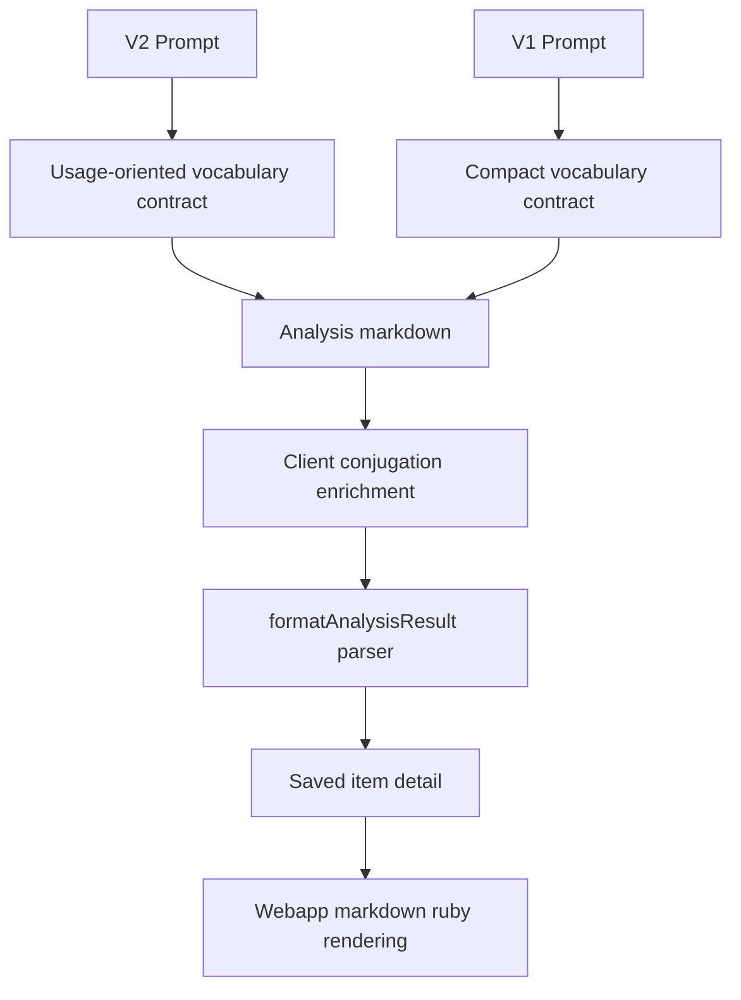

# Usage-Oriented Vocabulary Analysis - Plan

## Goal Capsule

- **Objective:** 重新設計單字分析，讓學生存下單字後能更容易產出自然日文句子，而不只是理解字典意思。
- **Product authority:** J-Buddy 的產品策略是把說明建立在學生正在閱讀的真實文本上，並把這個情境帶進後續複習。
- **Execution profile:** Code plan，主要修改 prompt contract 與測試覆蓋。
- **Stop conditions:** 如果實作需要改保存 schema、增加 webapp UI，或回到 LLM 生成動詞活用表，停止並回到產品範圍確認。
- **Tail ownership:** 完成 prompt、parser/save-detail 測試與驗證後交由一般 code review / PR 流程收尾。
- **Open blockers:** 無。

---

## Product Contract

### Summary

V1 保持輕量閱讀輔助；V2 改成以「真的會用」為目標的高價值詞單字分析。
V2 應從分析対象中最多選出 4 個有學習價值的 N1-N3 詞彙，並以常見搭配和句型框架組織每個條目，讓學生存下單字後可以寫出自己的句子。

### Problem Frame

學生可能知道 `{後押|あとお}しする` 是「推動、支持」，但仍然不知道怎麼用它造句。
真正缺少的學習單位往往不是單字意思，而是可重複套用的框架，例如 `〜を{後押|あとお}しする`，以及 `{成長|せいちょう}を{後押|あとお}しする` 這類常見搭配。
單字分析應該把這些用法模式保存在 saved item 裡，讓複習從「認得意思」前進到「能夠產出」。

### Key Decisions

- **V1 保持快速。** V1 應繼續服務快速理解，不應變成完整單字卡格式。
- **V2 承擔教學深度。** V2 已經是較深入的 prompt variant，因此應承接更完整的單字輸出契約。
- **高價值詞優先於只列動詞。** 影響造句的瓶頸常在サ變詞、複合名詞、副詞、形容詞和外來語，不只在動詞。
- **搭配優先。** V2 的單字條目應把可套用的片語框架視為核心內容，而不是把它放在例句裡順便展示。
- **本 scope 不新增練習 UI。** 在加入互動造句功能之前，先讓既有 markdown 保存與渲染流程中的 detail 變得更有學習價值。

### Requirements

**Prompt Variant Behavior**

- R1. V1 保持精簡單字分析，適合快速閱讀輔助。
- R2. V2 輸出完整教學型單字分析，服務保存後的學習。
- R3. V2 從分析対象中最多選出 4 個高價值詞。
- R4. V2 優先選擇對理解原句或之後造句有實質幫助的 JLPT N1-N3 詞彙。
- R5. V2 可包含動詞、サ變名詞、形容詞、副詞、重要複合名詞和片假名外來語。
- R6. V2 不列 N4/N5 基礎詞，除非該詞在原句中有值得學習的非直觀用法、語域或搭配。

**Vocabulary Entry Contract**

- R7. 每個含漢字的 V2 條目都在標題和例句中使用專案的 `{kanji|reading}` ruby tag format。
- R8. 每個 V2 條目都先說明該詞在原句中的意思，再補充較廣義的字典式意思。
- R9. 每個 V2 條目都包含至少一個可重複使用的搭配或句型框架，例如 `〜を{後押|あとお}しする`。
- R10. 每個 V2 條目都包含一個自然例句，用來展示該句型框架，並附 ruby 標註與繁體中文翻譯。
- R11. 每個 V2 條目都包含短用法說明；當語域、自然度或典型使用情境會影響造句時，必須標出。
- R12. 每個 V2 條目都包含一個造句導向提示或填空回想題，可在保存後用來複習。
- R13. V2 只在對產出有明確教學價值時，加入易混淆詞比較。
- R14. V2 避免冗長說明搶走核心產出欄位的注意力。

**Verb Compatibility**

- R15. 動詞條目仍提供 client-side conjugation engine 需要的欄位：讀音、重音、動詞分類、解釋、辭書形。
- R16. Prompt output 不輸出生成式動詞活用形，因為這些活用仍由系統產生。
- R17. 既有要求漢字詞輸出 `て形` 和 `否定形` 的舊指令，應與不輸出活用形的契約重新整理一致。

**Saved Study Contract**

- R18. V2 單字 detail 在離開原始 side panel session、保存後閱讀時仍然有學習價值。
- R19. 保存後的 V2 detail 必須保留句型框架、自然例句、用法說明和回想題，並維持 markdown 形狀。
- R20. Saved item 應支援學生的目標行為：之後能用該詞寫出自然句子。

### Key Flow

- F1. Usage-oriented saved vocabulary
  - **Trigger:** 學生使用 V2 分析日文文本，並保存一個單字。
  - **Steps:** V2 選出高價值詞；每個被選中的條目呈現原句意思和可重複使用的句型框架；學生保存條目；保存後的 detail 仍能渲染該框架和回想題。
  - **Outcome:** 學生複習 saved item 時，可以用該詞的自然搭配產出句子。

### Acceptance Examples

- AE1. **Covers R8, R9, R10, R12.** Given 原文包含 `{後押|あとお}しする`，when V2 分析該文本，then 條目包含 `〜を{後押|あとお}しする` 這類可重複使用的框架、`{成長|せいちょう}を{後押|あとお}しする` 這類自然搭配，以及要求學生產出該框架的回想題。
- AE2. **Covers R3, R4, R5.** Given 一個句子含有超過 4 個可能值得分析的詞，when V2 分析該句，then 它選出對理解或造句最有價值的 4 個詞，而不是全部列出。
- AE3. **Covers R1, R2.** Given 同一段原文分別用 V1 和 V2 分析，when 比較輸出，then V1 較短，V2 則包含更完整的 usage-oriented 欄位。
- AE4. **Covers R18, R19, R20.** Given 一個 V2 單字條目被保存，when 學生在 study webapp 中複習，then 句型框架、例句、用法說明和回想題仍顯示在 saved detail 裡。

### Success Criteria

- 保存 V2 單字後，學生有足夠資訊用該詞寫出自然句子。
- V2 單字分析讀起來像精簡 usage card，而不是字典資料堆疊。
- V1 仍適合快速閱讀輔助。
- Prompt 變更保留既有 analysis markdown section structure 和 ruby tag contract。

### Scope Boundaries

- 本 scope 不新增 webapp 造句 UI。
- 本 scope 不做學生自造句的互動評分或修正。
- 不要求列出原文中的每個 N1-N3 詞彙。
- 不回到 LLM 生成動詞活用表。
- 不要求 Firestore migration 或 saved-item backfill。

### Dependencies / Assumptions

- 既有 saved-item flow 應能在不改 schema 的情況下保存較豐富的 markdown detail。
- 重音仍由 LLM 提供，因為它屬於詞彙資訊，不由 conjugation engine 生成。
- Planning 階段應確認目前 client parser 和 webapp rendering，再決定是否需要擴充相容性測試。

### Sources / Research

- `STRATEGY.md` 將產品方向建立在 context-aware reading 和後續複習上。
- `CONCEPTS.md` 定義 Analysis markdown、Ruby tag format、Saved item、Enriched markdown 和 Prompt variant。
- `japanese-alchemy-hosting/functions/src/models/systemPromptV1.ts` 和 `japanese-alchemy-hosting/functions/src/models/systemPromptV2.ts` 保存目前的單字 prompt 契約。
- `japanese-alchemy-chrome-extension/src/sidepanel/sidepanel.js` 將 `### 單字分析` 條目解析成可保存的 word detail。
- `japanese-alchemy-webapp/lib/textUtils.ts` 將 saved vocabulary detail 以 markdown 和 ruby support 渲染。
- `docs/solutions/architecture-patterns/deterministic-client-side-verb-conjugation-engine.md` 記錄既有邊界：動詞活用形由 LLM prompt 外的 deterministic system 產生。

---

## Planning Contract

### Product Contract Preservation

Product Contract unchanged after brainstorm confirmation.
Planning only adds implementation approach, units, verification, and done criteria.

### Key Technical Decisions

- **KTD1. Prompt contract stays markdown-first.** 既有 extension parser 以 `### 單字分析` 和 `#### <單字>` 切分條目，saved item 會保存 heading 後的 detail；因此 richer V2 欄位應沿用 markdown bullets，而不是引入新的 response schema。
- **KTD2. V1 and V2 diverge intentionally.** V1 保持 compact vocabulary analysis；V2 才承擔完整教學型欄位，避免所有使用情境都被較重的輸出拖慢。
- **KTD3. Remove the contradictory kanji-word instruction.** 目前 prompt 同時要求不要輸出活用形，又在漢字詞規則要求 `て形` 和 `否定形`；實作要把這個衝突整理成單一 vocabulary contract。
- **KTD4. Parser work is test hardening, not data-model work.** `formatAnalysisResult` 已將 vocabulary entry detail 原樣保存，webapp 也會把 detail 當 markdown + ruby 渲染；計畫只要求增加保存與渲染形狀的保護測試，不預設 schema migration。
- **KTD5. Real LLM prompt-quality tests stay gated.** Default tests 驗證 prompt text、mocked canonical responses、parser/save-detail preservation；`npm run test:prompt-quality` 仍是 opt-in，避免 CI 依賴 secrets 或外部 LLM 穩定性。

### High-Level Technical Design

The implementation keeps the existing markdown pipeline as the source of truth.
V2 adds richer fields inside each word entry; downstream surfaces consume the same detail string.

### Assumptions

- Existing saved vocabulary detail can carry additional markdown bullets without changing Firestore shape.
- Existing webapp card layout can tolerate moderately richer detail for this scope; visual polish of saved vocabulary cards is deferred unless tests reveal rendering breakage.
- Prompt examples are the primary way to steer the LLM toward the new V2 vocabulary shape.

### Risks and Mitigations

- **Risk: V2 becomes too verbose.** Mitigate by limiting V2 to at most 4 high-value vocabulary items and requiring compact production fields.
- **Risk: prompt text tests pass while LLM output drifts.** Mitigate by updating canonical Tier 1 prompt response fixtures and leaving the opt-in Tier 2 runner available for manual provider checks.
- **Risk: verb enrichment skips entries if required verb fields move.** Mitigate by preserving `讀音`, `重音`, `動詞分類`, `解釋`, and `辭書形` in verb entries and testing the parser/enrichment integration.

---

## Implementation Units

### U1. Prompt vocabulary contract

- **Goal:** Update V1 and V2 prompt instructions and worked examples so V1 remains compact and V2 becomes usage-oriented.
- **Requirements:** R1-R17, AE1-AE3.
- **Dependencies:** None.
- **Files:** `japanese-alchemy-hosting/functions/src/models/systemPromptV1.ts`, `japanese-alchemy-hosting/functions/src/models/systemPromptV2.ts`, `japanese-alchemy-hosting/functions/test/models/systemPromptV1.test.ts`, `japanese-alchemy-hosting/functions/test/models/systemPromptV2.test.ts`.
- **Approach:** Rewrite the vocabulary script rules so V1 keeps short fields and V2 selects at most 4 high-value words with source meaning, sentence frame, natural example, usage note, recall prompt, and optional confusion comparison.
  Remove the older kanji-word rule that still asks for `て形` and `否定形`.
  Keep grammar rules and the shared section structure unchanged.
- **Patterns to follow:** Existing prompt files use Traditional Chinese instruction voice, `### 原句` / `### 單字分析` / `### 文法分析` sections, and `{kanji|reading}` examples.
- **Test scenarios:** V1 prompt still contains `### 單字分析`, `### 文法分析`, compact vocabulary fields, and no generated conjugation-form demand.
  V2 prompt contains the max-4 high-value word selection rule and required usage-oriented fields.
  Both prompts keep engine-needed verb fields and reject `て形` / `否定形` in prompt vocabulary instructions and worked examples.
- **Verification:** Prompt model tests fail before the prompt update and pass after the updated prompt contract is present.

### U2. Prompt quality fixtures and checks

- **Goal:** Update mocked prompt-quality coverage so the expected V2 output shape protects sentence-production fields.
- **Requirements:** R2-R14, R18-R20, AE1-AE4.
- **Dependencies:** U1.
- **Files:** `japanese-alchemy-hosting/functions/test/prompts/checks.ts`, `japanese-alchemy-hosting/functions/test/prompts/promptEvaluation.test.ts`, `japanese-alchemy-hosting/functions/test/prompts/fixtures/v1-response.md`, `japanese-alchemy-hosting/functions/test/prompts/fixtures/v2-response.md`, `japanese-alchemy-hosting/functions/test/prompts/fixtures/*.json`.
- **Approach:** Add V2 vocabulary-shape checks that look for sentence frame, source meaning, natural example, usage note, and recall prompt in vocabulary entries.
  Update canonical V2 response content to demonstrate the new shape, including a `{後押|あとお}しする` style production frame or another fixture-backed equivalent.
  Keep existing grammar-shape checks intact.
- **Patterns to follow:** `promptEvaluation.test.ts` already validates fixture schema, canonical responses, and broken-response teeth through `checks.ts`.
- **Test scenarios:** Canonical V2 response passes the new usage-oriented vocabulary checks.
  Canonical V1 response is not forced to include V2-only fields.
  A deliberately broken response missing sentence-frame fields fails the new check.
  Fixture schema continues to reject unknown check names.
- **Verification:** Default functions tests cover Tier 1 checks without real LLM calls.

### U3. Saved detail preservation coverage

- **Goal:** Prove richer V2 vocabulary detail survives extension parsing, save JSON, and webapp-style markdown rendering.
- **Requirements:** R18-R20, AE4.
- **Dependencies:** U1.
- **Files:** `japanese-alchemy-chrome-extension/src/sidepanel/sidepanel.js`, `japanese-alchemy-chrome-extension/tests/formatAnalysisResult.test.js`, `japanese-alchemy-chrome-extension/tests/conjugationIntegration.test.js`, `japanese-alchemy-webapp/lib/textUtils.ts`.
- **Approach:** Prefer tests over parser changes unless implementation discovers a real parsing bug.
  Add a realistic V2 vocabulary markdown sample with sentence frame, example, usage note, and recall prompt, then assert `formatAnalysisResult` preserves those fields in `json.words[].detail`.
  Where practical, exercise `renderVocabularyDetail`-equivalent behavior or document that webapp rendering is covered through existing markdown + ruby utility tests.
- **Patterns to follow:** Existing extension tests already mirror `formatAnalysisResult` and conjugation enrichment contracts using complete markdown samples.
- **Test scenarios:** A V2 usage-oriented vocabulary entry parses into exactly one saved word detail carrying the sentence frame and recall prompt.
  Ruby tags inside the new fields render in HTML and remain preserved in saved detail.
  Verb entries still receive client-side conjugation without duplicating or erasing usage-oriented fields.
  Katakana/non-verb entries without verb fields remain parseable.
- **Verification:** Extension tests prove rendered HTML and saved-item detail stay consistent.

---

## Verification Contract

| Gate | Command | Done Signal |
|---|---|---|
| Functions unit and prompt tests | `cd japanese-alchemy-hosting/functions && npm test -- --runInBand` | Prompt model tests and Tier 1 prompt evaluation pass. |
| Functions lint | `cd japanese-alchemy-hosting/functions && npm run lint` | ESLint passes with no prompt/test changes violating style. |
| Functions build | `cd japanese-alchemy-hosting/functions && npm run build` | TypeScript compilation succeeds. |
| Extension parser and integration tests | `cd japanese-alchemy-chrome-extension && npm test -- --runInBand` | `formatAnalysisResult` and conjugation integration coverage pass. |
| Extension build | `cd japanese-alchemy-chrome-extension && npm run build` | Production bundle builds successfully. |
| Webapp rendering check | `cd japanese-alchemy-webapp && npm run lint && npm run build` | Required only if implementation changes webapp rendering files; saved vocabulary detail still builds under Next.js. |
| Optional real LLM smoke | `cd japanese-alchemy-hosting/functions && npm run test:prompt-quality -- --prompt-version=v2` | Run only when local secrets are available; failures should be reviewed but do not block this plan's default verification unless the team chooses to gate provider output. |

---

## Definition of Done

- Product Contract remains unchanged except for correction explicitly agreed during implementation.
- V1 and V2 prompt contracts match their intended roles: V1 compact, V2 usage-oriented.
- V2 prompt and canonical examples include high-value word selection, sentence frames, natural examples, usage notes, and recall prompts.
- No prompt instruction asks the LLM to output generated verb conjugation forms.
- Parser/save-detail tests prove richer vocabulary detail survives into saved item detail.
- Required verification gates pass, and optional real LLM smoke is either run or noted as skipped due missing local secrets.
- Abandoned experimental prompt wording or temporary fixtures are removed before completion.
