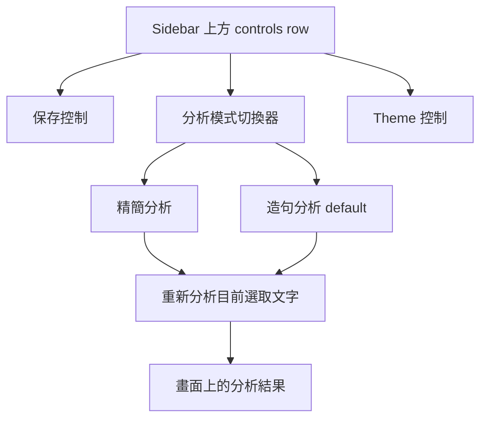

# Sidebar Analysis Mode Switch - Plan

## Goal Capsule

- **Objective:** 在 Chrome extension sidebar 加入可見的分析模式切換器，讓學習者能在快速理解與造句導向分析之間切換，而不需要看到 raw prompt version label。
- **Product authority:** J-Buddy 的產品方向是把日文說明建立在學習者正在閱讀的真實文本上，並把有用的情境保留下來供後續複習使用。
- **Execution profile:** Code plan，重點在 sidebar UI 行為與既有 prompt variant flow。
- **Stop conditions:** 如果實作需要改 backend prompt semantics、加入 webapp review UI，或引入超過兩種 user-facing mode，停止並回到產品範圍確認。
- **Tail ownership:** 完成 extension UI、mode persistence、cache isolation、重新分析行為與測試後交由一般 code review / PR 流程收尾。
- **Open blockers:** 無。

---

## Product Contract

### Summary

Chrome extension sidebar 應在上方 controls row 顯示精簡的 `精簡分析` / `造句分析` 模式切換器。
`造句分析` 是預設模式，對應較完整的 prompt 行為；切換模式後會立即重新分析目前選取文字，讓畫面上的結果永遠符合目前選到的學習模式。

### Problem Frame

產品已經有多個 prompt variant，但 sidebar 目前沒有讓學習者選擇分析風格的入口。
如果直接顯示 `v1` 和 `v2`，使用者看到的是實作詞彙，而不是有助於做決定的學習目的。
這個控制項應把選擇包裝成學習目標：快速閱讀輔助，或能重複使用的造句輔助。

### Key Decisions

- **使用學習目的命名。** UI 顯示 `精簡分析` 和 `造句分析`，不顯示 `v1` 和 `v2`。
- **預設使用 `造句分析`。** 這保留目前較完整的 default，也支持「保存後更容易用單字造句」的產品方向。
- **切換器放在上方 controls row。** 模式會影響生成內容，所以它應出現在結果之前，而不是放在 result toolbar。
- **切換後立即重新分析。** 學習者切換模式時，通常是想用新模式看目前這段文字，而不是只影響下一次選字。
- **維持雙模式控制。** 本 scope 不引入 prompt 管理、實驗管理，或開發者用的版本控制 UI。



### Requirements

**Mode Choice**

- R1. Sidebar 顯示一個可見的雙選項分析模式切換器，選項為 `精簡分析` 和 `造句分析`。
- R2. 一般使用者 UI 不顯示 `v1` 或 `v2` 這類 raw prompt identifiers。
- R3. 沒有已保存偏好的使用者預設選中 `造句分析`。
- R4. 使用者選擇的模式會跨 sidebar session 保存。

**Sidebar Behavior**

- R5. 切換器出現在上方 controls row，位置靠近既有 sidebar controls。
- R6. 當目前有有效選取文字時，切換模式會立即開始重新分析目前選取文字。
- R7. 分析執行期間，UI 必須避免重疊的模式切換分析產生過期或模式不一致的結果。
- R8. 如果目前沒有有效選取文字，切換模式只更新保存的偏好，不顯示誤導性的分析結果。

**Result Correctness**

- R9. 畫面上顯示的結果永遠對應目前選中的分析模式。
- R10. 快取結果必須依分析模式分開，讓同一段文字可以有不同的 `精簡分析` 與 `造句分析` 輸出。
- R11. 由模式切換觸發的重新分析必須保留既有 surrounding-context 行為。

**Scope Control**

- R12. 本功能不加入首次使用 onboarding prompt。
- R13. 本功能不加入多 prompt 管理 UI。
- R14. 本功能不向學習者暴露 debug-only prompt assignment controls。

### Key Flow

- F1. 學習者切換分析模式
  - **Trigger:** 學習者已選取日文文字，並在 sidebar 選擇另一個分析模式。
  - **Steps:** Sidebar 保存新模式，針對目前選取文字開始分析，顯示正常 loading state，並在新 response 完成後替換舊結果。
  - **Outcome:** 學習者看到目前文字在所選模式下的分析結果。

### Acceptance Examples

- AE1. **Covers R1, R2, R3.** Given 第一次使用的學習者開啟 sidebar，when controls render，then 可見模式為 `造句分析`，且不出現 raw prompt version label。
- AE2. **Covers R4, R6, R9.** Given 學習者在有有效選取文字時從 `造句分析` 切到 `精簡分析`，when 重新分析完成，then 結果以精簡模式生成，且重新開啟 sidebar 後仍保留該偏好。
- AE3. **Covers R8.** Given 沒有有效選取文字，when 學習者切換模式，then 偏好會更新，但 sidebar 不假裝已有分析結果。
- AE4. **Covers R10, R11.** Given 同一段選取文字分別用兩種模式分析過，when 學習者切回另一個模式，then 快取或顯示內容不會跨模式誤用，且仍反映相同的 surrounding context。

### Success Criteria

- 學習者不需要知道 prompt version terminology，也能發現並切換分析風格。
- `造句分析` 維持為預設學習體驗。
- 切換模式會可靠更新目前結果，而不是把過期分析留在畫面上。
- Sidebar 保持足夠精簡，適合反覆閱讀時使用。

### Scope Boundaries

- 分析模式的 first-run 教學不在 scope 內。
- 超過兩種分析模式不在 scope 內。
- 開發者或 A/B testing controls 不在 scope 內。
- Webapp 複習 UI 變更不在 scope 內。
- Backend prompt content 變更不在 scope 內，除非是為了維持既有 prompt selection contract 的相容性。

### Dependencies / Assumptions

- 既有 backend 可以根據 request 中的 prompt value 選擇正確 prompt。
- 既有 extension 已經有 stored prompt variant 概念，可支撐這個 user-facing mode。
- Planning 階段應在檢查目前 sidebar code 後，決定確切 control mechanics 與 disabled/loading states。

### Sources / Research

- `STRATEGY.md` 將 J-Buddy 錨定在 in-context reading 與 saved review value。
- `CONCEPTS.md` 定義 Prompt variant 是可選擇的 analysis generation prompt contract。
- `japanese-alchemy-chrome-extension/src/scripts/promptVariant.js` 目前會保存並解析 prompt variant，且 default 是 `v2`。
- `japanese-alchemy-chrome-extension/src/sidepanel/sidepanel.js` 已經在呼叫 streaming analysis API 前讀取選中的 prompt variant。
- `japanese-alchemy-chrome-extension/src/sidepanel/sidepanel.html` 包含既有 top controls row 與 result toolbar。
- `japanese-alchemy-hosting/functions/src/v1/explainStreamHandler.ts` 會根據 request prompt value 選擇 backend system prompt。

---

## Planning Contract

### Product Contract Preservation

Product Contract unchanged after brainstorm confirmation.
Planning adds implementation approach, units, verification, and done criteria only.

### Key Technical Decisions

- **KTD1. User-facing mode wraps the existing prompt variant.** The implementation should keep the backend request contract as `prompt: "v1" | "v2"` and map `精簡分析` to `v1`, `造句分析` to `v2` in the extension.
- **KTD2. Mode state belongs beside prompt variant storage.** `japanese-alchemy-chrome-extension/src/scripts/promptVariant.js` already owns defaulting and validation; extending it avoids a second preference source.
- **KTD3. Cache identity includes mode.** The sidepanel's result cache currently keys by selected text and surrounding context, so the same text in different modes would otherwise serve stale output.
- **KTD4. Re-analysis needs stale-stream protection.** The current `isAnalizing` guard prevents overlap but cannot express "newer mode choice wins"; mode switching should either abort or ignore older stream callbacks so only the latest requested mode renders.
- **KTD5. The control is compact, accessible, and generation-scoped.** The mode switch should live in the top controls row before the theme button, use button semantics for two choices, and expose selected state through ARIA rather than as decorative text.

### High-Level Technical Design

```mermaid
sequenceDiagram
  participant User as Learner
  participant UI as Sidebar mode switch
  participant Store as chrome.storage.local
  participant Cache as localStorage result cache
  participant API as explainStream
  participant Panel as Sidebar result

  User->>UI: Selects 精簡分析 or 造句分析
  UI->>Store: Persist mapped prompt variant
  UI->>Cache: Build key from mode + text + context
  alt cached mode-specific result exists
    Cache->>Panel: Render matching cached response
  else valid current selection
    UI->>API: Stream request with mapped prompt
    API-->>Panel: Render latest matching stream only
    Panel->>Cache: Store response under mode-specific key
  else no valid selection
    UI->>Panel: Keep preference; no fake result
  end
```

### Assumptions

- The existing `v2` default remains the correct default for `造句分析`.
- Backend validation already accepts the two prompt values this feature will send.
- Extension unit tests are the primary proof because the backend prompt selection contract is already covered by existing request validation and handler behavior.

### Risks and Mitigations

- **Risk: Long labels crowd the sticky controls row.** Mitigate with a compact segmented control or dropdown-like button styling that wraps predictably on narrow side panels.
- **Risk: Older stream callbacks overwrite the newer mode result.** Mitigate with a request sequence token or equivalent latest-request guard around chunk, done, and error callbacks.
- **Risk: Cache misses become too broad.** Mitigate by adding only prompt variant to the existing selected-text and surrounding-context cache identity.

---

## Implementation Units

### U1. Analysis mode preference and cache identity

- **Goal:** Extend the existing prompt variant helper so user-facing analysis modes map cleanly to stored prompt variants, and cache keys distinguish modes.
- **Requirements:** R1-R4, R9-R11, AE1, AE4.
- **Dependencies:** None.
- **Files:** `japanese-alchemy-chrome-extension/src/scripts/promptVariant.js`, `japanese-alchemy-chrome-extension/tests/promptVariant.test.js`, `japanese-alchemy-chrome-extension/src/scripts/surroundingContext.js`, `japanese-alchemy-chrome-extension/tests/sidepanel.context.test.js`.
- **Approach:** Add a small mode metadata layer around the existing valid variants, including labels for `精簡分析` and `造句分析`, a setter that persists only valid variants, and a way for the cache key builder to include the selected variant while preserving existing context behavior.
- **Patterns to follow:** Keep helper tests isolated from `sidepanel.js`, as `promptVariant.test.js` already does.
- **Test scenarios:** Default resolution still persists `v2`.
  Stored `v1` maps to `精簡分析`; stored `v2` maps to `造句分析`.
  Invalid values reset to the `v2` default.
  Setting a valid mode persists the mapped variant.
  Setting an invalid variant fails without corrupting storage.
  The same selected text and context produce different cache keys for `v1` and `v2`.
  Existing context-before/context-after collision protections still hold.
- **Verification:** `japanese-alchemy-chrome-extension npm test -- --runInBand` covers helper and cache behavior.

### U2. Sidebar analysis mode control

- **Goal:** Add the visible `精簡分析` / `造句分析` control to the sidebar's top controls row without exposing raw prompt version labels.
- **Requirements:** R1-R5, R12-R14, AE1.
- **Dependencies:** U1.
- **Files:** `japanese-alchemy-chrome-extension/src/sidepanel/sidepanel.html`, `japanese-alchemy-chrome-extension/src/sidepanel/sidepanel.js`.
- **Approach:** Add a compact two-option control in `.controls-right` before the theme toggle, initialize it from the prompt variant helper, and update selected state using CSS classes plus ARIA state.
- **Patterns to follow:** Reuse the existing inline CSS style organization and 4px-radius control language from `.theme-toggle`, `.save-for-later-btn`, and toolbar buttons.
- **Test scenarios:** The default rendered state shows `造句分析` selected.
  The visible labels are `精簡分析` and `造句分析`, with no `v1` or `v2` user-facing text.
  The selected button state updates when the stored mode is loaded.
  The control remains usable in light and dark themes.
- **Verification:** DOM-oriented Jest tests or focused helper tests cover initialization and state updates; production build proves markup and bundled imports compile.

### U3. Mode-triggered re-analysis and stale-result protection

- **Goal:** Make a mode change immediately re-run analysis for the current valid selection while preventing stale cached or streamed results from rendering.
- **Requirements:** R6-R11, AE2-AE4.
- **Dependencies:** U1, U2.
- **Files:** `japanese-alchemy-chrome-extension/src/sidepanel/sidepanel.js`, `japanese-alchemy-chrome-extension/tests/formatAnalysisResult.test.js`, `japanese-alchemy-chrome-extension/tests/conjugationIntegration.test.js`, optional new focused sidepanel interaction test under `japanese-alchemy-chrome-extension/tests/`.
- **Approach:** Track the latest selected text, surrounding context, and active request generation inside the sidepanel.
  On mode change, persist the new variant and call the existing analysis flow with the current selection when it is valid.
  Render cache hits only from a mode-aware cache key and let newer requests supersede older stream callbacks.
- **Patterns to follow:** Preserve the existing streaming lifecycle: progressive markdown render on chunks, final conjugation enrichment on done, and `lastResponse` as the source for copy/save/export.
- **Test scenarios:** Switching from `造句分析` to `精簡分析` with valid text calls the streaming API with `v1`.
  Switching back calls the streaming API with `v2`.
  A cached `v2` result is not shown after selecting `精簡分析`.
  An older stream finishing after a newer mode request does not overwrite the newer result.
  With invalid or absent text, switching mode changes preference but does not show the result panel.
- **Verification:** Focused sidepanel interaction coverage protects mode switching; existing formatting and conjugation tests continue to pass unchanged unless they need fixture updates for the new cache key input.

### U4. Build and regression verification

- **Goal:** Prove the extension still builds and the new UI behavior does not break existing analysis, save, copy, or export flows.
- **Requirements:** R1-R14, AE1-AE4.
- **Dependencies:** U1-U3.
- **Files:** `japanese-alchemy-chrome-extension/package.json`, existing extension test files, optional browser smoke evidence from the built sidepanel.
- **Approach:** Run the extension test suite and production build after implementation.
  Add browser-level smoke verification only if the local environment can load the built extension sidebar or serve the sidepanel artifact reliably.
- **Patterns to follow:** Existing project scripts are `npm test -- --runInBand` and `npm run build` from `japanese-alchemy-chrome-extension`.
- **Test scenarios:** Existing parser, request body, context cache, prompt variant, and conjugation integration tests remain green.
  Production webpack build completes with the new sidebar imports and markup.
- **Verification:** Extension test and build commands pass.

---

## Verification Contract

| Check | Scope | Done Signal |
|---|---|---|
| `npm test -- --runInBand` in `japanese-alchemy-chrome-extension` | Unit and integration coverage for mode helpers, cache identity, sidepanel formatting, and existing extension behavior | All Jest tests pass |
| `npm run build` in `japanese-alchemy-chrome-extension` | Production bundle, HTML injection, and import compatibility | Webpack build exits successfully |
| Browser smoke check when available | Visual placement and basic interaction of the sidebar mode switch | The top controls row shows `造句分析` by default and switching modes updates selected state without layout breakage |

---

## Definition of Done

- Product Contract remains unchanged except for explicitly approved clarifications.
- `精簡分析` and `造句分析` are visible in the sidebar top controls row, and raw `v1` / `v2` labels are not exposed to learners.
- `造句分析` maps to `v2`, `精簡分析` maps to `v1`, and the selected mode persists.
- Switching mode with valid selected text immediately re-analyzes that text.
- Cache keys include the selected mode, selected text, and surrounding context.
- Older cached or streamed results cannot overwrite the result for the latest selected mode.
- Extension tests and build pass, or any unavailable browser smoke check is reported with the reason.
- Dead-end implementation code and obsolete experiments are removed before commit.
