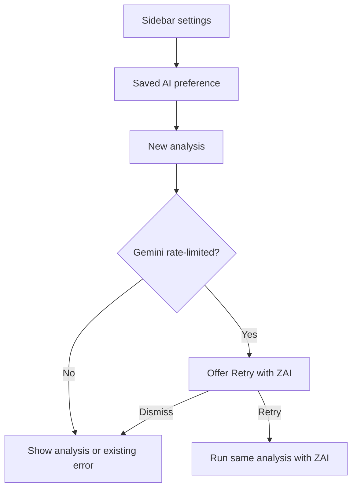

# Sidebar AI Selection and Rate-Limit Recovery - Plan

## Goal Capsule

- **Objective:** Let J-Buddy learners choose Gemini or ZAI independently of the analysis type, and recover quickly when Gemini is temporarily rate-limited.
- **Product authority:** J-Buddy's in-context reading experience depends on making an explanation available while the learner is reading selected Japanese text.
- **Open blockers:** None.

---

## Product Contract

### Summary

The Chrome extension sidebar will provide a saved AI preference with Gemini as the initial default and ZAI as the alternative. This choice is separate from the existing analysis type, and a Gemini rate-limit response will offer a one-time retry with ZAI.

### Problem Frame

Gemini is the current default, but a temporary rate limit can interrupt the reading-and-analysis loop with no alternative for the learner. The existing server-wide provider setting also prevents a user from choosing a different configured AI for a particular analysis.

### Key Decisions

- **AI preference is independent of analysis type.** The sidebar settings surface owns the saved AI preference rather than treating Gemini and ZAI as analysis types. Governs R1, R2. (session-settled: user-approved — chosen over an always-visible combined analysis-options control: analysis type and AI serve different choices.)
- **Gemini remains the initial default.** A user may proactively replace it with ZAI in settings. Governs R2, R3. (session-settled: user-directed — chosen over making ZAI retry-only: users should be able to change their saved default.)
- **Rate-limit recovery requires consent.** A Gemini rate-limit error offers a one-time ZAI retry instead of automatically changing provider. Governs R5, R6. (session-settled: user-approved — chosen over changing settings then retrying or prompting for a full provider choice: it is the fastest recovery without changing the default.)

### Requirements

**Saved AI preference**

- R1. Sidebar settings must present Gemini and ZAI as an AI selection separate from the selected analysis type.
- R2. New users must start with Gemini, and changing the AI selection must persist as the user's default for later analyses.
- R3. Each new analysis must use the AI currently selected by the user when that configured AI is available.

**Analysis identity and recovery**

- R4. Cached analysis results must be scoped to the AI that produced them so changing AI never shows a result created by the other AI.
- R5. When Gemini is rate-limited, the sidebar must offer a one-time action to retry the failed analysis with ZAI.
- R6. A ZAI retry must preserve the failed analysis's text, analysis type, and surrounding context without replacing the user's saved Gemini default.
- R7. The existing failure experience must remain available when ZAI cannot complete the retry or when the Gemini failure is not a rate limit.

### Actors

- **Learner:** selects an AI preference, starts an analysis, and may accept a ZAI retry after a Gemini rate limit.
- **Chrome extension and backend:** retain the selected AI through the request, run the corresponding configured AI, and preserve the analysis identity.

### Key Flows

- F1. **Proactive AI selection**
  - **Trigger:** The learner opens sidebar settings.
  - **Steps:** The learner changes the AI selection; the extension saves it; the next analysis uses that selection.
  - **Outcome:** The learner can use ZAI without waiting for Gemini to fail.
- F2. **Gemini rate-limit recovery**
  - **Trigger:** An analysis using Gemini receives a rate-limit failure.
  - **Steps:** The sidebar explains that Gemini is temporarily unavailable and offers `Retry with ZAI`; the learner accepts; the same analysis runs with ZAI.
  - **Outcome:** The learner receives a new ZAI result while Gemini remains the saved default.

### Acceptance Examples

- AE1. **Covers R1, R2, R3.** Given a new learner, when they open sidebar settings, then Gemini is selected by default; when they select ZAI and start a later analysis, then that analysis uses ZAI while the analysis type remains independently selectable.
- AE2. **Covers R4.** Given an analysis of the same text and context was previously completed with Gemini, when the learner changes the AI to ZAI and runs it again, then the sidebar does not reuse the Gemini result as the ZAI result.
- AE3. **Covers R5, R6.** Given Gemini is rate-limited during an analysis, when the learner chooses `Retry with ZAI`, then ZAI receives the same text, analysis type, and surrounding context, and Gemini remains the saved default.
- AE4. **Covers R7.** Given ZAI cannot complete a retry, when the retry fails, then the learner receives the normal error state rather than another automatic provider switch.

### Scope Boundaries

- Do not automatically switch AI providers or modify the saved preference after a Gemini rate limit.
- Do not offer the ZAI retry for non-rate-limit Gemini failures.
- Do not add new analysis types or change the meaning of existing analysis types.
- Do not expose credentials, raw backend configuration, or an unrestricted list of backend models in the sidebar.

### Dependencies / Assumptions

- Gemini and ZAI remain configured and individually available as user-selectable backend options.
- The backend can safely authorize only the supported AI choices per request.
- The sidebar can persist a user preference locally without requiring a cross-device preference feature in this scope.

### Sources / Research

- `japanese-alchemy-hosting/functions/src/config.ts` and `japanese-alchemy-hosting/functions/src/services/llmService.ts` show that provider choice is currently server-wide.
- `japanese-alchemy-hosting/functions/src/v1/explainStreamHandler.ts` and `japanese-alchemy-hosting/functions/src/v1/requestValidation.ts` show that streaming requests currently lack an AI selection.
- `japanese-alchemy-chrome-extension/src/scripts/jaAlchemyApiService.js` and `japanese-alchemy-chrome-extension/src/scripts/requestBody.js` show the current streaming request contract.
- `japanese-alchemy-chrome-extension/src/sidepanel/sidepanel.js` and `japanese-alchemy-chrome-extension/src/scripts/surroundingContext.js` show that the current analysis cache identity omits AI selection.

---

## Planning Contract

### Key Technical Decisions

- KTD1. Use an allowlisted request-level AI identifier and construct the corresponding LLM service from it, while retaining Gemini as the default for absent identifiers.
- KTD2. Keep the preference in `chrome.storage.local`, following the existing prompt-variant persistence pattern.
- KTD3. Treat a 429 stream failure as a structured, retryable client error so the sidebar can offer a one-time ZAI retry without changing the preference.

### Implementation Units

### U1. Request-scoped AI selection

- **Goal:** Accept an allowlisted AI choice on batch and streaming explain requests and route it to the matching configured service.
- **Files:** `japanese-alchemy-hosting/functions/src/services/llmService.ts`, `japanese-alchemy-hosting/functions/src/v1/requestValidation.ts`, `japanese-alchemy-hosting/functions/src/v1/explainStreamHandler.ts`, `japanese-alchemy-hosting/functions/src/v1/explainCallable.ts`, and their tests.
- **Test scenarios:** Gemini remains the default; ZAI requests instantiate ZAI; an unknown AI is rejected; both request handlers pass the chosen AI through.

### U2. Sidebar preference and request identity

- **Goal:** Add a settings control for the saved AI preference and include it in outgoing request and cache identity.
- **Files:** `japanese-alchemy-chrome-extension/src/sidepanel/sidepanel.html`, `japanese-alchemy-chrome-extension/src/sidepanel/sidepanel.js`, `japanese-alchemy-chrome-extension/src/scripts/requestBody.js`, a new AI-preference helper, `japanese-alchemy-chrome-extension/src/scripts/surroundingContext.js`, and extension tests.
- **Test scenarios:** Gemini is persisted on first use; ZAI is saved after changing settings; request bodies carry the selection; cache keys differ by AI.

### U3. Rate-limit retry

- **Goal:** Offer one ZAI retry when a Gemini analysis fails with a 429 while preserving the selected text, prompt variant, and context.
- **Files:** `japanese-alchemy-chrome-extension/src/scripts/jaAlchemyApiService.js`, `japanese-alchemy-chrome-extension/src/sidepanel/sidepanel.js`, `japanese-alchemy-chrome-extension/src/sidepanel/sidepanel.html`, and extension tests.
- **Test scenarios:** Gemini 429 shows a retry action; accepting it runs ZAI once without changing the saved default; non-429 and failed ZAI retries retain normal error behavior.

## Verification Contract

| Gate | Command |
|---|---|
| Functions tests | `cd japanese-alchemy-hosting/functions && npm test -- --runInBand` |
| Functions build | `cd japanese-alchemy-hosting/functions && npm run build` |
| Extension tests | `cd japanese-alchemy-chrome-extension && npm test -- --runInBand` |
| Extension build | `cd japanese-alchemy-chrome-extension && npm run build` |
