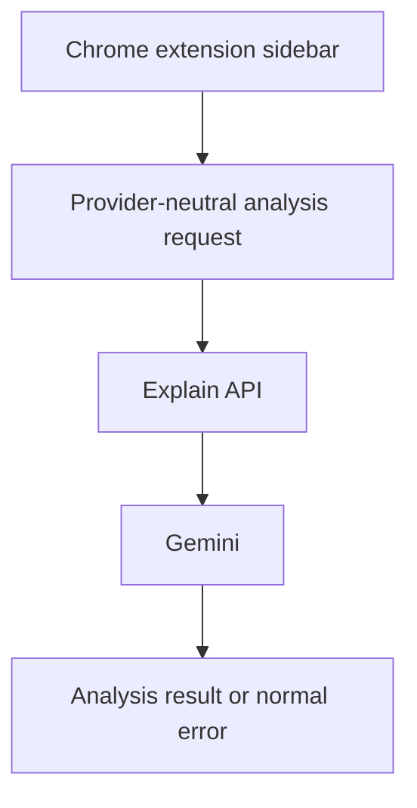
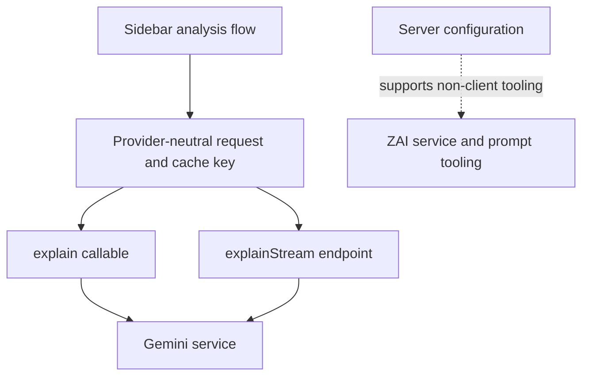

# Gemini-Only Client Analysis - Plan

## Goal Capsule

- **Objective:** Make Gemini the only provider used for analyses initiated by J-Buddy clients.
- **Product authority:** J-Buddy's in-context reading experience should give learners one predictable analysis path while they read Japanese web content.
- **Open blockers:** None.

---

## Product Contract

### Summary

The Chrome extension will present a single analysis experience backed by Gemini. Provider choice and ZAI retry recovery will disappear from the learner-facing flow, and backend explain requests will always execute with Gemini regardless of client-supplied provider input.

### Problem Frame

The current analysis flow exposes a saved Gemini/ZAI preference and a rate-limit fallback. That adds provider-specific state and creates multiple learner outcomes for the same action, when the product needs one predictable explanation path.

### Key Decisions

- **Gemini is client-invariant.** Learners cannot choose or fail over to another provider. Governs R1, R2, R4. (session-settled: user-directed — chosen over retaining a ZAI-compatible fallback: the client surface must have one fixed provider.)
- **Provider selection is not in the client protocol.** The backend API remains available, but its client route is fixed to Gemini. Governs R4, R5.

### Requirements

**Learner experience**

- R1. The Chrome extension sidebar must not display an AI-provider selector or a ZAI retry action.
- R2. An analysis initiated from the Chrome extension must not persist, read, send, or use a client AI preference, including in its cache identity.
- R3. A Gemini failure must retain the normal analysis error experience without offering an alternate-provider retry.

**Provider enforcement**

- R4. Every valid client analysis request must execute with Gemini, even when its payload contains a provider value.
- R5. The existing batch and streaming explain APIs must remain available without exposing a client-selectable provider contract.

### Actors

- A1. **Learner:** starts an analysis and receives either its Gemini result or the normal error state.
- A2. **Chrome extension and backend:** send and process a provider-neutral client request, then route the analysis through Gemini.

### Key Flows

- F1. Fixed-provider analysis
  - **Trigger:** A learner starts an analysis in the sidebar.
  - **Actors:** A1, A2.
  - **Steps:** The extension sends the analysis without a provider choice; the API routes it to Gemini; the sidebar renders the result.
  - **Outcome:** The learner receives a Gemini analysis without managing provider state.
- F2. Gemini error
  - **Trigger:** Gemini cannot complete an analysis.
  - **Actors:** A1, A2.
  - **Steps:** The sidebar presents its normal error experience.
  - **Outcome:** The flow ends without an alternate-provider action.

### Acceptance Examples

- AE1. **Covers R1, R2.** Given a learner opens the sidebar and starts an analysis, when they inspect the available controls and the request state, then no AI preference or provider-selection behavior is present.
- AE2. **Covers R3.** Given Gemini returns a rate-limit or other analysis error, when the sidebar displays the failure, then it offers the normal error experience and no ZAI retry action.
- AE3. **Covers R4, R5.** Given a client sends either explain API a valid analysis request containing `ai: "zai"`, when the API processes it, then the analysis runs with Gemini and the endpoint otherwise preserves its normal behavior.

### Scope Boundaries

- Do not remove ZAI service configuration or the separate prompt-quality tooling.
- Do not change analysis modes, prompt variants, saved-analysis behavior, or the webapp.
- Do not add another learner-facing recovery mechanism for Gemini failures.

### Dependencies / Assumptions

- Gemini remains the configured default provider for the backend.
- The existing API endpoint shapes remain the integration boundary for the Chrome extension.

### Sources / Research

- `japanese-alchemy-chrome-extension/src/sidepanel/sidepanel.html`, `japanese-alchemy-chrome-extension/src/sidepanel/sidepanel.js`, and `japanese-alchemy-chrome-extension/src/scripts/requestBody.js` contain the current selector, preference, retry, and request behavior.
- `japanese-alchemy-hosting/functions/src/v1/explainCallable.ts`, `japanese-alchemy-hosting/functions/src/v1/explainStreamHandler.ts`, and `japanese-alchemy-hosting/functions/src/services/llmService.ts` contain the client provider-routing behavior and Gemini default.
- The existing extension and backend tests cover the old provider-selection behavior but require Gemini-only and retry-removal coverage.

---

## Planning Contract

### Product Contract Preservation

Product Contract unchanged.

### Key Technical Decisions

- KTD1. **Pin Gemini at both client API handlers.** Pass the Gemini provider explicitly at the callable and streaming handler boundary instead of inheriting the mutable default. Governs R4, R5. (session-settled: user-directed — chosen over retaining a ZAI-compatible fallback: the client surface must have one fixed provider.)
- KTD2. **Accept known legacy provider values but ignore them.** Keep existing validation for `gemini` and `zai`, retain rejection of malformed values, and remove the value from routing and client-facing construction. Governs R4, R5.
- KTD3. **Version the provider-neutral cache namespace.** Bump the cache version while removing the provider segment so a pre-change ZAI result cannot become a Gemini cache hit. Governs R2. (session-settled: user-approved — chosen over preserving pre-change cache keys: stale provider-specific results must not appear as Gemini.)

### High-Level Technical Design

### Assumptions

- Existing `chrome.storage.local` values for `aiPreference` become inert. The plan does not add a one-time storage cleanup path.
- The backend continues to accept the existing valid provider values only for compatibility. New client requests do not construct the field.

### Implementation Sequence

1. U1 hardens both backend handlers so legacy and provider-neutral requests have the same Gemini route.
2. U2 removes provider data from the extension request and cache contracts while invalidating older cache entries.
3. U3 removes the sidebar control and retry behavior after the provider-neutral client boundary is in place.

---

## Implementation Units

### U1. Enforce Gemini at the backend request boundary

- **Goal:** Make both explain endpoints route every valid client request through Gemini while retaining their current API behavior.
- **Requirements:** R4, R5, AE3.
- **Dependencies:** None.
- **Files:** `japanese-alchemy-hosting/functions/src/v1/explainCallable.ts`, `japanese-alchemy-hosting/functions/src/v1/explainStreamHandler.ts`, `japanese-alchemy-hosting/functions/src/v1/requestValidation.ts`, `japanese-alchemy-hosting/functions/test/v1/explainCallable.test.ts`, `japanese-alchemy-hosting/functions/test/v1/explainStreamHandler.test.ts`, `japanese-alchemy-hosting/functions/test/v1/requestValidation.test.ts`.
- **Approach:**
  1. Keep the shared validator's current allowlist for legacy provider values and its malformed-value rejection per KTD2.
  2. Stop using the validated client provider value for handler logging or service selection.
  3. Have both handlers select Gemini explicitly per KTD1 while leaving prompts, context, rate limiting, SSE frames, and response shapes unchanged.
  4. Make the handler mocks observe the provider passed to the LLM-service factory.
- **Patterns to follow:** Keep callable and streaming validation/rate-limit parity in `japanese-alchemy-hosting/functions/src/v1/explainCallable.ts` and `japanese-alchemy-hosting/functions/src/v1/explainStreamHandler.ts`.
- **Test scenarios:**
  - Both endpoints route a provider-neutral request to the Gemini factory.
  - Both endpoints route legacy `ai: "gemini"` and `ai: "zai"` requests to the Gemini factory. Covers AE3.
  - Validation continues to reject an unknown provider value before either handler invokes the LLM.
  - Existing prompt-version, surrounding-context, rate-limit, and streaming completion assertions remain green after the routing change.
- **Verification:** The test suite proves that valid legacy provider input cannot reach ZAI through either client endpoint.

### U2. Neutralize extension request and cache contracts

- **Goal:** Remove provider data from extension requests and cache identity without reusing a pre-change provider-specific response.
- **Requirements:** R2, R4, AE1.
- **Dependencies:** U1.
- **Files:** `japanese-alchemy-chrome-extension/src/scripts/requestBody.js`, `japanese-alchemy-chrome-extension/src/scripts/jaAlchemyApiService.js`, `japanese-alchemy-chrome-extension/src/scripts/surroundingContext.js`, `japanese-alchemy-chrome-extension/tests/requestBody.test.js`, `japanese-alchemy-chrome-extension/tests/sidepanel.context.test.js`.
- **Approach:**
  1. Remove the provider argument from request-body construction and the streaming API-service signature.
  2. Remove the provider component from `buildContextCacheKey` while preserving prompt-variant and surrounding-context separation.
  3. Bump the cache namespace per KTD3 so installed clients miss older provider-specific entries once.
- **Patterns to follow:** Preserve the versioned cache-key format and collision protections in `japanese-alchemy-chrome-extension/src/scripts/surroundingContext.js`; preserve the shared batch/stream request-body builder in `japanese-alchemy-chrome-extension/src/scripts/requestBody.js`.
- **Test scenarios:**
  - A batch or streaming request body contains content, prompt, and applicable context but never `ai`.
  - Cache keys remain stable for identical selection, prompt variant, and context, and differ when any of those inputs differ.
  - A provider-neutral key differs from the prior cache-version key, preventing a stored ZAI-era response from being reused. Covers AE1.
  - Passing an obsolete provider argument does not change the generated cache key.
- **Verification:** Existing analysis cache behavior remains partitioned by prompt and context, while provider state has no effect on a request or cache key.

### U3. Remove provider controls and fallback behavior from the sidebar

- **Goal:** Simplify the sidebar to one Gemini analysis flow and remove all AI-preference runtime code.
- **Requirements:** R1, R2, R3, F1, F2, AE1, AE2.
- **Dependencies:** U2.
- **Files:** `japanese-alchemy-chrome-extension/src/sidepanel/sidepanel.html`, `japanese-alchemy-chrome-extension/src/sidepanel/sidepanel.js`, `japanese-alchemy-chrome-extension/src/scripts/aiPreference.js` (delete), `japanese-alchemy-chrome-extension/tests/sidepanel.analysisModeBehavior.test.js`, `japanese-alchemy-chrome-extension/tests/sidepanel.analysisModeMarkup.test.js`.
- **Approach:**
  1. Remove the provider selector markup and its styling while preserving the analysis-mode controls.
  2. Remove AI-preference imports, state, initialization, event listeners, and provider-dependent cache/request arguments.
  3. Keep the normal streaming error and loading-reset behavior, but remove the rate-limit-specific ZAI button, its listener, and any second analysis request.
  4. Delete the now-unreferenced AI-preference helper; do not read or migrate old stored preference data.
- **Patterns to follow:** Preserve the completed-stream finalization path in `japanese-alchemy-chrome-extension/src/sidepanel/sidepanel.js`, including the shared enriched-markdown result used for rendering, saving, copying, exporting, and caching.
- **Test scenarios:**
  - Sidebar markup contains the analysis-mode controls but no provider selector or provider data attributes. Covers AE1.
  - A normal analysis calls the provider-neutral streaming service signature and does not access an AI preference.
  - A Gemini 429 produces the normal error state, resets loading, makes exactly one request, and renders no ZAI retry control. Covers AE2.
  - Non-429 errors retain the existing normal error state without a retry control.
  - Prompt-mode changes still force a fresh analysis and stale streaming callbacks cannot overwrite the latest result.
- **Verification:** No Chrome extension sidebar import or DOM event path references `aiPreference`, ZAI, or a provider-retry control, while normal analysis and error behavior remain covered.

---

## System-Wide Impact

- **Existing installations:** Old local AI-preference values remain unused. The cache version changes once, so the first matching analysis after upgrade is recomputed.
- **API compatibility:** Existing batch and stream endpoints retain their request/response shapes. Known legacy provider values remain valid inputs but no longer select the provider.
- **Backend operations:** ZAI service configuration and prompt-quality tooling remain available outside the client request path.

---

## Risks & Dependencies

- **Stale cached analysis:** Dropping the provider segment without a version bump could display an older ZAI response as Gemini. U2 prevents this through KTD3.
- **Incomplete mock coverage:** Current backend mocks do not inspect factory arguments. U1 must make provider pinning observable in tests.
- **Streaming regression:** Provider cleanup must not change existing chunk, done, or ordinary error semantics. U3 preserves and tests those boundaries.

---

## Verification Contract

| Gate | Command | Proves |
|---|---|---|
| Functions tests | `cd japanese-alchemy-hosting/functions && npm test -- --runInBand` | Both request handlers pin Gemini and preserve validation, rate-limit, prompt, and stream behavior. |
| Functions build | `cd japanese-alchemy-hosting/functions && npm run build` | TypeScript handler and mock changes compile. |
| Extension tests | `cd japanese-alchemy-chrome-extension && npm test -- --runInBand` | Provider-neutral request/cache contracts and sidebar removal behavior work. |
| Extension build | `cd japanese-alchemy-chrome-extension && npm run build` | The packaged extension no longer imports the removed preference module. |

---

## Definition of Done

- U1 is complete when both explain endpoints always instantiate Gemini for provider-neutral and legacy-valid client requests.
- U2 is complete when extension requests and cache keys have no provider dimension and the cache version prevents reuse of old entries.
- U3 is complete when the sidebar exposes no provider choice or ZAI retry while retaining normal analysis, cache, and error behavior.
- All Verification Contract gates pass.
- The final diff contains no abandoned provider-selection code, tests, or documentation that contradicts the Gemini-only Product Contract.
