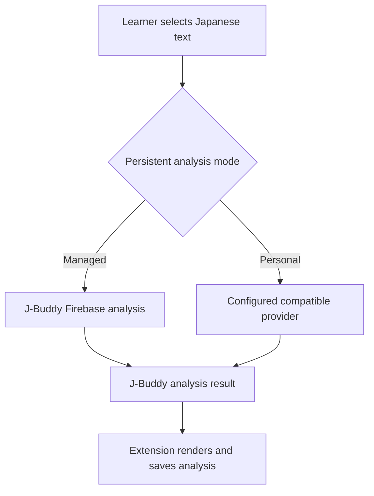
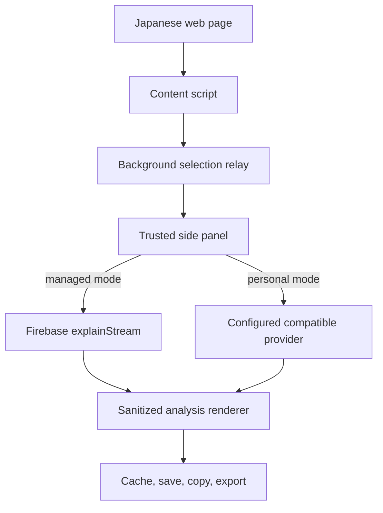
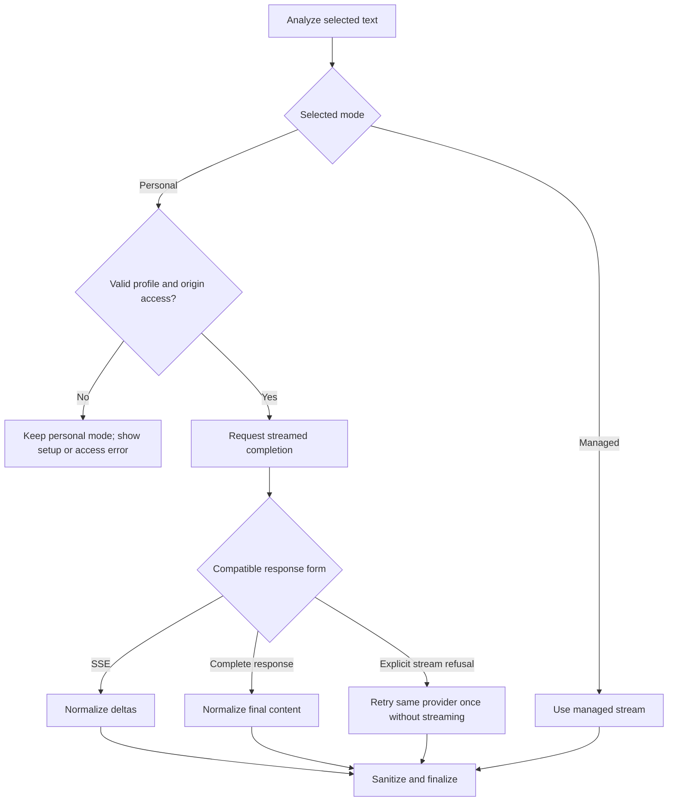

# Extension Personal Provider Analysis - Plan

## Goal Capsule

- **Objective:** Let Chrome-extension learners analyze Japanese text through one personally configured OpenAI-compatible provider, without relying on J-Buddy's backend LLM path.
- **Product authority:** This plan owns analysis-provider selection in the Chrome extension only. The webapp remains a saved-items and review experience.
- **Open blockers:** None.

---

## Product Contract

### Summary

The Chrome extension will offer a personal-provider analysis mode alongside J-Buddy's managed backend mode. A learner can configure one device-local OpenAI-compatible provider and make either mode their persistent default.

### Problem Frame

Managed Gemini availability can temporarily prevent learners from analyzing the text they are reading. Learners who already have an LLM provider and API key need a path that continues to work when the managed LLM path is unavailable, without sending their key through J-Buddy.

### Key Decisions

- **The Chrome extension is the only client in scope.** The webapp remains unchanged. Governs R1, R2. (session-settled: user-directed — chosen over sharing settings with the webapp: provider setup is Chrome-extension-only for now.)
- **One local OpenAI-compatible profile is enough.** It remains in the browser profile rather than Chrome Sync. Governs R2, R3. (session-settled: user-directed — chosen over multiple saved providers: the smallest useful version has one provider; chosen over sync: private keys stay on the device.)
- **The provider mode is persistent and learner-controlled.** Managed mode is the first-run default; a configured personal provider can become the default. Governs R4, R5, R8. (session-settled: user-directed — chosen over a per-analysis toggle: the Analyze action stays simple.)
- **Personal requests are direct and transparent.** The extension does not proxy a personal key through Firebase or fail over automatically. Governs R5, R7, R8. (session-settled: user-directed — chosen over Firebase relay and managed fallback: users must know which provider handled the analysis.)
- **Streaming is preferred, not mandatory.** Personal analysis uses progressive output when available and accepts a complete compatible response otherwise. Governs R6. (session-settled: user-directed — chosen over stream-only support: compatible non-streaming providers remain usable.)

### Requirements

**Provider setup and mode**

- R1. The Chrome extension must provide settings for one personal provider with an API URL, API key, and model.
- R2. Personal-provider settings and the API key must remain in protected current-browser-profile storage and must not be synced, saved to Firestore, or sent to Firebase.
- R3. Setup must make clear that the selected provider receives the analysis request and may charge for its use.
- R4. With no personal provider configured, managed backend analysis must remain the default experience.
- R5. After configuration, a learner must be able to persistently choose personal-provider or managed-backend analysis as their default.

**Analysis behavior**

- R6. When personal-provider mode is selected, the extension must send the analysis directly to the configured compatible provider and render progressive output when the provider streams, otherwise render its complete response.
- R7. If a configured endpoint cannot accept a direct extension request, the extension must report that the endpoint is unsupported and must not relay the request through Firebase.
- R8. If the selected personal provider fails, the extension must preserve the selected mode and show the provider failure without automatically switching to managed analysis.
- R9. Personal-provider analysis must preserve J-Buddy's structured analysis format so existing rendering, saving, caching, copying, and export behavior continue to work.
- R10. Personal-provider analysis must preserve the selected prompt variant and surrounding-text context supplied by the current analysis flow.
- R11. The extension must sanitize personal-provider output before it enters the side panel while preserving the markup required by J-Buddy analysis rendering.

### Actors

- A1. **Learner:** configures a provider and chooses the default analysis mode.
- A2. **Chrome extension:** keeps the mode and personal settings local, sends the selected analysis path, and renders the resulting analysis.
- A3. **Personal provider or J-Buddy managed backend:** receives the selected analysis request and returns a J-Buddy-compatible result.

### Key Flows

- F1. First-run managed analysis
  - **Trigger:** A learner starts analysis before configuring a personal provider.
  - **Actors:** A1, A2, A3.
  - **Steps:** The extension uses managed mode; the managed backend returns the analysis.
  - **Outcome:** Zero-setup analysis remains available. Covers R4.
- F2. Personal-provider setup and selection
  - **Trigger:** A learner enters provider settings.
  - **Actors:** A1, A2.
  - **Steps:** The learner supplies one provider profile and selects personal mode as the persistent default.
  - **Outcome:** Later analyses use the learner's provider directly. Covers R1, R2, R3, R5.
- F3. Direct personal analysis
  - **Trigger:** A learner starts analysis while personal mode is selected.
  - **Actors:** A1, A2, A3.
  - **Steps:** The extension sends the current prompt and context to the provider; it renders streamed output when available or a complete response otherwise.
  - **Outcome:** The normal J-Buddy analysis result remains available without the backend LLM path. Covers R6, R9, R10.
- F4. Unsupported or failed personal provider
  - **Trigger:** The selected provider blocks the request or returns an error.
  - **Actors:** A1, A2, A3.
  - **Steps:** The extension identifies the endpoint as unsupported or shows the provider failure.
  - **Outcome:** The selected mode remains unchanged and the request is not proxied or retried with managed analysis. Covers R7, R8.

### Acceptance Examples

- AE1. **Covers R1, R2, R3, R5.** Given a learner opens provider settings, when they configure one provider and choose it as default, then the extension retains the profile only locally and clearly identifies its direct-use and billing implications.
- AE2. **Covers R4.** Given a learner has not configured a personal provider, when they select text and analyze it, then the extension uses managed backend analysis.
- AE3. **Covers R6, R9, R10, R11.** Given personal mode is selected and the provider accepts the direct request, when the learner analyzes selected text with a prompt variant and context, then the extension renders a sanitized J-Buddy-compatible analysis progressively when streamed or after a complete response otherwise.
- AE4. **Covers R7, R8.** Given personal mode is selected, when the endpoint blocks direct extension access or the provider returns an error, then the extension explains the failure and does not proxy or automatically switch providers.

### Success Criteria

- A configured and reachable personal provider can complete an analysis while the managed backend LLM path is unavailable.
- Personal-provider output remains usable by the extension's existing analysis-result workflows.
- A learner's personal API key never reaches Firebase or Firestore.

### Scope Boundaries

- Do not add personal-provider configuration to the webapp.
- Do not support multiple saved providers, Chrome Sync for API keys, or per-analysis provider selection.
- Do not implement Firebase proxying, automatic provider failover, or a workaround for endpoints that block direct extension requests.
- Do not change the managed backend's provider configuration or remove its existing analysis APIs.

### Dependencies / Assumptions

- A learner's configured endpoint supports the OpenAI-compatible analysis request and response contract required for J-Buddy analysis.
- The learner authorizes the extension to connect directly to the configured provider endpoint.
- Existing account, saved-item, and review behavior may continue to use Firebase; only LLM analysis traffic in personal mode bypasses Firebase.

### Sources / Research

- `japanese-alchemy-chrome-extension/src/scripts/jaAlchemyApiService.js` and `japanese-alchemy-chrome-extension/src/sidepanel/sidepanel.js` establish the current streamed Firebase analysis path.
- `japanese-alchemy-hosting/functions/src/v1/explainCallable.ts` and `japanese-alchemy-hosting/functions/src/v1/explainStreamHandler.ts` currently pin client analysis to Gemini.
- `japanese-alchemy-hosting/functions/src/config.ts`, `japanese-alchemy-hosting/functions/secrets.example`, and the LLM service implementations establish the existing `api_url`, `api_key`, and `model` OpenAI-compatible convention.
- `japanese-alchemy-chrome-extension/src/manifest.json` has no arbitrary provider host permissions today, so direct endpoint access requires a deliberate extension permission design.
- `docs/plans/2026-08-08-001-feat-ai-provider-selection-plan.md` describes the superseded Gemini-only client direction; it is historical context, not authority for this Product Contract.
- Chrome extension guidance on [cross-origin requests](https://developer.chrome.com/docs/extensions/develop/concepts/network-requests), [optional permissions](https://developer.chrome.com/docs/extensions/reference/api/permissions), and [storage access](https://developer.chrome.com/docs/extensions/reference/api/storage) defines the direct-request and local-secret boundaries.

---

## Planning Contract

### Product Contract Preservation

Product Contract changed: R11 and AE3 now require personal-provider output sanitization after the plan-time scope confirmation.

### Key Technical Decisions

- KTD1. **Store one profile in protected extension-local storage.** At extension startup, restrict `chrome.storage.local` to trusted extension contexts before profile use; background selection messages must never return profile or authorization fields. Store the profile, persistent route, and non-secret revision there. No profile on first run or an explicit clear persists managed mode; a selected personal route with an invalid, incomplete, or inaccessible profile remains selected but blocks analysis with a setup/access error. Governs R1, R2, R4, R5, R8. (session-settled: user-directed — chosen over multiple profiles and Chrome Sync: one provider stays in the current browser profile.)
- KTD2. **Request and contain only the configured provider origin.** Parse the HTTPS API base URL; reject user info, query, and fragment, preserve its normalized base path for transport, and derive a separate origin-only optional permission. Acquire the new origin from the learner's setup action before committing a replacement profile, then remove the old origin after replacement or clear when it is no longer active. Missing or revoked access blocks personal analysis without a proxy. Governs R1, R3, R7. (session-settled: user-directed — chosen over a Firebase proxy: personal requests remain direct.)
- KTD3. **Give the extension its own OpenAI-compatible analysis adapter with deliberate parity evidence.** The side panel owns prompt selection, context construction, request assembly, and direct response normalization; it keeps a browser-safe copy of J-Buddy's two prompt contracts rather than calling Firebase for them. Versioned golden request fixtures derived from the server prompt/message contract make any direct-contract drift explicit in extension tests; the server files are reference inputs, not routing changes in this feature. Governs R6, R9, R10. (session-settled: user-directed — chosen over backend-owned LLM analysis: the configured provider performs the analysis.)
- KTD4. **Treat streamed and complete provider responses as one result contract.** Prefer streaming and accept a compatible complete response to a streamed request. Retry once without streaming only for an allow-listed, pre-content HTTP refusal that explicitly identifies unsupported streaming, after consuming or cancelling that first response; all other HTTP, network, parser, or post-delta failures are terminal personal-mode errors. Incomplete streams never become saved or cached analyses. Governs R6, R8, R9. (session-settled: user-directed — chosen over stream-only support: compatible complete responses remain usable.)
- KTD5. **Partition cached analyses by source and profile revision.** Include managed versus personal source identity and a non-secret profile revision in the cache identity, then invalidate an in-flight result when either changes. Governs R5, R8, R9.
- KTD6. **Sanitize every analysis-to-DOM rendering path with an HTML allow-list.** Add a browser sanitizer after markdown/ruby/checkbox transformation and before every side-panel HTML insertion, including streaming previews, completed results, and cache replays. Preserve only the markdown-derived elements J-Buddy needs; render provider error text as text, never HTML. Governs R11.

### High-Level Technical Design

The extension keeps provider credentials and direct network requests inside trusted extension contexts. Content scripts continue to supply selected text through the existing background-message path and never receive the profile or API key.

### Implementation Sequence

1. U1 establishes secure, valid provider state and per-origin access before the UI can select personal mode.
2. U2 exposes that state in the side panel without colliding with existing prompt-variant controls.
3. U3 creates the browser-owned request and response adapter that preserves the analysis-markdown contract.
4. U4 routes analyses through the selected adapter and isolates cached and in-flight results.
5. U5 hardens rendering and completes end-to-end regression coverage.

---

## Implementation Units

### U1. Add protected provider state and optional host access

- **Goal:** Persist one valid personal-provider profile and managed/personal mode without exposing the API key to web-page contexts.
- **Requirements:** R1, R2, R3, R4, R5, R7.
- **Dependencies:** None.
- **Files:** `japanese-alchemy-chrome-extension/src/manifest.json`, `japanese-alchemy-chrome-extension/src/scripts/background.js`, `japanese-alchemy-chrome-extension/src/scripts/personalProvider.js` (new), `japanese-alchemy-chrome-extension/tests/personalProvider.test.js` (new), `japanese-alchemy-chrome-extension/tests/jest.setup.js`.
- **Approach:**
  1. Extend the existing Chrome-local preference pattern with profile, route, and revision helpers that parse a single HTTPS API base URL, reject credentials/query/fragment, retain a normalized base path, and validate key and model.
  2. At startup, restrict local storage to trusted extension contexts before profile access; preserve the content-script-to-background selection relay and ensure its messages never return provider data.
  3. Declare optional HTTPS host access, derive only the normalized origin pattern, acquire the new origin during the learner's save or enable action before profile commit, and remove an inactive prior origin after replacement or clear.
  4. Keep managed mode active on first run or after explicit clear. If personal mode is selected but its profile is invalid, setup is incomplete, permission is denied, or access is later revoked, keep personal mode selected and block analysis with an actionable error.
- **Patterns to follow:** `japanese-alchemy-chrome-extension/src/scripts/promptVariant.js` for persisted preference validation; `japanese-alchemy-chrome-extension/src/scripts/background.js` for trusted-context message relaying.
- **Test scenarios:**
  - A complete HTTPS profile persists locally and reads back with a non-secret revision.
  - First run, or a failed attempt to create a personal profile, remains in managed mode; an already-selected personal route with a missing, malformed, non-HTTPS, or incomplete profile remains selected and blocks analysis.
  - Saving a profile requests only its origin; denied or revoked access blocks personal analysis without rerouting it to managed.
  - Replacing or clearing a profile removes the inactive origin permission; clearing an active profile then switches the persisted mode to managed and removes credentials.
  - Storage access is locked before profile use, provider data never appears in background responses, and the existing selection relay still works.
  - Keys never appear in synchronized storage, request-independent cache state, or logged test arguments.
- **Verification:** Provider state is valid only when its local profile and origin permission both exist, and selection text still reaches the side panel.

### U2. Add side-panel provider setup and mode controls

- **Goal:** Let a learner configure one provider, understand its privacy and billing implications, and choose the persistent analysis route.
- **Requirements:** R1, R3, R4, R5, R7.
- **Dependencies:** U1.
- **Files:** `japanese-alchemy-chrome-extension/src/sidepanel/sidepanel.html`, `japanese-alchemy-chrome-extension/src/sidepanel/sidepanel.js`, `japanese-alchemy-chrome-extension/tests/sidepanel.analysisModeMarkup.test.js`, `japanese-alchemy-chrome-extension/tests/sidepanel.analysisModeBehavior.test.js`.
- **Approach:**
  1. Add settings inside the existing side panel, separate from the existing learner-facing prompt variant control.
  2. Render the active managed or personal route, a redacted saved key state, and a clear/reset path.
  3. Require a successful profile save and origin authorization before personal mode can be selected.
  4. Disclose that selected text and surrounding context go directly to the chosen provider and may incur provider charges.
- **Patterns to follow:** Existing side-panel initialization and analysis-mode markup; `ANALYSIS_MODE_OPTIONS` in `japanese-alchemy-chrome-extension/src/scripts/promptVariant.js` for controlled, persisted choices.
- **Test scenarios:**
  - The side panel shows provider settings and route controls without removing prompt-variant controls.
  - First run presents managed mode and a clear path to provider setup.
  - A saved personal profile shows a redacted key and can become the persistent route.
  - Permission denial or invalid configuration during initial setup keeps managed mode selected; denial, revocation, or invalidation after personal mode was selected keeps it selected and explains why analysis is unavailable.
  - Changing provider settings does not silently trigger a new billable analysis.
- **Verification:** A learner can complete setup, switch routes, and understand what data leaves the extension without using an options page.

### U3. Build the direct compatible-provider request adapter

- **Goal:** Recreate the analysis request contract in the trusted side panel and normalize compatible streamed or complete responses.
- **Requirements:** R6, R8, R9, R10.
- **Dependencies:** U1.
- **Files:** `japanese-alchemy-chrome-extension/src/scripts/directAnalysisContract.js` (new), `japanese-alchemy-chrome-extension/src/scripts/directLlmApiService.js` (new), `japanese-alchemy-chrome-extension/tests/directAnalysisContract.test.js` (new), `japanese-alchemy-chrome-extension/tests/directLlmApiService.test.js` (new), `japanese-alchemy-hosting/functions/src/models/systemPromptV1.ts`, `japanese-alchemy-hosting/functions/src/models/systemPromptV2.ts`, `japanese-alchemy-hosting/functions/src/models/analysisMessage.ts`.
- **Approach:**
  1. Create a browser-safe copy of the two system prompts and the selected-text/context construction rules, with versioned golden request fixtures that make parity changes against the server reference deliberate without changing backend routing.
  2. Send OpenAI-compatible chat-completion requests from the side panel using the configured base URL, model, and bearer key.
  3. Normalize raw provider SSE deltas and complete JSON responses into the callbacks used by the existing side-panel lifecycle.
  4. Classify the stream request deterministically: accept a compatible complete response, retry same-provider complete mode only for an allow-listed pre-content unsupported-streaming refusal after closing the first response, and otherwise surface a terminal personal-mode error with no fallback.
- **Execution note:** Start with contract tests that compare prompt-variant and surrounding-context semantics against the server reference before adding the provider transport.
- **Patterns to follow:** `japanese-alchemy-hosting/functions/src/v1/explainStreamHandler.ts` and `japanese-alchemy-hosting/functions/src/models/analysisMessage.ts` for the current analysis contract; `japanese-alchemy-chrome-extension/src/scripts/jaAlchemyApiService.js` for reader lifecycle callbacks.
- **Test scenarios:**
  - Each prompt variant and bounded surrounding context produce the expected direct-provider message contract.
  - A streamed OpenAI-compatible response emits incremental content and exactly one completed result.
  - A successful complete response produces the same final callback without a stream parser.
  - Only an allow-listed, pre-content stream-capability refusal retries once with the same provider; a network error, ambiguous HTTP failure, malformed payload, or any post-delta partial stream does not retry or fail over.
  - Provider error bodies and unsupported response shapes return a redacted actionable error.
- **Verification:** Direct requests preserve the analysis-markdown contract and never send the credential or request through Firebase.

### U4. Route analysis and cache state by selected provider

- **Goal:** Make existing analysis orchestration choose the selected route while preventing stale managed and personal results from crossing boundaries.
- **Requirements:** R4, R5, R6, R8, R9, R10.
- **Dependencies:** U1, U2, U3.
- **Files:** `japanese-alchemy-chrome-extension/src/scripts/jaAlchemyApiService.js`, `japanese-alchemy-chrome-extension/src/scripts/surroundingContext.js`, `japanese-alchemy-chrome-extension/src/sidepanel/sidepanel.js`, `japanese-alchemy-chrome-extension/tests/sidepanel.context.test.js`, `japanese-alchemy-chrome-extension/tests/sidepanel.analysisModeBehavior.test.js`, `japanese-alchemy-chrome-extension/tests/surroundingContext.test.js`.
- **Approach:**
  1. Restore the managed streaming URL derived from Firebase configuration so the packaged managed default does not target the local emulator.
  2. Select the managed or personal adapter before an analysis starts and preserve the existing prompt-variant, context, progress, and finalization behavior; a selected but unavailable personal profile remains a blocking personal-mode error, not a managed request.
  3. Version the cache key with a source identity and non-secret profile revision; clear or ignore active work when settings or route changes.
  4. Keep personal partial output visible only as an incomplete failure and prevent it from reaching final cache, save, copy, or export paths.
- **Patterns to follow:** `analizingSelectedText` in `japanese-alchemy-chrome-extension/src/sidepanel/sidepanel.js`; `buildContextCacheKey` in `japanese-alchemy-chrome-extension/src/scripts/surroundingContext.js`.
- **Test scenarios:**
  - No profile routes analysis to managed streaming; a selected profile routes directly and never calls Firebase analysis.
  - Managed and personal analyses with identical text, context, and prompt do not share a cache entry.
  - Editing the provider profile or switching routes invalidates the prior cache and prevents a stale callback from replacing the current result.
  - Personal-provider failure leaves personal mode selected and does not cache, save, copy, or export an incomplete analysis.
  - Existing prompt-mode changes and surrounding-context cache behavior remain intact.
- **Verification:** The route, cache, and result lifecycle remain internally consistent across every supported mode transition.

### U5. Sanitize analysis rendering and complete regression coverage

- **Goal:** Make personal-provider output safe to render without breaking J-Buddy markup or downstream analysis workflows.
- **Requirements:** R9, R11.
- **Dependencies:** U3, U4.
- **Files:** `japanese-alchemy-chrome-extension/package.json`, `japanese-alchemy-chrome-extension/package-lock.json`, `japanese-alchemy-chrome-extension/src/sidepanel/sidepanel.js`, `japanese-alchemy-chrome-extension/tests/formatAnalysisResult.test.js`, `japanese-alchemy-chrome-extension/tests/conjugationIntegration.test.js`.
- **Approach:**
  1. Add a maintained browser HTML sanitizer and use an allow-list that preserves J-Buddy's rendered markdown, ruby annotations, and save-selection controls.
  2. Route every markdown-to-DOM conversion—streaming preview, completed result, and cache-hit replay—through the allow-listed sanitizer immediately before HTML assignment, while retaining enriched markdown as the single cache/save/copy/export artifact.
  3. Render provider error text with text-only DOM APIs and expose only redacted status/category diagnostics; keep API keys, authorization data, provider bodies, and URL queries out of logs, snapshots, and learner-visible errors.
- **Patterns to follow:** `formatAnalysisResult` and the completed-stream finalization in `japanese-alchemy-chrome-extension/src/sidepanel/sidepanel.js`; `docs/solutions/architecture-patterns/deterministic-client-side-verb-conjugation-engine.md` for one completed analysis artifact across consumers.
- **Test scenarios:**
  - Scriptable markup and unsafe URL attributes from a personal provider are removed from streamed chunks, completed responses, and cache-hit replays before rendering.
  - Ruby annotations, vocabulary/grammar controls, and expected markdown structure survive sanitization.
  - A sanitized completed response still enriches, caches, saves, copies, and exports the same finished analysis artifact.
  - Error rendering and diagnostic logging never include reflected API keys, authorization headers, provider bodies, or endpoint query values.
- **Verification:** Untrusted provider output cannot execute in the extension, and valid J-Buddy analyses retain all existing learner workflows.

---

## System-Wide Impact

- **Learners:** Can use a personally configured provider when the managed LLM path is unavailable, but must authorize one endpoint and accept its privacy and billing terms.
- **Privacy and security:** Personal credentials stay in trusted extension-local storage. Selected text and surrounding context go to the selected provider only in personal mode; an unavailable selected personal profile blocks rather than silently sends the text to Firebase.
- **Firebase:** Authentication, saving, and review remain unchanged. Personal analysis bypasses the Firebase LLM route, while managed analysis stays available.
- **Compatibility:** The Chrome extension requires a current MV3 browser with optional host permissions. Providers must implement the narrow OpenAI-compatible chat-completion contract defined by U3.

---

## Risks & Dependencies

| Risk or dependency | Mitigation |
| --- | --- |
| Providers differ in streaming and error framing | Normalize the supported contract, accept complete responses, and retry only explicit stream-capability refusals. |
| Prompt copies drift from backend analysis behavior | Use server prompts and message construction as a parity reference with contract tests. |
| Personal and managed results become mixed | Version cache identity by source and non-secret profile revision; discard stale in-flight results. |
| Arbitrary provider output attempts unsafe markup | Sanitize the final side-panel HTML with a narrow allow-list and regression tests. |
| Learner denies or later revokes host access | Fail closed in personal mode and direct the learner back to setup without proxying or fallback. |
| A replaced or cleared profile leaves unnecessary host access | Remove the no-longer-active optional origin and test replacement and clear paths. |
| A provider charges twice for a stream fallback | Permit one same-provider non-stream retry only before any response content arrives. |

---

## Verification Contract

| Gate | Command or check | Proves |
| --- | --- | --- |
| Extension unit and integration tests | `cd japanese-alchemy-chrome-extension && npm test -- --runInBand` | Profile security, permission handling, direct request normalization, route/cache isolation, rendering safety, and legacy analysis behavior. |
| Extension production build | `cd japanese-alchemy-chrome-extension && npm run build` | New modules, optional permissions, and the sanitizer bundle into the MV3 extension. |
| Manual managed smoke test | Load the production build, leave personal mode unconfigured, and analyze a valid selection. | The managed default uses the deployed Firebase stream instead of the local emulator. |
| Manual personal-provider smoke test | Configure a compatible HTTPS endpoint, grant its host access, select personal mode, and analyze text with surrounding context. | Direct analysis streams or completes successfully without Firebase receiving the credential. |
| Manual failure-path check | Deny/revoke the endpoint permission and interrupt a personal stream after output begins. | The extension remains in personal mode, reports the issue, and does not save or cache an incomplete result. |

---

## Definition of Done

- U1 through U5 meet their verification outcomes and feature-bearing test scenarios.
- The Chrome extension supports one protected, device-local compatible provider profile and a persistent managed/personal route.
- Personal analysis preserves J-Buddy analysis markdown, prompt variants, surrounding context, progressive rendering when available, and completed-result workflows.
- Personal credentials and authorization data never enter Firebase, Firestore, Chrome Sync, response caches, logs, or user-visible errors.
- Managed analysis remains the default without a profile and uses the configured production stream endpoint.
- Unsupported, denied, malformed, and incomplete personal-provider paths fail in personal mode without proxying, automatic fallback, or abandoned experimental code.
