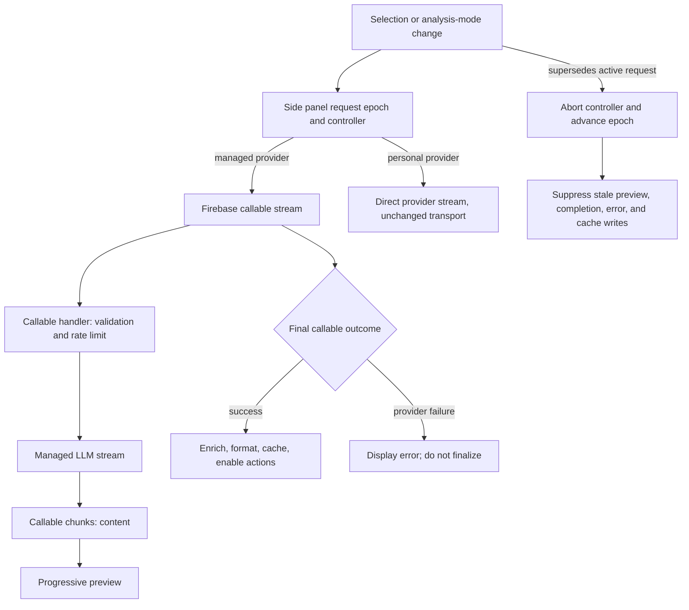

# feat: Consolidate managed callable streaming migration

## Goal Capsule

- **Objective:** Make the managed-provider Analysis Flow's callable-streaming migration a single, durable, implementation-ready record, including delivery evidence for #12–#15 and the remaining documentation/tracker closure.
- **Primary outcome:** Managed analysis streams through Firebase callable APIs in production and the Emulator Suite in development, while final enriched markdown behavior and stale-request safety remain intact.
- **Authority:** #11 defines product scope; #12–#15 define the delivery slices. Current source and tests are the evidence for completed behavior.
- **Stop condition:** The current callable contract, emulator workflow, raw-route retirement, cancellation/partial-result rules, and ticket traceability are documented without reopening unrelated personal-provider, auth, or Analysis markdown work.

---

## Product Contract

### Summary

This plan consolidates the managed-provider migration from a public raw Firebase HTTP/SSE route to Firebase callable streaming.
It preserves progressive learner feedback and the final enriched Analysis markdown workflow while giving developers a safe emulator path and a clear cancellation contract.

### Problem Frame

The earlier managed stream used a hand-maintained raw SSE transport while the batch analysis path already used Firebase callables.
That split duplicated routing, error, and emulator concerns, and left the raw endpoint's consumer ownership unclear.
Superseded streams also needed an explicit lifecycle guarantee so obsolete text could not finalize, cache, or enable actions in the active side panel.

### Requirements

- R1. Managed-provider progressive analysis uses the Firebase callable streaming contract in `us-central1`, preserving validation, prompt variants, surrounding context, per-IP rate limiting, provider selection, and runtime safeguards.
- R2. Progressive chunks remain learner-visible before finalization. A successful final outcome, or the established non-abort partial-result completion path after text has accumulated, enables enriched rendering, cache writes, copy, and saved-item preparation.
- R3. Development extension builds connect the Functions client to the local emulator before callable use, receive only loopback host permission, and retain CSP-safe source maps; production builds do none of these things.
- R4. Functions and Firestore emulators run together for local managed analysis, and `.secret.local` keeps provider credentials outside version control.
- R5. The raw managed `explainStream` HTTP/SSE contract is retired because no supported consumer or owner exists; batch `explain` remains available.
- R6. A newer managed analysis aborts and invalidates its predecessor before asynchronous setup; stale chunks, completion, error UI, cache writes, and delayed previews cannot update the active Analysis Flow.
- R7. Intentional cancellation is silent. Non-abort transport interruption after text follows the established partial-result policy, while a callable final provider failure remains an error and never becomes completed analysis.
- R8. Tests describe user-visible chunks, finalization, failure, development routing, and cancellation behavior without asserting raw SSE parser buffers or HTTP event framing.
- R9. Current documentation and issue tracking clearly identify the callable migration as the supported managed-stream contract and show the delivery evidence for #12–#15.

### Key Flows

- F1. Managed analysis success
  - **Trigger:** A learner selects valid Japanese text while the managed provider is active.
  - **Outcome:** Callable chunks produce a progressive preview; a successful final result triggers enriched formatting, cache writes, and completed actions.
- F2. Managed analysis failure
  - **Trigger:** Validation, rate limiting, or provider execution fails.
  - **Outcome:** Pre-content callable failures display an error. A final provider failure after chunks keeps the rendered preview visible, displays an error, and does not finalize, cache, or enable completed actions.
- F3. Superseded analysis
  - **Trigger:** Selection, context, mode, provider state, or a forced reanalysis changes.
  - **Outcome:** The active controller is aborted and the previous request epoch becomes stale before setup for the replacement begins.
- F4. Emulator verification
  - **Trigger:** A developer loads the development extension against the local Functions and Firestore emulators.
  - **Outcome:** The extension's Firebase traffic targets the emulators; the side panel receives callable chunks and Emulator Suite logs show the request and emulator-local rate-limit activity. The Functions emulator may still call the configured external LLM provider.

### Scope Boundaries

- The personal-provider direct OpenAI-compatible SSE transport remains unchanged, except for sharing the side panel's generic abort lifecycle.
- Analysis markdown schema, ruby tag format, prompt content, saved-item schema, sign-in topology, and webapp persistence remain unchanged.
- The internal provider-response parser may continue to consume provider SSE; the retired surface is the public Firebase raw HTTP/SSE route.
- Emulator routing does not add local HTTP content-script matches. The development loopback permission authorizes callable traffic only; text selection still requires a supported page.

#### Deferred to Follow-Up Work

- Propagating client cancellation to terminate an already-started upstream LLM request is not guaranteed by the current callable handler and is a separate cost-control/operational design decision.
- Closing #11 and #15 or checking their acceptance boxes is tracker housekeeping after the delivery evidence is reviewed; it does not imply additional product implementation.

---

## Planning Contract

### Key Technical Decisions

- KTD1. **Callable streaming is the sole supported managed-stream transport.** `explainStreamCallable` is an `onCall` function; `docs/solutions/CALLABLE_STREAMING_MIGRATION.md` is the current contract, and `docs/solutions/SSE_STREAMING_MIGRATION.md` remains historical.
- KTD2. **Progressive preview and final completion remain separate phases.** Chunks update the accumulated preview. Final success normally promotes markdown through conjugation enrichment, structured formatting, caching, copying, and saving; the established non-abort partial-result completion path is the documented exception.
- KTD3. **Cancellation uses layered protection.** The side panel invalidates a request epoch and aborts its controller before awaited setup; callbacks and throttled previews still check request identity. Either mechanism alone is insufficient for all setup and callback races.
- KTD4. **Partial results depend on failure intent.** A deliberate abort is silent; a non-abort transport exception after accumulated text may finalize that partial text; a final callable `{ success: false, error }` stays an error even after chunks.
- KTD5. **Emulator routing is build-scoped.** Development connects the initialized Functions client to `127.0.0.1:5001` before callable creation and adds loopback host permission. Production retains deployed Functions routing and no local host permission.

### High-Level Technical Design

### Outcome Matrix

| Outcome | Side-panel action | Finalize/cache/enable actions |
|---|---|---|
| Final `{ success: true }` | Render final enriched Analysis markdown | Yes |
| Validation or rate-limit callable error before content | Show error | No |
| Final `{ success: false, error }` | Show error, including after preview chunks | No |
| Non-abort transport interruption after accumulated text | Use the established partial-result completion path | Yes |
| Intentional abort or supersession | Stay silent and ignore stale callbacks | No |

### Assumptions

- The documented Functions emulator workflow is the required local verification path; it still calls the configured external LLM provider unless a separate provider stub is introduced.
- Existing commits and tests are acceptable delivery evidence for the code units; this plan does not use plan status to represent implementation progress.

---

## Implementation Units

> **Delivery status:** U1–U4 are delivery-blueprint and evidence units already represented by the commits and tests in [Delivery Evidence](#delivery-evidence). They are not instructions to reimplement shipped behavior. U5 identifies the remaining documentation and tracker-reconciliation work.

### U1. Callable backend contract

- **Goal:** Deliver the managed streaming handler as a Firebase callable while preserving the existing analysis safeguards and provider stream semantics.
- **Requirements:** R1, R2, R5, R7, R8.
- **Dependencies:** None.
- **Files:** `japanese-alchemy-hosting/functions/src/index.ts`, `japanese-alchemy-hosting/functions/src/v1/explainStreamCallableHandler.ts`, `japanese-alchemy-hosting/functions/src/v1/llmStreamDeltas.ts`, `japanese-alchemy-hosting/functions/test/v1/explainStreamCallableHandler.test.ts`, `japanese-alchemy-hosting/functions/test/index.test.ts`.
- **Approach:** Export `explainStreamCallable` with the streaming runtime timeout, retain validation and rate-limit failure as callable errors, forward provider deltas only to streaming callers, and return a final success/failure object.
- **Patterns to follow:** `explainHandler` request validation and rate-limit wiring; LLM service abstraction and `streamLlmDeltas` for upstream provider parsing.
- **Test scenarios:**
  - A valid streaming callable request emits ordered `{ content }` chunks and resolves with final success.
  - Invalid or oversized data throws `invalid-argument` rather than emitting a stream result.
  - Rate-limit denial throws the appropriate callable error.
  - Provider failure before or after attempted deltas resolves as final `{ success: false, error }`.
  - The public export contains `explainStreamCallable` and no raw `explainStream`/`onRequest` route.
- **Verification:** Backend callable tests prove the external callable contract and retain its validation, limiter, prompt, context, and provider seams.

### U2. Managed callable adapter and emulator build boundary

- **Goal:** Route managed analysis through the Functions SDK in production and the Emulator Suite in development without reintroducing endpoint construction.
- **Requirements:** R1, R3, R4, R7, R8.
- **Dependencies:** U1.
- **Files:** `japanese-alchemy-chrome-extension/src/scripts/jaAlchemyApiService.js`, `japanese-alchemy-chrome-extension/webpack.config.js`, `japanese-alchemy-chrome-extension/src/manifest.json`, `japanese-alchemy-chrome-extension/tests/jaAlchemyApiService.test.js`, `japanese-alchemy-chrome-extension/tests/webpack.config.test.js`, `japanese-alchemy-hosting/functions/package.json`, `japanese-alchemy-hosting/.gitignore`.
- **Approach:** Initialize the regional Functions client, connect it to `127.0.0.1:5001` only for development before creating callables, and pass the standard abort signal to callable streaming. Keep production routing and permissions free of emulator-only behavior.
- **Patterns to follow:** The existing `generateResponse` callable adapter and webpack manifest transformation test style.
- **Test scenarios:**
  - Managed chunks arrive in order and final success calls the completion callback once with accumulated text.
  - A callable error before content calls the error callback; final provider failure does not promote a preview to completion.
  - A non-abort stream failure after text follows the established partial completion path.
  - Development connects the emulator before callable use; production does not.
  - The development manifest has only loopback host permission, and production omits it.
- **Verification:** Extension tests cover the callable callback contract and build output preserves Chrome MV3 CSP compatibility.

### U3. Side-panel request lifecycle and stale-result safety

- **Goal:** Prevent a superseded managed request from affecting the active learner view while preserving identical-request deduplication and existing finalization behavior.
- **Requirements:** R2, R6, R7, R8.
- **Dependencies:** U2.
- **Files:** `japanese-alchemy-chrome-extension/src/sidepanel/sidepanel.js`, `japanese-alchemy-chrome-extension/tests/sidepanel.analysisModeBehavior.test.js`.
- **Approach:** Snapshot selection/context, invalidate the request epoch and abort the active controller before asynchronous setup, then pass one controller to the selected analysis service. Guard all chunks, finalization, errors, and delayed previews with the epoch; clear active UI state on setup failure and preserve non-forced duplicate selection work.
- **Execution note:** Start from deferred-service and abort tests because callback races, not DOM structure, are the highest-risk behavior.
- **Patterns to follow:** Existing `renderStreamingPreview`, `formatAnalysisResult`, context-aware cache key, and personal-provider mode separation.
- **Test scenarios:**
  - A replacement aborts the previous signal before its own setup resolves, and stale completion cannot write cache or render markdown.
  - Cancellation before the first chunk and after a partial chunk invokes neither completion nor error for the stale request.
  - A normal current request transitions from loading to progressive preview then finalized enriched markdown.
  - A duplicate non-forced selection preserves the in-flight stream.
  - A setup failure clears loading/result state and permits a retry for the same selection.
- **Verification:** Side-panel tests prove active UI, cache, and completed-action state can only be changed by the latest request.

### U4. Raw-contract retirement and current operator guidance

- **Goal:** Retire the unsupported public raw SSE route without retiring the internal provider parser or batch callable.
- **Requirements:** R4, R5, R9.
- **Dependencies:** U1, U2.
- **Files:** `docs/solutions/CALLABLE_STREAMING_MIGRATION.md`, `docs/solutions/SSE_STREAMING_MIGRATION.md`, `japanese-alchemy-hosting/README.md`, `japanese-alchemy-hosting/functions/README.md`, `japanese-alchemy-chrome-extension/README.md`.
- **Approach:** Record the no-supported-consumer decision, keep the historical SSE document explicitly non-authoritative, direct new consumers to callable streaming, and document the Functions+Firestore emulator workflow plus extension reload requirements.
- **Patterns to follow:** Existing solution-document YAML frontmatter and the extension README's managed-provider emulator section.
- **Test scenarios:**
  - Documentation review confirms no current consumer instruction points to the raw `explainStream` route.
  - The local workflow names both Functions and Firestore and the Git-ignored `.secret.local` override.
  - The documented development/prod distinction agrees with the manifest-transform and Firebase adapter tests.
- **Verification:** A developer can follow the README workflow, observe progressive `explainStreamCallable` logs in the Emulator Suite, and confirm rate-limit state stays local.

### U5. Consolidation evidence and tracker closure

- **Goal:** Make the completion boundary for #11 and its child tickets auditable without treating documentation as a progress ledger.
- **Requirements:** R8, R9.
- **Dependencies:** U1, U2, U3, U4.
- **Files:** `docs/plans/2026-08-11-001-feat-managed-callable-streaming-plan.md`, `docs/solutions/CALLABLE_STREAMING_MIGRATION.md`, GitHub issues #11 and #15.
- **Approach:** Keep this plan as the durable execution blueprint, add the cancellation/partial-result matrix to the current callable migration documentation, and use linked commits/tests to verify that open issue checkboxes represent tracker cleanup rather than unimplemented behavior.
- **Patterns to follow:** Existing `docs/solutions/CALLABLE_STREAMING_MIGRATION.md` as the current managed-analysis source of truth.
- **Test scenarios:**
  - The callable migration document names `AbortSignal` support and distinguishes abort from non-abort partial-result behavior.
  - Ticket #15 acceptance evidence points to before-first-chunk, after-partial, and normal-completion tests.
  - No current documentation revives the historical raw SSE endpoint.
- **Verification:** Reviewers can trace each #11 requirement to a code/test/documentation seam and close tracker items without an additional product change.

---

## Verification Contract

| Gate | Applies to | Evidence of completion |
|---|---|---|
| Functions tests | U1 | `npm test -- --runInBand` in `japanese-alchemy-hosting/functions` covers callable chunks, finalization, validation, rate limiting, provider failure, and export retirement. |
| Extension tests | U2, U3 | `npm test -- --runInBand` in `japanese-alchemy-chrome-extension` covers callable callbacks, emulator routing, cancellation races, progressive render, and duplicate-selection behavior. |
| Functions quality gates | U1 | `npm run lint` and `npm run build` in `japanese-alchemy-hosting/functions` succeed. |
| Extension production build | U2, U4 | `npm run build` in `japanese-alchemy-chrome-extension` succeeds without eval-based CSP behavior; existing bundle-size advisories are recorded separately from functional correctness. |
| Emulator smoke verification | U2, U4 | The development extension streams a managed analysis while Functions/Firestore emulator logs show `explainStreamCallable` and emulator-local rate-limit activity. |
| Documentation/tracker review | U4, U5 | Current docs name callable streaming and its cancellation matrix; the historical SSE document remains historical; #11/#15 tracker state is reconciled with commit/test evidence. |

---

## Definition of Done

- The current managed-provider stream is callable-only, with the batch `explain` callable retained and no supported raw `explainStream` route.
- Learners receive progressive chunks and the same final enriched Analysis markdown behavior as before the transport migration.
- Validation, rate limits, provider failures, non-abort partial interruptions, and intentional cancellation follow the documented outcome matrix.
- A development extension routes managed-analysis Firebase calls to the Functions emulator, with Functions and Firestore emulators running together and rate-limit state remaining local; the Functions emulator may still call the configured external LLM provider. Production retains deployed Functions routing.
- Superseded requests cannot mutate the current side panel, cache, or completed-action state.
- Documentation names the current callable contract, local workflow, compatibility decision, and cancellation behavior; obsolete SSE details are historical only.
- Ticket delivery can be traced to `13f0e45` (#12), `aec5aa6` (#13), `b5e6d53` (#14), and `6d5e5a4` (#15).

---

## Appendix

### Sources and Research

- Product source: [GitHub issue #11](https://github.com/xfalcons/j-buddy/issues/11) and child tickets [#12](https://github.com/xfalcons/j-buddy/issues/12), [#13](https://github.com/xfalcons/j-buddy/issues/13), [#14](https://github.com/xfalcons/j-buddy/issues/14), and [#15](https://github.com/xfalcons/j-buddy/issues/15).
- Current contract: `docs/solutions/CALLABLE_STREAMING_MIGRATION.md`.
- Historical context only: `docs/solutions/SSE_STREAMING_MIGRATION.md`.
- Backend seams: `japanese-alchemy-hosting/functions/src/index.ts`, `japanese-alchemy-hosting/functions/src/v1/explainStreamCallableHandler.ts`, and their tests.
- Extension seams: `japanese-alchemy-chrome-extension/src/scripts/jaAlchemyApiService.js`, `japanese-alchemy-chrome-extension/src/sidepanel/sidepanel.js`, and their tests.

### Delivery Evidence

| Ticket | Commit | Consolidated result |
|---|---|---|
| #12 | `13f0e45` | Callable backend/client path and callable-seam coverage. |
| #13 | `aec5aa6` | Emulator-aware extension build, local Functions+Firestore workflow, and development-only permission/CSP handling. |
| #14 | `b5e6d53` | Raw public SSE route retirement and callable migration decision. |
| #15 | `6d5e5a4` | Abort lifecycle, stale-state suppression, and cancellation regression coverage. |
