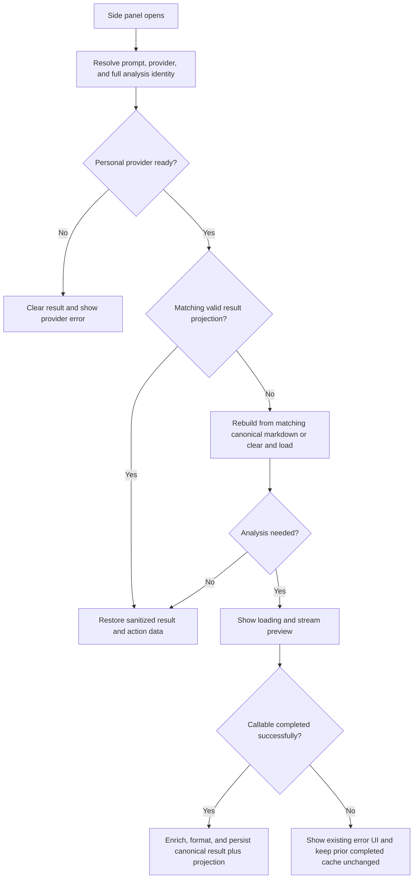

# Sidepanel Analysis Result Restore - Plan

## Goal Capsule

- **Objective:** Restore the latest completed analysis when the Chrome side panel reopens for the same analysis context.
- **Product authority:** Preserve the Product Contract below. This plan only defines the client-side cache, restore, and stream-completion mechanics.
- **Stop conditions:** Stop if the implementation would expose a cached personal-provider result before its readiness check or would make a partial stream look complete.
- **Execution profile:** Implement the units in dependency order with focused regression coverage before the extension-wide test and build checks.

## Product Contract

### Summary

The side panel will restore a completed analysis from its matching client-side cache without requesting a new analysis.
It will rebuild the interactive result from the canonical final analysis data and show loading instead of stale output when the current analysis context differs.

### Key Decisions

- **Restore complete result state, not HTML alone.** The restored result must remain usable by existing result actions. Governs R1, R2. (session-settled: user-directed — chosen over caching HTML only: restored output must remain interactive.)
- **Never show a mismatched result while a new selection loads.** Stale analysis can be mistaken for an explanation of the new text. Governs R3. (session-settled: user-directed — chosen over leaving the cached result visible during loading: avoid stale analysis.)

### Requirements

**Completed-result cache**

- R1. After a successful analysis completes, cache the complete renderable result and the structured state required by existing result actions.
- R2. When the side panel opens with the same analysis identity, render the cached result as completed without starting another analysis request.

**Selection change behavior**

- R3. When the current analysis identity differs from the cached result, clear cached output before showing loading and beginning the new analysis.
- R4. Failed, cancelled, or partial analyses must not replace the last completed cached result.

**Safety and compatibility**

- R5. Cached personal-provider results must continue to honor the existing provider-readiness gate before they can be displayed.
- R6. Restored results must preserve the existing Copy, Save As, and Save for Later behavior.

### Key Flows

- F1. Restore or replace a cached result
  - **Trigger:** The Chrome side panel opens.
  - **Steps:** Resolve the current analysis identity and provider readiness; restore a matching completed result; otherwise clear the rendered result, show loading, and begin the new analysis.
  - **Outcome:** The learner either sees the relevant completed analysis immediately or a clean loading state for the new selection.
  - **Covers:** R2, R3, R5.

### Acceptance Examples

- AE1. Restore a matching result
  - **Covers:** R1, R2, R6.
  - **Given:** A completed analysis is cached for the current selection and context.
  - **When:** The side panel opens.
  - **Then:** Its rendered result appears as complete and its existing result actions remain available.

- AE2. Replace a mismatched result
  - **Covers:** R3.
  - **Given:** A completed result is cached for another analysis context.
  - **When:** The side panel opens for a new selection.
  - **Then:** The cached content is not displayed, and the panel shows loading for the new analysis.

- AE3. Preserve the last completed result on failure
  - **Covers:** R4.
  - **Given:** A completed result is cached.
  - **When:** A later analysis is cancelled, fails, or ends before completion.
  - **Then:** It does not overwrite the cached completed result.

### Scope Boundaries

- This work does not add backend or cross-device result persistence.
- This work does not cache partial streaming output or error states as completed results.
- This work does not preserve unsaved checkbox or sharing choices across a side-panel close.

### Sources / Research

- `japanese-alchemy-chrome-extension/src/sidepanel/sidepanel.js` owns identity resolution, completed-result rendering, action state, and panel-open analysis.
- `japanese-alchemy-chrome-extension/src/scripts/surroundingContext.js` defines the versioned analysis key across selection, context, prompt variant, and provider revision.
- `japanese-alchemy-chrome-extension/src/scripts/jaAlchemyApiService.js` currently converts a non-abort transport failure with partial text into `onDone`, which conflicts with R4.
- `docs/solutions/architecture-patterns/deterministic-client-side-verb-conjugation-engine.md` establishes enriched markdown as the common source for render, save, copy, export, and cache behavior.
- `docs/solutions/CALLABLE_STREAMING_MIGRATION.md` defines callable-stream completion as `{ success: true }` and failure as `{ success: false, error }`.

---

## Planning Contract

### Product Contract Preservation

Product Contract unchanged.

### Key Technical Decisions

- KTD1. **Keep enriched markdown canonical and cache only a validated render projection.** Keep `lastResponse` as the source for Copy and Save As, and make any stored `analysisResult` projection keyed, versioned, validated, and disposable. Fall back to formatting canonical markdown when that projection is absent or invalid. Governs R1, R2, R6. (session-settled: user-directed — chosen over an HTML-only source of truth: restored output must remain interactive.)
- KTD2. **Only terminal callable success completes a managed analysis.** Progressive chunks remain previews, while cancellation and every non-success terminal path route to error handling without calling the side-panel completion callback. Governs R4.
- KTD3. **Reuse the existing full identity and readiness boundary.** A restore must use the current context-cache key and run after personal-provider readiness is known; persisted HTML is sanitized again before insertion. Governs R2, R3, R5.

### High-Level Technical Design

### Implementation Constraints

- Keep the existing context-cache key as the authority for matching text, surrounding context, prompt variant, provider mode, and personal-provider revision.
- Keep enriched markdown as the canonical persisted analysis. A cached HTML/JSON projection is an optimization, never an independent source of truth.
- Store exactly one latest completed-result projection beside the existing canonical response in `localStorage`; never use sync storage, and replace it only after terminal success.
- Treat a missing, malformed, stale, or unsafe projection as a cache miss or canonical-markdown fallback. Do not bypass sanitization or provider-readiness checks.
- Keep existing progressive-preview throttling and do not revive the retired raw streaming route.

---

## Implementation Units

### U1. Enforce terminal success for managed streams

- **Goal:** Ensure that only a confirmed callable success can reach the side-panel completion callback.
- **Requirements:** R4, AE3.
- **Dependencies:** None.
- **Files:** `japanese-alchemy-chrome-extension/src/scripts/jaAlchemyApiService.js`, `japanese-alchemy-chrome-extension/tests/jaAlchemyApiService.test.js`.
- **Approach:** Change the managed streaming adapter so non-abort transport failures with accumulated chunks call the error path instead of `onDone`. Retain silent cancellation and the existing successful callable completion path per KTD2.
- **Patterns to follow:** The direct-provider stream already keeps partial or aborted streams out of `onDone`; callable failures already use `onError` when the terminal result reports `success: false`.
- **Test scenarios:**
  - A managed stream with successful terminal data sends accumulated text to `onDone` once.
  - A managed stream cancelled before or after a chunk sends neither `onDone` nor `onError`.
  - A managed provider failure after preview chunks calls `onError` and never calls `onDone`.
  - A non-abort transport failure after preview chunks calls `onError` and never calls `onDone`.
- **Verification:** The managed adapter distinguishes final success, failure, and cancellation without promoting partial text to a completed result.

### U2. Persist and restore the completed result projection

- **Goal:** Restore a matching completed analysis without a new stream while keeping enriched markdown as the canonical result.
- **Requirements:** R1, R2, R3, R5, R6, F1, AE1, AE2.
- **Dependencies:** U1.
- **Files:** `japanese-alchemy-chrome-extension/src/sidepanel/sidepanel.js`, `japanese-alchemy-chrome-extension/tests/sidepanel.analysisModeBehavior.test.js`.
- **Approach:** Add small side-panel cache helpers for a versioned completed-result projection. Create that projection only after enrichment and final formatting succeed, and store it as the single latest record beside the existing canonical `localStorage` response. Match it with the existing full cache key, validate its version, key, HTML, and structured action data before hydration, sanitize restored HTML, and retain canonical markdown for Copy and Save As. Delegate panel-open restoration through the current analysis path so the provider-readiness gate and mismatch loading behavior remain shared. Per KTD1 and KTD3, malformed or absent projections fall back to compatible canonical markdown or the normal cache-miss path.
- **Patterns to follow:** `formatAnalysisResult()` produces the rendered and structured result; `setCompletedAnalysisAvailable()` controls result actions; `buildContextCacheKey()` separates selection, context, prompt, provider route, and revision.
- **Test scenarios:**
  - Covers AE1. A matching projection restores rendered output, structured save data, and completed actions without starting a stream.
  - Covers AE2. A text, surrounding-context, prompt, provider-mode, or personal-revision mismatch clears old output and starts the normal loading path.
  - A missing or corrupt projection safely rebuilds from matching canonical markdown when available, otherwise follows the cache-miss path.
  - A restored projection is sanitized before insertion and cannot bypass the existing HTML-safety boundary.
  - A failed replacement analysis leaves loading or preview for the existing error UI while retaining, but not redisplaying, the prior completed cache.
  - A revoked or unready personal provider clears and blocks its matching cached result before it is rendered.
  - Copy and Save As continue to use the restored canonical markdown, and Save for Later uses the hydrated structured data.
- **Verification:** Opening the side panel restores only the correct completed result; every other identity or readiness state shows a clean loading or provider-error transition.

### U3. Lock down cache compatibility and completion regressions

- **Goal:** Preserve the cache-key compatibility contract and prove that failed analysis cannot replace a completed result.
- **Requirements:** R1, R2, R3, R4, R6, AE1, AE2, AE3.
- **Dependencies:** U1, U2.
- **Files:** `japanese-alchemy-chrome-extension/tests/sidepanel.context.test.js`, `japanese-alchemy-chrome-extension/tests/sidepanel.analysisModeBehavior.test.js`, `japanese-alchemy-chrome-extension/tests/jaAlchemyApiService.test.js`.
- **Approach:** Extend the existing cache-key and deferred-stream harnesses instead of adding a second identity scheme. Keep legacy canonical-response restoration compatible while ensuring a new completed projection cannot be reused across a different prompt or provider source. Per KTD2, assert that errors and cancellation leave the latest completed cache intact.
- **Patterns to follow:** The context-key tests cover versioning and non-secret provider revisions; the side-panel mode tests already model stale callbacks, cache hits, loading transitions, and personal-provider safety.
- **Test scenarios:**
  - Identical selection, context, prompt, and provider revision produce a reusable cache identity.
  - Each identity dimension changes independently to a cache miss without exposing stale output.
  - A legacy canonical response remains displayable after upgrade when its existing identity matches.
  - A successful later analysis replaces the completed cache, while an error, abort, or partial failure does not.
  - A stale callback from a superseded request cannot overwrite the restored or newer completed result.
- **Verification:** The regression suite proves cache isolation, legacy safety, and completed-result durability across success, failure, cancellation, and replacement.

---

## Verification Contract

| Gate | Applies to | Evidence |
| --- | --- | --- |
| Focused stream tests | U1, U3 | `cd japanese-alchemy-chrome-extension && npm test -- jaAlchemyApiService.test.js --runInBand` passes. |
| Focused side-panel tests | U2, U3 | `cd japanese-alchemy-chrome-extension && npm test -- sidepanel.analysisModeBehavior.test.js sidepanel.context.test.js --runInBand` passes. |
| Extension regression suite | U1-U3 | `cd japanese-alchemy-chrome-extension && npm test -- --runInBand` passes. |
| Production build | U1-U3 | `cd japanese-alchemy-chrome-extension && npm run build` completes successfully. |
| Manual smoke check | U2 | Reopen the panel with the same selection, then with a different selection, and with a revoked personal provider; verify restore, loading, and safety behavior. |

## Definition of Done

- U1, U2, and U3 meet their verification outcomes.
- A matching completed analysis restores without a new stream and retains Copy, Save As, and Save for Later behavior.
- A changed identity clears stale content before the new loading state appears.
- Only a terminal successful stream can replace canonical markdown or its render projection.
- Personal-provider readiness is checked before every restore path.
- No transient checkbox or sharing state is persisted across side-panel closure.
- The extension test suite and production build are green.
- Any exploratory or abandoned cache code is removed from the final change.
