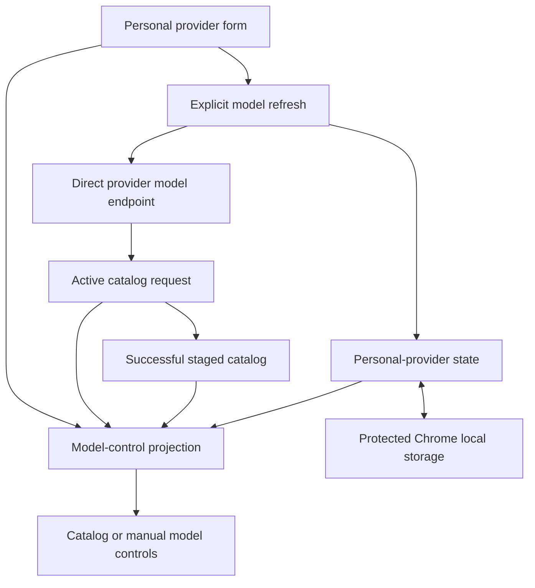
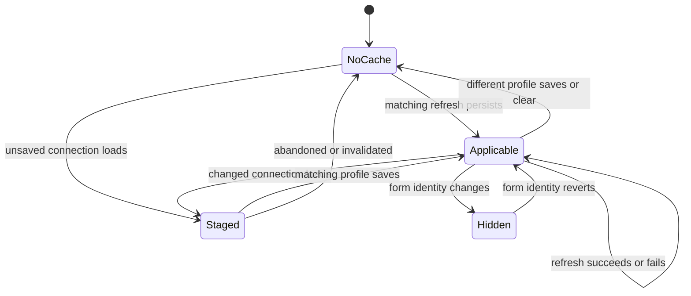
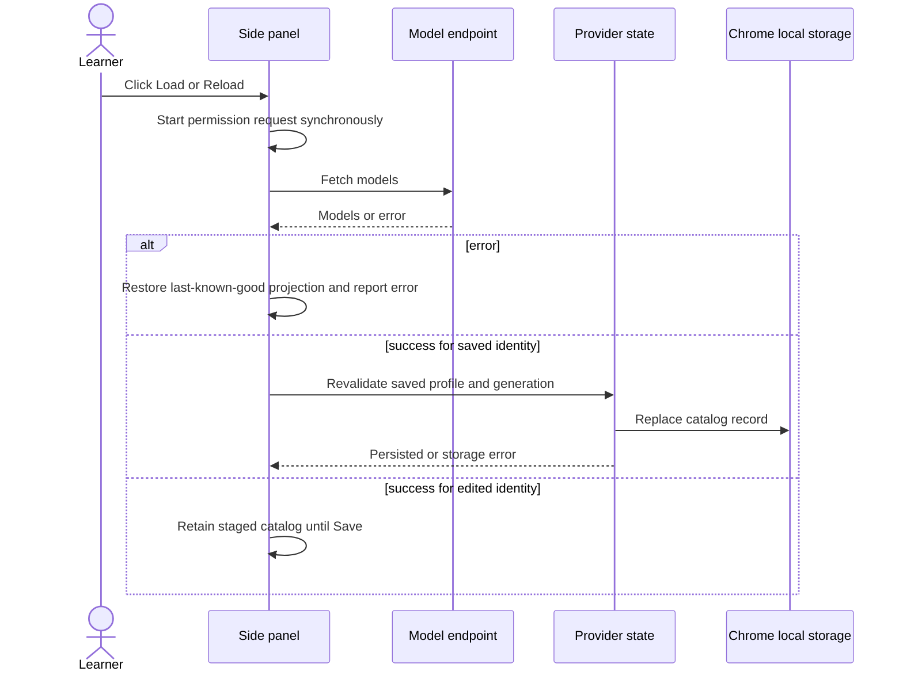

# Personal Provider Model Catalog Cache - Plan

## Goal Capsule

- **Objective:** Restore a personal provider's saved model and last successful model catalog whenever the side panel reopens, without an automatic provider request.
- **Authority:** The confirmed Product Contract governs user-visible behavior. The Planning Contract governs storage, projection, and refresh mechanics. Existing optional-permission and trusted-storage boundaries remain mandatory.
- **Execution profile:** Extend the Chrome extension's personal-provider state module and side-panel settings flow with focused Jest coverage. Do not change the Firebase backend or Next.js webapp.
- **Stop conditions:** Stop if the implementation requires duplicating the API key outside the saved profile, requesting host permission without a user gesture, or weakening current personal-provider save validation.
- **Tail ownership:** Complete extension tests and the production build, then confirm the domain glossary still describes the shipped behavior.

---

## Product Contract

### Summary

J-Buddy will retain the current saved personal provider's last successful model catalog in protected local extension storage. Settings will restore that catalog and the saved model without a network request, while explicit model loading remains a force-refresh action.

### Problem Frame

The side panel currently keeps discovered models only in module memory. Initialization and post-save rendering rebuild the model control with a disabled placeholder, so reopening settings shows a blank field even though the saved profile still contains a model. Learners must repeatedly call the provider's model endpoint and grant or revalidate access to reconstruct state that J-Buddy already discovered.

### Key Decisions

- **Retain one last-known-good catalog without TTL.** Governs R1, R2, R5. (session-settled: user-approved — chosen over session-only or time-expiring caching: connection changes and explicit refresh provide the freshness boundary.)
- **Keep provider access explicit.** Governs R2, R3, R4. (session-settled: user-approved — chosen over automatic or cache-first loading: opening settings stays offline and the load action always contacts the provider.)
- **Treat the saved model as durable configuration.** Governs R2, R4, R7. (session-settled: user-approved — chosen over blanking or silently replacing unavailable selections: the learner's configured model remains visible and stable.)
- **Persist only saved-profile state.** Governs R3, R5, R8. (session-settled: user-approved — chosen over caching unsaved connections or historical providers: only the current committed profile owns durable catalog state.)
- **Record Responses model source.** Governs R6, R7. (session-settled: user-approved — chosen over render-time inference alone: reopening must reliably restore catalog selection versus manual entry.)

### Requirements

**Persistence and identity**

- R1. Expose only the last successful Model catalog as the current reachable catalog for the saved personal provider in protected `chrome.storage.local`, without storing another raw API key; unreferenced generation records may remain temporarily until ownership-checked cleanup removes them.
- R2. A Cached model catalog is applicable only when its saved-profile generation, normalized full API URL, credential identity, and personal-provider protocol match; opening settings must never issue a provider request.
- R3. An explicit Load or Reload action must always request the provider catalog; success for the unchanged saved profile persists immediately, while success for an edited or new connection stays staged until Save commits the matching profile.

**Restoration and failure behavior**

- R4. Settings must always restore the Saved model selection, including when no valid catalog exists, permission is revoked, refresh fails, or a successful refresh omits that model.
- R5. Temporary connection edits must hide an inapplicable saved catalog without deleting it; reverting the complete identity must restore it, while saving a different connection or clearing the profile removes the old cache.
- R6. Responses-compatible profiles must persist Model source as `catalog` or `manual`; legacy profiles infer `catalog` only when a valid matching catalog contains the saved model and otherwise infer `manual`.

**Validation and feedback**

- R7. An unchanged Saved model selection remains save-valid without rediscovery; a new selection must still be backed by the matching catalog or the eligible Responses manual fallback.
- R8. Refresh failure must retain the last-known-good projection and show the error; stale request completion must never overwrite another saved profile, generation, or current form state.
- R9. The model action must read `載入模型` without an applicable cache and `重新載入模型` when a valid cached catalog is displayed.

### Acceptance Examples

- AE1. **Covers R2, R4, R9.** Given a saved profile and matching cached catalog, when the side panel initializes, then the catalog and saved model appear with Reload wording and no model-service call occurs.
- AE2. **Covers R2, R4, R7.** Given a legacy or cacheless saved profile, when settings open, then its saved model appears as the selected saved value and the unchanged profile can be saved without discovery.
- AE3. **Covers R3, R8.** Given an applicable cached catalog, when explicit refresh fails or permission is denied, then the prior catalog and selection remain visible and the failure is reported.
- AE4. **Covers R4, R8.** Given refresh succeeds without the saved model, when the new catalog renders, then the saved model stays selected as absent from the refreshed catalog and the learner sees a warning.
- AE5. **Covers R5.** Given a saved cached catalog, when the learner edits an identity field and later restores its exact saved value, then the catalog disappears and reappears without a new request or storage deletion.
- AE6. **Covers R3, R5.** Given discovery succeeds for a changed connection, when the learner has not saved it, then the result remains session-staged; saving commits that profile and catalog together and replaces the old cache.
- AE7. **Covers R6, R7.** Given a saved manual Responses model, when settings reopen or catalog refresh fails, then the manual model remains selected; successful discovery changes provenance only after the learner selects a discovered model and saves.
- AE8. **Covers R1, R8.** Given a malformed, incompatible-version, or stale cache record, when state loads, then the profile still renders, the cache is treated as absent, and no secret is exposed or copied into replacement cache state.

### Scope Boundaries

- No TTL, background refresh, startup fetch, or automatic permission prompt.
- No reachable historical cache collection or support for more than the single saved personal provider; unreachable generation records are implementation debris, never applicable history, and may remain only until safe conditional cleanup.
- No Firebase Functions, Firestore, direct-analysis transport, or Next.js webapp behavior changes.
- Do not add a second active model control for a Responses profile: persisted Model source selects the control, so a `catalog` profile uses its applicable catalog while a `manual` profile stays manual until the learner selects a discovered model and saves; refresh failure preserves the already-active projection.
- Model-catalog size limits and string-length caps are implementation safeguards, not new learner-facing policy.

### Sources / Research

- `japanese-alchemy-chrome-extension/src/scripts/personalProvider.js` owns normalized profiles, protected local storage, permission lifecycle, and the existing revision seam that this plan strengthens into a generation that survives clear.
- `japanese-alchemy-chrome-extension/src/sidepanel/sidepanel.js` owns staged discovery, connection matching, destructive dropdown rendering, save validation, and settings initialization.
- `japanese-alchemy-chrome-extension/tests/personalProvider.test.js` and `japanese-alchemy-chrome-extension/tests/sidepanel.personalProviderBehavior.test.js` establish the storage, permission-ordering, and DOM-state test patterns.
- `docs/plans/2026-08-09-001-feat-extension-personal-provider-analysis-plan.md` establishes the single protected profile, exact-origin permission, and non-secret revision boundaries.
- `docs/solutions/architecture-patterns/deterministic-client-side-verb-conjugation-engine.md` establishes versioned cache contracts and one canonical finalized projection for all consumers.
- `docs/solutions/runtime-errors/window-fetch-illegal-invocation.md` requires receiver-sensitive coverage at the browser fetch boundary.
- `docs/adr/0001-personal-provider-protocols.md` preserves protocol-sensitive discovery and the Responses manual fallback.

---

## Planning Contract

### Key Technical Decisions

- KTD1. **Bind versioned catalogs to a non-repeating saved-profile generation.** Preserve a monotonic non-secret generation across clear, and address each catalog record by that generation so a stale writer cannot overwrite a newer profile's catalog. Every saved generation atomically owns a deterministic current catalog reference even before a payload exists, so immediate refresh writes only its pre-owned key and never races to publish a singleton reference. Canonical profile transitions write profile or tombstone, next generation, Model source, current catalog reference, matching catalog payload or absence tombstone, and the bounded pending permission-cleanup origin set in one storage update; physical cleanup of unreferenced records is conditional and never part of correctness. Credential identity comes from the generation-bound saved profile rather than a copied key or extra credential fingerprint. Governs R1, R2, R3, R5, R8. (session-settled: user-approved — chosen over storing another key or a TTL key: the saved profile's unique generation defines credential identity without duplicating the credential.)
- KTD2. **Return normalized cached state through the personal-provider state boundary.** Storage reads normalize the base profile and generation, validate the referenced catalog's schema, binding, URL, protocol, and bounded deduplicated model list, then infer legacy Responses provenance and expose one snapshot. Build persisted catalog payloads from an explicit field allowlist so staged connection credentials and provider-response residue cannot leak into storage. Cap the response body at 2 MiB, the normalized catalog at 2,000 IDs, each ID at 512 Unicode code points, and aggregate UTF-8 model-ID data at 512 KiB before staging, rendering, or persistence; reject control and bidirectional-format characters. Malformed, oversized, or mismatched records become read-only cache misses. Cleanup requires a fresh ownership check and may never delete a newer valid record. Governs R1, R2, R6, R8.
- KTD3. **Project one complete model-control state from saved and staged inputs.** Rendering uses the saved profile, Model source, applicable persisted cache, matching staged catalog, current form identity, and loading status together. It selects the saved model, synthesizes a saved-only option when necessary, displays omission warnings, chooses catalog versus manual control, and derives Load versus Reload wording from that projection. Governs R2, R4, R5, R6, R7, R9. (session-settled: user-approved — chosen over independent destructive render paths: every settings lifecycle must reconstruct the same learner-visible state.)
- KTD4. **Refresh non-destructively and commit only to its generation.** Preserve the existing synchronous permission request before the first asynchronous operation. Separate the active request from successful staged models and the persisted last-known-good catalog. After success, write only to the request's generation-addressed record, then re-read ownership; a stale writer conditionally removes only its own unreferenced payload and never the current profile's record. A storage failure leaves the successful result staged for the session and reports that it will not survive reopening. Governs R3, R4, R8. (session-settled: user-approved — chosen over clearing before request or trusting request-start state: failures and stale completions must not destroy or cross-bind cache data.)
- KTD5. **Persist model provenance beside the transport profile and migrate safely on read.** New saves record `catalog` or `manual` as provider-state metadata without widening the normalized runtime profile passed to the transport. Legacy Responses profiles infer catalog provenance only after a valid matching cache contains the saved model; otherwise they restore as manual. Persisted Model source is authoritative on reopen: explicit discovery may temporarily project a staged catalog picker for a manual profile, but it does not change durable provenance until the learner chooses a discovered model and saves. Governs R6, R7. (session-settled: user-approved — chosen over permanent UI inference: stored provenance prevents reopening the wrong control.)

### High-Level Technical Design

#### Component boundaries

The personal-provider module owns persistence, normalization, migration, generation ownership, and cache/profile consistency. The side panel owns form identity, active requests, successful staged catalogs, user feedback, and a single projection into DOM controls. The transport remains responsible only for retrieving and normalizing provider model IDs. Projection precedence is matching successful staged catalog, matching persisted catalog, then saved-only or manual fallback; loading state changes controls and status without replacing that projection.

#### Catalog lifecycle

Hidden means inapplicable to the current form, not deleted. Refresh failure leaves Applicable unchanged. Staged state retains the existing abort-controller and temporary-permission lifecycle.

#### Explicit refresh sequence

### Implementation Sequence

1. Establish the versioned storage and migration contract with focused state-module tests.
2. Replace destructive model-control rendering with the unified projection and saved-selection validation.
3. Rework refresh and form/storage change handling around persisted-versus-staged state, preserving permission ordering and stale-completion checks.
4. Finish UX copy, cross-flow regression coverage, and documentation consistency.

---

## Implementation Units

### U1. Add persistent catalog and model-source state

- **Goal:** Make a versioned cached catalog and model provenance first-class members of the protected personal-provider state.
- **Requirements:** R1, R2, R3, R5, R6, R8; KTD1, KTD2, KTD5.
- **Dependencies:** None.
- **Files:** `japanese-alchemy-chrome-extension/src/scripts/personalProvider.js`, `japanese-alchemy-chrome-extension/tests/personalProvider.test.js`.
- **Approach:**
  1. Add a versioned generation-addressed catalog record, deterministic per-generation current reference, and strict normalizer beside the profile, mode, and generation state; write an explicit absence tombstone when the generation has no catalog payload.
  2. Preserve a monotonic generation across clear, and expose Model source beside the normalized runtime profile while preserving Chat Completions defaults and deterministic Responses legacy inference.
  3. Return only the current referenced cache after validating the stored profile, generation, schema, and bounded allowlisted payload; treat corrupt, incompatible, or mismatched data as absent without unsafe read-time deletion.
  4. Make saved-profile writes carry forward a compatible catalog or replace it with a matching staged catalog in the same canonical storage transition as profile or tombstone, next generation, source, and current reference.
  5. Provide a refresh persistence seam that writes only the request generation's payload, rechecks ownership after the write, and conditionally cleans only its own unreferenced record.
  6. Make clear idempotent, remove credential and current-cache reachability before releasing permission, and durably retain obsolete origins in a bounded, deduplicated pending-permission-cleanup set until `chrome.permissions.remove` confirms each removal. A profile replacement or clear is committed once protected storage transitions, so immediately reproject the new or cleared state and report cleanup failure as a distinct partial-success warning rather than implying rollback. Retry pending cleanup during trusted-state initialization and later provider-state operations, never remove the current profile's origin, and block another origin-changing transition only if the 32-origin pending set would overflow.
  7. Run bounded, ownership-checked catalog-namespace garbage collection after successful transitions and during initialization. Clear attempts to remove every unreachable catalog record; cleanup failure never restores reachability and is retried later.
- **Execution note:** Implement the storage contract test-first because its generation and migration behavior constrains every side-panel path.
- **Patterns to follow:** `getStoredProviderValues()`, `normalizePersonalProviderProfile()`, `savePersonalProvider()`, and `clearPersonalProvider()` for protected state; the version segment in `japanese-alchemy-chrome-extension/src/scripts/surroundingContext.js` for incompatible-cache misses.
- **Test scenarios:**
  1. A valid catalog round-trips with its saved profile, schema version, non-repeating generation, normalized URL, protocol, source, and ordered deduplicated model IDs; recursive inspection finds no API key, authorization data, nested connection object, unknown field, or raw provider-response residue.
  2. Cache with an old version, malformed fields, wrong generation, URL mismatch, protocol mismatch, empty invalid models, or excessive invalid content is returned as absent while the saved profile remains usable.
  3. An unchanged or model-only profile save advances generation and carries a still-compatible catalog to the new generation.
  4. A different URL, key, or protocol save replaces or removes the old cache and never exposes it to the new profile.
  5. A matching staged catalog saves atomically with the replacement profile and records catalog provenance; a Responses manual save records manual provenance without a catalog.
  6. Legacy Chat Completions profiles keep their default protocol; legacy Responses profiles infer catalog provenance only when the valid cache contains the saved model.
  7. Immediate refresh persistence succeeds only for its saved generation and connection; a controllable interleaving with a newer save proves the stale writer cannot erase the newer catalog and can clean only its own record.
  8. Starting refresh, clearing, and recreating the identical connection never reuses its generation or accepts the old completion.
  9. Replacement and clear storage failures never expose a mixed snapshot or report a transition that did not commit. After a committed transition, rejected or false-result permission removal immediately renders the new/cleared state with a cleanup-pending warning and retains every obsolete origin in the deduplicated pending set; initialization or a later operation retries A→B→C failures to convergence without touching the current origin.
  10. Malformed-cache or bounded namespace cleanup racing a valid cross-context write leaves the valid record intact; repeated generations, cleanup failure, clear, and reopen cannot make an orphan reachable or grow retained records without bound.
  11. Over-count, over-length, over-total-size, unknown-field, and misleading control-character model IDs are rejected before staging or storage and become safe cache misses without harming the profile.
- **Verification:** State reads expose one internally consistent profile/catalog/source snapshot, and every persistence path preserves trusted-local-storage access control and exact-origin permission behavior.

### U2. Restore one deterministic model-control projection

- **Goal:** Render the saved model, cached catalog, manual fallback, warnings, and action wording consistently across initialization, save, mode change, and form edits.
- **Requirements:** R2, R4, R5, R6, R7, R9; KTD3, KTD5.
- **Dependencies:** U1.
- **Files:** `japanese-alchemy-chrome-extension/src/sidepanel/sidepanel.js`, `japanese-alchemy-chrome-extension/src/sidepanel/sidepanel.html`, `japanese-alchemy-chrome-extension/tests/sidepanel.personalProviderBehavior.test.js`.
- **Approach:**
  1. Keep loaded saved provider state, the active catalog request, and the successful staged catalog separate, then derive the model-control projection from saved state, resolved form identity, staged state, and Model source.
  2. Populate URL, masked key, and protocol before projecting model controls so Responses profiles restore the correct catalog or manual field.
  3. Generalize option rendering to select the saved model, include a saved-only or saved-but-absent option, preserve provider order, and avoid forcing the control to blank.
  4. Hide an inapplicable persisted catalog on form edits without deleting it; reproject it when the saved identity is restored.
  5. Add a saved-selection validation path for the exact unchanged profile while preserving matching-catalog and eligible-manual checks for new values.
  6. Derive Load versus Reload copy from whether the projection currently displays an applicable cached catalog.
  7. Route loading and success feedback through the existing polite live-status region, and route saved-model warnings and refresh errors through the existing alert/described-by relationship without introducing a focus regression.
- **Execution note:** Start with failing behavior tests for initialization and edit/revert restoration before changing renderer helpers.
- **Patterns to follow:** `renderPersonalProviderState()`, `replacePersonalProviderModelOptions()`, `setManualPersonalProviderModelMode()`, `connectionMatchesFormValues()`, and existing `createElements()` DOM doubles.
- **Test scenarios:**
  1. Initialization with a valid cache renders its options, selects the saved model, uses Reload copy, and never calls the model service.
  2. Initialization without a valid cache renders the saved model as selected, uses Load copy, and allows an otherwise unchanged profile to save.
  3. A saved manual Responses profile restores the manual field and masked same-origin key; a catalog-backed Responses profile restores the catalog picker.
  4. Changing URL, key, or protocol hides the persisted catalog and requires matching staged state for new selections; restoring the exact identity resurfaces it without a request.
  5. Revoked host permission leaves the valid cached catalog and saved selection visible while provider readiness remains unavailable.
  6. A new arbitrary Chat Completions model cannot use the saved-only validation path, and a manual model cannot bypass Responses eligibility or connection matching.
  7. Successful discovery for a saved manual Responses profile does not switch its active provenance until a discovered model is selected and saved.
     During that session the successful staged discovery may temporarily activate the catalog picker; reopening before Save restores the persisted manual control.
  8. First-run, clear, managed/personal mode changes, and existing focus/error behavior remain correct.
  9. Loading and success updates remain observable through `personalProviderStatus`, while warnings and errors remain associated with the model control through `personalProviderError`; existing focus behavior is preserved for errors requiring immediate attention.
- **Verification:** Every settings entry path produces the same model-control state for the same saved profile, form identity, persisted cache, staged catalog, and source.

### U3. Make refresh non-destructive and race-safe

- **Goal:** Preserve last-known-good state across explicit refresh while committing only results that still belong to the saved or staged connection.
- **Requirements:** R3, R4, R5, R8, R9; KTD3, KTD4.
- **Dependencies:** U1, U2.
- **Files:** `japanese-alchemy-chrome-extension/src/sidepanel/sidepanel.js`, `japanese-alchemy-chrome-extension/tests/sidepanel.personalProviderBehavior.test.js`, `japanese-alchemy-chrome-extension/tests/directLlmApiService.test.js`.
- **Approach:**
  1. Preserve the synchronous optional-permission request at the start of the click handler and separate active request state, successful staged results, and persisted-cache projection.
     Enforce the shared catalog limits at the model-service result boundary before the result can be staged or rendered, including a `Content-Length` precheck when present and a 2 MiB capped body read for chunked or missing-length responses.
  2. Keep the last-known-good catalog visible during loading and on denial, network failure, incompatible response, or storage failure.
     Snapshot the pending model choice at request start and preserve the learner's current choice through completion when it is unchanged; if the refreshed catalog omits that choice, project it as selected-but-absent with the same warning used for an omitted saved model.
  3. After success, verify the active request and resolved form connection, then use generation-addressed persistence and post-write ownership validation to choose immediate persistence versus staged-only state.
  4. Keep a saved model omitted by the refreshed catalog as selected saved-but-absent state and show a warning without mutating the profile.
  5. On storage failure, retain successful models as session-staged, preserve the prior stored cache, and report that the refresh will not survive reopening.
  6. Expand local-area storage-change handling so profile/generation changes invalidate incompatible staged UI and cache changes from another extension context reproject settings without altering analysis source identity. Guard asynchronous state reads with a dedicated settings-projection generation so an older callback cannot repaint newer state.
  7. Retain temporary-origin cleanup and abort behavior when form edits, clear, or another context supersedes an in-flight request.
- **Execution note:** Keep characterization coverage for permission-request timing, request abort, temporary permission release, and receiver-sensitive fetch while changing refresh control flow.
- **Patterns to follow:** `handlePersonalProviderLoadModels()`, `invalidatePersonalProviderModelCatalog()`, `releaseStagedModelCatalogPermission()`, the `chrome.storage.onChanged` listener, and the receiver-binding regression in `japanese-alchemy-chrome-extension/tests/directLlmApiService.test.js`.
- **Test scenarios:**
  1. Explicit Reload always invokes the model service, disables duplicate clicks during the request, and does not blank the displayed cached catalog.
  2. Success for the unchanged saved connection persists immediately without Save; success for an edited/new connection remains absent from storage until Save.
  3. Permission denial, provider failure, empty/incompatible catalog, and abort retain the applicable last-known-good catalog and saved selection while reporting the correct failure state.
  4. A successful refresh that omits the saved model keeps it selected, labels it as absent from the refreshed catalog, and does not change the saved profile.
  5. A form edit, profile replacement, generation change, or clear during refresh prevents stale persistence and releases a newly granted unused origin permission; clear followed by identical-profile recreation cannot accept the old request.
  6. Cache persistence failure keeps the successful catalog staged for the session, preserves the older stored catalog, and reports the non-durable result.
  7. A cache update from another extension context refreshes settings projection; profile/generation changes invalidate local staged state without misclassifying the catalog as an analysis-result source change. When older and newer event-triggered reads resolve out of order, only the newest projection renders.
  8. The model-loading request still calls a receiver-sensitive `fetch` with the extension global and forwards abort signals.
  9. Reload does not silently replace an unsaved model choice made before or during the request; an omitted choice remains selected-but-absent and is not persisted until Save.
  10. Excessive model counts, overlong IDs, aggregate-size violations, and disallowed control characters are rejected before staging, rendering, or persistence and leave the prior projection intact.
  11. Concurrent successful refreshes for the same saved generation use completion-order last-write-wins; both are identity-valid, and storage-change reprojection converges every open settings view on the final completion.
- **Verification:** Refresh never destroys a usable catalog on failure, never persists across an identity/generation race, and preserves Chrome's user-gesture permission contract.

### U4. Keep domain documentation aligned

- **Goal:** Ensure project vocabulary describes the implemented persistence, restoration, and provenance contract.
- **Requirements:** R1, R2, R3, R4, R5, R6.
- **Dependencies:** U1, U2, U3.
- **Files:** `CONTEXT.md`, `CONCEPTS.md`.
- **Approach:** Verify that Cached model catalog, Saved model selection, Model source, the generation + normalized full API URL + credential + protocol applicability identity, explicit refresh, and no-auto-fetch behavior match the final implementation. Keep `CONTEXT.md` glossary-only and leave implementation mechanisms in the plan and code.
- **Patterns to follow:** Existing Provider Configuration entries in `CONTEXT.md` and the Model catalog family in `CONCEPTS.md`.
- **Test scenarios:** Test expectation: none — these files are domain vocabulary and carry no executable behavior.
- **Verification:** The glossary uses one canonical term per concept and contains no claim contradicted by the shipped settings flow.

---

## System-Wide Impact

- **Data lifecycle:** A canonical current reference exposes one versioned generation-addressed catalog for the saved profile. Replacement and clear remove reachability in the same transition; temporary form edits do not. Bounded conditional garbage collection removes only unreferenced records whose ownership still matches the cleanup request and retries failures without restoring reachability.
- **Privacy:** Catalog metadata remains restricted to trusted extension contexts. An explicit serialization allowlist prevents the cache from copying the API key, nested connection state, authorization data, provider-response residue, or learner text.
- **Permissions:** Cached visibility is independent of host permission readiness. Network refresh and analysis still require the exact configured origin.
- **Compatibility:** Existing profiles migrate on read without a blocking storage migration. Malformed or unknown-version cache records degrade to the saved-model fallback.
- **Concurrency:** A non-repeating generation prevents clear/recreate ABA, generation-addressed writes prevent stale overwrite of the current catalog, post-write ownership checks clean only the stale writer's payload, and ordered settings projections prevent UI rollback.

---

## Risks & Dependencies

| Risk | Mitigation |
|---|---|
| An unchanged save advances generation and invalidates a good cache | Carry or replace compatible cache state in the canonical transition for the next generation. |
| Clear and recreate reuse an old identity | Preserve a monotonic generation across clear and test an identical-connection ABA interleaving. |
| A stale refresh overwrites a newer profile | Write to generation-addressed storage, validate ownership afterward, and conditionally remove only the stale writer's record. |
| Replacement or clear fails between storage operations | Use one canonical profile/source/reference transition, surface partial failure, release permission only after protected state removal, and make retry idempotent. |
| Destructive rendering blanks saved state on an error path | Use one projection function for initialization, edits, refresh, save, mode changes, and storage changes. |
| Legacy Responses profiles restore the wrong control | Infer catalog source only from a valid matching cache containing the saved model; otherwise use manual source. |
| Mutable local storage contains malformed or oversized catalog data | Version and normalize the record, bound accepted model data, and degrade to a safe cache miss. |
| An older storage event repaints newer settings | Use a dedicated settings-projection generation and drop late reads; cache-only changes must not cancel analysis. |
| Refactoring refresh breaks the Chrome permission gesture | Preserve the synchronous permission request before the handler's first asynchronous operation and its timing test. |
| Transport regressions appear to validate cache failure behavior | Retain receiver-sensitive fetch and abort-signal coverage at the direct model-service boundary. |

---

## Verification Contract

| Gate | Command or check | Done signal |
|---|---|---|
| Focused state and settings tests | `cd japanese-alchemy-chrome-extension && npm test -- --runInBand tests/personalProvider.test.js tests/sidepanel.personalProviderBehavior.test.js` | Storage, migration, restoration, validation, refresh, permission, and stale-state scenarios pass. |
| Full extension regression suite | `cd japanese-alchemy-chrome-extension && npm test -- --runInBand` | Existing analysis, cache, provider, and rendering behavior remains green. |
| Production bundle | `cd japanese-alchemy-chrome-extension && npm run build` | Webpack emits the MV3 production build without module or syntax failures. |
| Manual reopen check | Save a catalog-backed provider, close/reopen the side panel, then reopen settings. | Saved catalog and model restore with Reload wording and no permission prompt or network request. |
| Manual failure check | Refresh a cached provider with denied permission or simulated network failure. | Last-known-good catalog remains visible, selection stays unchanged, and the error is actionable. |

---

## Definition of Done

- R1-R9 and AE1-AE8 are satisfied without backend or webapp changes.
- U1-U4 verification outcomes are met and their named test scenarios have coverage at the owning test paths.
- The cached catalog contains no duplicate API key and is inaccessible to content scripts.
- Existing exact-origin permission acquisition, abort, and release behavior remains intact.
- No automatic model request occurs during initialization, mode change, render, or settings reopen.
- The final diff contains no abandoned experimental cache shape, duplicate projection path, or obsolete workaround.
- The extension's focused tests, full Jest suite, and production build pass.
