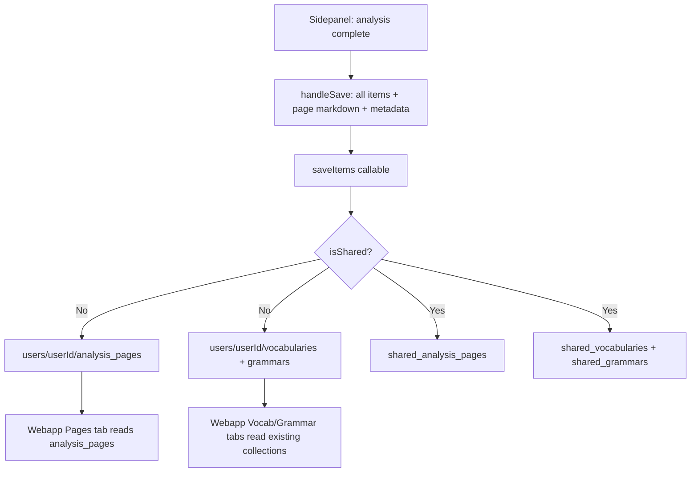

# Analysis Page Save & Webapp Browsing - Plan

## Goal Capsule

- **Objective:** A learner can save a completed sidepanel analysis as a self-contained "page" — the full rendered analysis plus source metadata — and later browse these pages in the webapp, re-reading each analysis in its original context. Saving a page also populates the existing per-item vocab/grammar review collections, so the review tabs still work.
- **Product authority:** This is the active scope. Surrounding areas (shared-page browsing, page deletion, structured JSON in the page document) are not active scope.
- **Open blockers:** None.

## Product Contract

### Summary

A page-level save replaces the sidepanel's per-item checkbox save flow. The single save action captures the whole analysis (rendered markdown without sidepanel interaction artifacts, plus source metadata) as one Firestore document in a new personal pages collection, and derives all vocab and grammar items into the existing per-item collections — feeding both the new webapp Pages route and the existing vocab/grammar review tabs. Sharing is preserved: a shared save writes the page and derived items to shared collections, mirroring the current shared-items pattern with an added page layer.

### Problem Frame

The Chrome extension sidepanel currently lets a learner save individual vocabulary and grammar entries from a completed analysis via checkboxes, persisting each as a separate item to Firestore. The webapp then displays these items in Anki-style review tabs (vocabularies, grammars). There is no way to save or re-read the *whole* analysis as it appeared in context — the rendered markdown, the original source text, the source URL, the moment the learner encountered it. Once the sidepanel closes or a new analysis begins, the full analysis is gone (except for a local cache of the most recent one). Learners who want to revisit a complete analysis — not just discrete flashcard items — have no persistent surface for that. This plan adds that surface: a page-level save in the sidepanel and a page-by-page browsing route in the webapp, while keeping the per-item review flow fed by deriving items from each saved page.

### Requirements

**Page save (sidepanel)**

- R1. A completed analysis can be saved as a page via a single save action in the sidepanel. The action is available only after analysis completion.
- R2. The page captures the full rendered analysis markdown (vocabulary and grammar sections, ruby annotations in the `{kanji|reading}` format) and source metadata: original source text, source URL, and a timestamp.
- R3. The per-item checkbox save flow is removed. The sidepanel no longer renders per-item checkboxes next to vocabulary or grammar entries.
- R4. The existing "Save As" file export button and copy button are unaffected by this change.
- R5. The page does not store the structured `{words, grammars}` JSON. Only the rendered analysis and source metadata are persisted.

**Derived items**

- R6. Saving a page derives all vocabulary and grammar items from the analysis into the existing per-item collections (`users/{userId}/vocabularies`, `users/{userId}/grammars`), using the same item shape the current per-item save produces.
- R7. Derived items are snapshots — copies, not live references to the page. Editing or deleting a page (out of scope now) does not affect already-saved derived items.

**Sharing**

- R8. A shared save writes the page to a shared pages collection and writes all derived items to the existing shared vocab/grammar collections, mirroring the current shared-items save pattern with the page layer added.
- R9. Shared pages are writable but not yet browsable in the webapp. Browsing shared pages is deferred.

**Webapp Pages route**

- R10. The webapp gains a "Pages" entry alongside the existing Vocabularies and Grammars tabs.
- R11. The Pages route lists the signed-in user's saved personal pages, ordered by save time descending.
- R12. Each page is browsable and renders the full saved analysis (rendered markdown with ruby annotations converted via the existing `textUtils` ruby conversion) and its source metadata (source text, source URL, timestamp).
- R13. The Pages route reads from the new personal pages collection only. It does not read shared pages.

### Key Decisions

- KTD1. Saving a page replaces the per-item checkbox save rather than coexisting with it (session-settled: user-directed — chosen over coexist: simpler model, a single save action feeds both the page and the review tabs without mode confusion).
- KTD2. A page save derives all items into the existing per-item collections rather than making the page the canonical source with items as computed views (session-settled: user-approved — Approach A chosen over canonical-source Approach B because page editing/deletion is deferred, so canonical-source elegance doesn't pay off yet and the data-access rework it requires is unjustified now).
- KTD3. The page stores rendered analysis plus source metadata, not the structured `{words, grammars}` JSON (session-settled: user-directed — JSON stays out; can be added later if a feature needs it).
- KTD4. The sidepanel removes per-item checkboxes entirely rather than keeping them as visual markers (session-settled: user-directed — checkboxes no longer drive any save action and would mislead users).
- KTD5. Shared-page browsing is deferred; shared pages are writable only for now (session-settled: user-directed — shared browsing is a future enhancement).
- KTD6. A page, once saved, cannot be deleted (session-settled: user-directed — deletion is a future enhancement; pages are permanent for now).
- KTD7. The webapp gains a separate Pages route alongside the existing tabs rather than replacing the Anki-style review view (session-settled: user-directed — the review tabs serve the spaced-review track; pages add a re-read-in-context lens without disrupting what works).

### Scope Boundaries

**Deferred for later**

- Page deletion — saved pages are permanent for now.
- Shared-page browsing in the webapp — shared pages are writable but not yet browsable.
- Structured `{words, grammars}` JSON in the page document — only rendered analysis and source metadata are stored.
- Canonical-source data model (page as single source of truth, items as computed views) — items are independently written snapshots under Approach A.
- "Import from shared page" — viewers of shared pages cannot pull items into their personal collection from a shared page.

**Outside this product's identity**

- Repurposing checkboxes for future selective save — checkboxes are fully removed, not kept as a forward-looking affordance.
- Migrating legacy per-item saves to a page-derived model — existing items in `vocabularies`/`grammars` remain as-is and coexist with new page-derived items.

### Success Criteria

- A learner completes an analysis in the sidepanel, saves it as a page, and the full analysis (with ruby annotations) plus source metadata appears in the webapp's Pages route.
- The same save action populates the existing Vocabularies and Grammars tabs with the analysis's items — the review flow still works without a separate per-item save gesture.
- A shared save writes both the page and derived items to shared collections.
- The sidepanel no longer shows per-item checkboxes; the copy and file-export buttons still work.

---

## Planning Contract

### Key Technical Decisions

- KTD8. The `saveItems` callable is extended to accept an optional `page` object in the analysis payload rather than creating a separate callable. One callable handles both page and derived-item writes in a single batched transaction, keeping the save atomic from the client's perspective. Governs R1, R6, R8.
- KTD9. The page document stores the raw analysis markdown (the LLM response text with `{kanji|reading}` ruby syntax) rather than pre-rendered HTML. The webapp renders markdown to HTML at read time via the existing `markdownToHtml` + `parseFurigana` pipeline in `lib/textUtils.ts`, matching how vocab/grammar details are already rendered. This avoids storing sidepanel-specific HTML (which carried checkbox artifacts) and keeps the rendering layer in the webapp. Governs R2, R12.
- KTD10. The sidepanel's `handleSaveForLater` function is reworked to send all parsed words and grammars (from `saveForLaterJson`) rather than filtering by checked checkboxes. The checkbox-rendering logic in `renderAnalysisMarkdown` is removed, and `formatAnalysisResult` stops passing `includeCheckboxes: true`. Governs R3, R6.
- KTD11. The page document lives at `users/{userId}/analysis_pages/{pageId}` for personal saves and `shared_analysis_pages/{pageId}` for shared saves, mirroring the existing `vocabularies`/`grammars` vs `shared_vocabularies`/`shared_grammars` pattern. The `users/{userId}` wildcard rule in `firestore.rules` already covers any subcollection under the user doc, so personal pages are readable by the client without new rules. Shared pages are Admin-SDK-written only (no client read path yet, per R9). Governs R8, R13.
- KTD12. The webapp dashboard gains a third tab ("Pages") in the existing `Tabs` component, rather than a separate route or page. The tab reads `users/{userId}/analysis_pages` ordered by `createdAt` desc. Each page renders in a `Card` with the source metadata as header and the full analysis markdown as body. Governs R10, R11, R12.
- KTD13. The `SaveItemsRequest` type's `analysis.metadata` field is reused for page metadata (source_text, source_url, saved_at). A new optional `analysis.page` field carries the `rendered_markdown` string. This keeps the request shape backward-compatible — a client not sending `page` gets the old behavior (items only). Governs R2, R5.

### High-Level Technical Design

The save flow crosses three components. A `saveItems` callable receives the analysis payload; the backend writes the page document and derives items in one batched write. The webapp reads pages from the new subcollection.

### Assumptions

- The `saveForLaterJson` object (populated by `formatAnalysisResult`) reliably contains all words and grammars from the analysis, so sending all items without checkbox filtering is safe.
- The raw analysis markdown (`getCompletedAnalysisResponse()`) is the canonical text to store as the page's `rendered_markdown` — it contains the `{kanji|reading}` ruby syntax and markdown structure the webapp can re-render.
- The Firestore `users/{userId}/{document=**}` wildcard rule covers the new `analysis_pages` subcollection for client reads without a rules change.
- The existing `saveItems` callable's lack of auth enforcement (it trusts client-sent `userId`) is a pre-existing condition; this plan does not fix it and does not make it worse, since the page save uses the same trust model.

### Deferred Questions

- Should the sidepanel prevent duplicate page saves for the same analysis? (Deferred — the user can save multiple times; deduplication is a future enhancement.)
- Should the webapp Pages tab support pagination or infinite scroll for large page counts? (Deferred — the existing vocab/grammar tabs load all items without pagination; pages follow the same pattern for now.)

---

## Implementation Units

### U1. Backend: extend saveItems to write analysis pages

- **Goal:** The `saveItems` callable writes a page document alongside derived items when the payload includes a `page` field.
- **Files:** `japanese-alchemy-hosting/functions/src/models/types.ts`, `japanese-alchemy-hosting/functions/src/services/firestoreService.ts`, `japanese-alchemy-hosting/functions/src/v1/saveItemsCallable.ts`
- **Patterns:** Follow the existing `saveVocabulary`/`saveGrammar` batch-write pattern in `FirestoreService`. The new `saveAnalysisPage` method writes to `users/{userId}/analysis_pages` or `shared_analysis_pages` based on the `isShared` flag, using the same batch commit approach.
- **Technical design:** Add an `AnalysisPage` interface to `types.ts` with `rendered_markdown: string` and metadata fields (`source_text`, `source_url`, `saved_at`). Add an optional `page?: AnalysisPage` field to `SaveItemsRequest.analysis`. In `saveItemsHandler`, after saving vocab and grammar items, call `firestoreService.saveAnalysisPage` when `analysis.page` is present. The handler returns an augmented `SaveItemsResponse` with a `page_saved: boolean` field. Use a single `Firestore.batch()` for the page write to keep it atomic with item writes.
- **Test scenarios:**
  - Save with page field present writes one document to `users/{userId}/analysis_pages` with the rendered markdown and metadata.
  - Save with page field absent does not write to `analysis_pages` (backward-compatible).
  - Shared save writes the page to `shared_analysis_pages` and items to `shared_vocabularies`/`shared_grammars`.
  - Save with empty page markdown still writes the page document (the handler does not validate page content).
  - Response includes `page_saved: true` when a page was written, `false` when not.

### U2. Chrome extension: rework save to capture full page, remove checkboxes

- **Goal:** The sidepanel's save button captures the full analysis as a page and sends all items, without per-item checkboxes.
- **Files:** `japanese-alchemy-chrome-extension/src/sidepanel/sidepanel.js`, `japanese-alchemy-chrome-extension/src/sidepanel/sidepanel.html`, `japanese-alchemy-chrome-extension/src/scripts/jaAlchemyApiService.js`
- **Patterns:** The `handleSaveForLater` function is renamed to `handleSaveAnalysisPage` (or similar). It sends all items from `saveForLaterJson.words` and `saveForLaterJson.grammars` without filtering by checkbox state. It adds a `page` object to the analysis payload with `rendered_markdown` set to `getCompletedAnalysisResponse()` (the raw markdown) and metadata (source_text, source_url, saved_at). The `renderAnalysisMarkdown` function's `includeCheckboxes` branch is removed; `formatAnalysisResult` stops passing `{ includeCheckboxes: true }`. The HTML button label changes from "稍後儲存" to reflect page-level save (e.g., "儲存分析"). The `shareCheckbox` and its container remain (sharing is still a user choice).
- **Technical design:** In `formatAnalysisResult`, change `renderAnalysisMarkdown(markdown, { includeCheckboxes: true })` to `renderAnalysisMarkdown(markdown)`. Remove the checkbox-injection `replace` block from `renderAnalysisMarkdown`. In `handleSaveForLater`, remove the checkbox-querying logic (`querySelectorAll('input[name="words"]:checked')` etc.) and the validation that at least one item is checked. Build `words` and `grammars` arrays from all entries in `saveForLaterJson`. Add `page: { rendered_markdown: getCompletedAnalysisResponse(), ...metadata }` to the analysis object. Update `jaAlchemyApiService.saveAnalysis` to pass through the `page` field (no change needed if it already passes the full analysis object). Update the success message to reflect page save. Remove the post-save checkbox-unchecking logic.
- **Test scenarios:**
  - `formatAnalysisResult` output HTML contains no `type="checkbox"` inputs.
  - `renderAnalysisMarkdown` called without `includeCheckboxes` produces no checkboxes.
  - Save button click with a completed analysis sends all words and grammars from `saveForLaterJson`, not just checked ones.
  - Save payload includes a `page` object with `rendered_markdown` set to the raw analysis markdown.
  - Save payload includes `is_shared` reflecting the share checkbox state.
  - Copy button and Save As button still work after the change.
  - Share checkbox still toggles shared vs personal save.

### U3. Webapp: add Pages tab and page rendering

- **Goal:** The webapp dashboard shows a third "Pages" tab that lists and renders saved analysis pages.
- **Files:** `japanese-alchemy-webapp/app/page.tsx`, `japanese-alchemy-webapp/services/firestoreService.ts`, `japanese-alchemy-webapp/types/index.ts`, `japanese-alchemy-webapp/lib/textUtils.ts`
- **Patterns:** Follow the existing `getUserVocabularies`/`getUserGrammars` pattern for the new `getUserAnalysisPages` service function. Follow the existing `Tabs`/`TabsContent`/`Card` pattern in `page.tsx` for the new tab. Use `markdownToHtml` + `parseFurigana` from `textUtils.ts` to render the page's `rendered_markdown`.
- **Technical design:** Add an `AnalysisPage` interface to `types/index.ts` with `id`, `rendered_markdown`, `source_text`, `source_url`, `saved_at`, `createdAt`. Add `getUserAnalysisPages(userId)` to `firestoreService.ts` reading `users/{userId}/analysis_pages` ordered by `createdAt` desc. In `page.tsx`, add a third `TabsTrigger` ("Pages") and `TabsContent`. Each page renders as a `Card` with the source text (with furigana), source URL (as a link), timestamp, and the full analysis markdown rendered via `markdownToHtml(parseFurigana(rendered_markdown))`. Add `analysisPages` state to the dashboard, loaded in `loadData` alongside vocab and grammar.
- **Test scenarios:**
  - `getUserAnalysisPages` returns pages ordered by `createdAt` descending.
  - Pages tab shows when the user has saved pages.
  - Pages tab shows an empty state when no pages exist.
  - Each page card displays the source text with ruby annotations.
  - Each page card displays the source URL as a clickable link.
  - Each page card displays the timestamp.
  - The full analysis markdown renders with ruby annotations and markdown formatting.

### U4. Firestore rules: verify personal pages are client-readable

- **Goal:** Confirm the existing Firestore rules allow the webapp to read `users/{userId}/analysis_pages`.
- **Files:** `japanese-alchemy-hosting/firestore.rules`
- **Patterns:** The existing `match /users/{userId} { match /{document=**} { allow read, write: if isOwner(userId); } }` wildcard already covers any subcollection under `users/{userId}`.
- **Technical design:** No rule changes needed for personal pages. Shared pages (`shared_analysis_pages`) are written by the Admin SDK only and have no client read path (per R9). Verify the wildcard covers `analysis_pages` by inspection — no code change required unless a future shared-page browsing feature needs a read rule.
- **Test expectation:** none — this is a verification unit, not a feature-bearing unit. The existing wildcard rule covers the new subcollection by inspection.

---

## Verification Contract

| Command | Scope | Applies to |
|---|---|---|
| `cd japanese-alchemy-hosting/functions && npm test` | Jest unit tests for the saveItems handler and FirestoreService | U1 |
| `cd japanese-alchemy-chrome-extension && npm test` | Jest unit tests for formatAnalysisResult and save behavior | U2 |
| `cd japanese-alchemy-chrome-extension && npm run build` | Webpack production build (catches import/syntax errors) | U2 |
| `cd japanese-alchemy-hosting/functions && npm run build` | TypeScript compilation (catches type errors) | U1 |
| `cd japanese-alchemy-webapp && npm run build` | Next.js production build (catches type and import errors) | U3 |
| `cd japanese-alchemy-webapp && npm run lint` | ESLint (catches code quality issues) | U3 |

---

## Definition of Done

**Global:**
- All three components build without errors.
- All existing tests pass (no regressions from checkbox removal or save flow change).
- A learner can save a completed analysis and see it in the webapp Pages tab.
- The Vocabularies and Grammars tabs still populate from the same save action.

**Per-unit:**
- U1: `saveItems` writes a page document when `page` is present; existing save (without `page`) still works.
- U2: No checkboxes in the sidepanel analysis display; save captures full analysis + all items; copy/save-as still work.
- U3: Pages tab lists saved pages; each renders full analysis with ruby annotations and source metadata.
- U4: Firestore wildcard rule covers `analysis_pages` (verified by inspection, no change needed).
