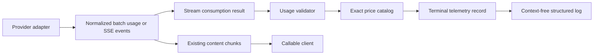

# LLM Cost Observability - Plan

## Goal Capsule

- **Objective:** Operators can determine token use and estimated LLM spend for each managed analysis call from privacy-safe application logs.
- **Means:** Normalize provider usage, apply an explicit price catalog, and write one terminal telemetry event per call. (KTD1, KTD4, KTD5)
- **Product authority:** The Product Contract below is authoritative for managed provider telemetry.
- **Execution profile:** Backend-only Firebase Functions change with test-first contract coverage.
- **Stop conditions:** Do not add provider routing, client fields, persistence, a dashboard, or automatic price refresh.

---

## Product Contract

### Summary

The backend records log-only usage and estimated USD cost for managed Gemini and Z.AI completions.
The implementation uses exact model catalog matches and preserves all existing callable and streaming-client contracts.

### Problem Frame

The provider adapters currently discard batch usage metadata.
The streaming parser forwards text deltas only and ignores terminal provider usage.
Operators therefore cannot calculate per-call managed-model spend from existing logs.

### Key Decisions

- K1. **Cost telemetry is application-log-only.** The feature does not alter callable responses, client behavior, Firestore data, or UI. Governs R1, R6.
- K2. **The catalog is explicit and exact-match only.** It contains the eight approved provider/model IDs, and an unmatched ID remains observable without a calculated price. Governs R3, R4, R5. (session-settled: user-directed — chosen over alias matching: `gemini-3-flash` was removed in favor of the canonical `gemini-3-flash-preview` ID.)
- K3. **Batch and streaming completions have equal terminal observability.** Both paths emit one normalized completion record when a provider exposes usable usage data. Governs R1, R2.
- K4. **Managed provider routing remains Gemini-only.** Z.AI telemetry is implemented and tested at the shared adapter boundary; selecting Z.AI for supported managed callables is deferred. Governs R1, R4.
- K5. **Raw provider-response debug logging is removed.** Telemetry logs only approved operational fields. Governs R7.

### Requirements

**Usage capture and normalization**

- R1. Every successful managed Gemini batch or stream completion emits one terminal record containing provider, model ID, request mode, normalized input tokens, normalized output tokens, total tokens when supplied, and supported cached-input or reasoning usage. Z.AI adapters retain the same normalized metadata for adapter-level tests until managed provider routing is introduced.
- R2. Streaming preserves the current content chunks while retaining terminal provider usage for one completion record after stream consumption.

**Pricing and cost calculation**

- R3. The price catalog contains `gemini-3-flash-preview`, `gemini-2.5-flash-lite`, `gemini-2.5-flash`, `gemini-3.1-flash-lite`, and `gemini-3.5-flash-lite`.
- R4. The price catalog contains `GLM-5.3-Flash`, `GLM-4.7-FlashX`, and `glm-4.7`.
- R5. Each catalog entry records USD input, cached-input, and output rates per one million tokens, a source URL, a verification date, and an effective-date note. Cost calculation uses only declared, validated usage dimensions.
- R6. A catalog match logs calculated USD cost and catalog metadata. An unmatched model logs `price_unavailable` with no invented total.

**Operational safety**

- R7. New telemetry and existing provider-success logs exclude API keys, API URLs, prompts, generated analysis content, raw provider responses, user identifiers, and IP addresses.
- R8. Missing, malformed, or unsupported usage does not fail an otherwise successful analysis. The terminal log records an explicit telemetry status instead.

### Key Flows

- F1. Managed batch completion
  - **Trigger:** A managed analysis callable receives a successful provider response.
  - **Steps:** Normalize provider usage, resolve the exact catalog entry, calculate cost when possible, then emit one terminal log before returning the unchanged callable response.
  - **Outcome:** Operators can inspect usage and estimated cost without a client-contract change.
  - **Covers R1, R5, R6, R7, R8.**

- F2. Managed streaming completion
  - **Trigger:** A managed streaming callable consumes provider stream events.
  - **Steps:** Forward content deltas unchanged, retain terminal usage and completion state, then emit one terminal log after consumption ends.
  - **Outcome:** Streaming is observable without delaying or changing learner-visible chunks.
  - **Covers R1, R2, R5, R6, R7, R8.**

### Acceptance Examples

- AE1. **Covers R2, R6.**
  - **Given:** A cataloged provider stream contains terminal usage.
  - **When:** The stream completes.
  - **Then:** The client receives the existing chunks and the backend writes one completion log with normalized usage and calculated USD cost.

- AE2. **Covers R6, R8.**
  - **Given:** A successful completion has usage for a model that is not in the catalog.
  - **When:** The call completes.
  - **Then:** The backend logs usage and `price_unavailable`, without a cost total or client-visible error.

- AE3. **Covers R8.**
  - **Given:** A successful provider response has no usable usage object.
  - **When:** The call completes.
  - **Then:** Analysis succeeds and the backend writes an incomplete-usage status without fabricated counts or cost.

### Success Criteria

- Unit and handler tests prove deterministic cost calculation for all eight catalog entries and preserve existing callable behavior.
- Stream tests prove fragmented usage frames, terminal usage without content, and incomplete streams do not alter delivered chunks.
- A successful telemetry path emits exactly one structured event and no raw provider response remains in provider-success logging.

### Scope Boundaries

- Supported managed callables continue to select Gemini; provider-selection wiring is not part of this plan.
- No usage or cost data is returned to callables, stored in Firestore, shown in either client, aggregated into dashboards, or used for billing.
- No runtime price fetch or model-prefix/alias fallback is allowed.

#### Deferred to Follow-Up Work

- Selecting Z.AI through the supported managed callable contract.
- Catalog-refresh automation, cost aggregation, alerts, dashboards, or billing reconciliation.

### Dependencies and Assumptions

- Gemini OpenAI-compatible streaming returns usage when its documented usage option is requested.
- Z.AI streaming usage is available in its documented terminal completion event.
- The deployed provider model IDs use the catalog's exact case-sensitive identifiers.

### Sources and Research

- `docs/solutions/CALLABLE_STREAMING_MIGRATION.md` — callable streaming is the supported managed surface; the retired raw SSE route must not return.
- [Gemini OpenAI compatibility](https://ai.google.dev/gemini-api/docs/openai), [Gemini pricing](https://ai.google.dev/gemini-api/docs/pricing), and [Gemini model deprecations](https://ai.google.dev/gemini-api/docs/deprecations).
- [Z.AI streaming](https://docs.z.ai/guides/capabilities/streaming), [Z.AI chat completions](https://docs.z.ai/api-reference/llm/chat-completion), and [Z.AI pricing](https://docs.z.ai/guides/overview/pricing).
- [Server-sent events standard](https://html.spec.whatwg.org/multipage/server-sent-events.html) — event framing and incomplete-stream handling.

---

## Planning Contract

### Key Technical Decisions

- KTD1. **Create a provider-neutral internal telemetry record and calculator.** It carries validated token counts, provider/model identity, operation, completion state, pricing status, and estimated cost; callable response types remain content-only. Governs R1, R5, R6, R8.
- KTD2. **Use an explicit versioned catalog in USD micro-units.** The calculation separates cached from uncached prompt tokens and avoids floating-point accumulation; a zero cost is valid only for a recognized free-rate entry. Governs R3, R4, R5, R6.
- KTD3. **Make stream consumption return terminal metadata beside content delivery.** A stream-consumption result reports usage, response model, finish reason, and completion state after invoking the existing content-delta callback. Governs R1, R2, R8.
- KTD4. **Use provider-specific request behavior behind the shared adapter contract.** Gemini streaming requests usage with its documented option; Z.AI streaming relies on its documented terminal usage frame. Governs R1, R2.
- KTD5. **Emit telemetry once at the callable completion boundary through a context-free logger.** Adapters supply normalized data but do not produce duplicate completion logs; terminal logs use stable structured fields, omit request identity, and remove raw response debug logs. Governs R6, R7, R8.

### High-Level Technical Design

The usage path ends in a server-side log.
The content path remains the current callable contract.

### Initial Catalog Values

Use the Standard service tier and USD per one million tokens.
The implementation records these values with their source URL, verification date, and any promotion expiry before release.

| Provider | Exact model ID | Input | Cached input | Output | Effective-date note |
| --- | --- | ---: | ---: | ---: | --- |
| Gemini | `gemini-3-flash-preview` | $0.50 | $0.05 | $3.00 | Preview; Google recommends migration to 3.5 Flash when appropriate. |
| Gemini | `gemini-2.5-flash-lite` | $0.10 | $0.01 | $0.40 | Standard text/image/video pricing. |
| Gemini | `gemini-2.5-flash` | $0.30 | $0.03 | $2.50 | Standard text/image/video pricing. |
| Gemini | `gemini-3.1-flash-lite` | $0.25 | $0.025 | $1.50 | Standard text/image/video pricing. |
| Gemini | `gemini-3.5-flash-lite` | $0.30 | $0.03 | $2.50 | Standard text/image/video pricing. |
| Z.AI | `GLM-5.3-Flash` | $0.075 | $0.015 | $0.25 | Promotional rate ends 2026-09-09 UTC+8. |
| Z.AI | `GLM-4.7-FlashX` | $0.07 | $0.01 | $0.40 | Current published text-model rate. |
| Z.AI | `glm-4.7` | $0.60 | $0.11 | $2.20 | Current published text-model rate. |

### Implementation Constraints

- Treat provider usage as untrusted input: token counts must be finite, non-negative integers, and cached input cannot exceed prompt input.
- Price the provider response model when present, otherwise use the requested configured model; never perform prefix or case-insensitive matching.
- Retain the latest non-null stream usage seen before a valid completed stream. A premature EOF cannot be presented as final usage.
- Catch telemetry failures so they do not convert successful analysis into callable errors.
- Preserve current `explain` and `explainStreamCallable` Gemini routing.

---

## Implementation Units

### U1. Create normalized usage and pricing foundation

**Goal:** Supply one reusable, testable representation of provider usage and cost for both adapters and request modes.

**Requirements:** R1, R3, R4, R5, R6, R8.

**Dependencies:** None.

**Files:**

- `japanese-alchemy-hosting/functions/src/models/types.ts`
- `japanese-alchemy-hosting/functions/src/services/llmUsageTelemetry.ts` (new)
- `japanese-alchemy-hosting/functions/test/services/llmUsageTelemetry.test.ts` (new)

**Approach:**

1. Extend internal LLM response types with optional raw usage and response-model metadata while keeping the existing callable `SuccessResponse` shape unchanged.
2. Add a pure normalizer that maps OpenAI-compatible token fields into the terminal telemetry record and assigns a non-fatal usage status.
3. Add the eight-entry exact-match catalog, source/effective-date metadata, and deterministic cost calculation using integer micro-USD arithmetic.
4. Return no cost for unknown models, invalid counts, absent usage, or invalid cached-token relationships.

**Execution note:** Start with calculator and normalization tests; they define the cross-provider contract before adapters change.

**Patterns to follow:** Existing provider configuration in `japanese-alchemy-hosting/functions/src/config.ts`; TypeScript interface conventions in `japanese-alchemy-hosting/functions/src/models/types.ts`.

**Test scenarios:**

- Each approved catalog entry calculates the expected input, cached-input, output, and total cost from known integer counts.
- Cached usage charges cached and uncached prompt tokens separately.
- An exact model mismatch, a missing catalog entry, and an absent model produce `price_unavailable` with no total.
- Negative, fractional, non-finite, or cached-greater-than-prompt values produce a non-fatal malformed-usage status.
- A recognized zero-rate catalog entry, if added later, resolves to zero rather than an unknown-price status.

**Verification:** Pure tests demonstrate all catalog and fallback statuses without a Firebase callable response change.

### U2. Preserve provider usage in both adapters

**Goal:** Make batch usage and provider-specific streaming-usage requests available to the internal telemetry path without logging raw responses.

**Requirements:** R1, R2, R4, R7, R8.

**Dependencies:** U1.

**Files:**

- `japanese-alchemy-hosting/functions/src/services/llmService.ts`
- `japanese-alchemy-hosting/functions/src/services/geminiLlmService.ts`
- `japanese-alchemy-hosting/functions/src/services/zaiLlmService.ts`
- `japanese-alchemy-hosting/functions/test/services/geminiLlmService.test.ts`
- `japanese-alchemy-hosting/functions/test/services/zaiLlmService.test.ts` (new)

**Approach:**

1. Evolve the internal service contract so batch calls retain normalized usage beside generated content, while callers keep returning the existing `SuccessResponse`.
2. Request streamed usage through Gemini's documented OpenAI-compatible stream option.
3. Keep Z.AI stream requests compatible with its documented terminal-usage behavior rather than sending Gemini-only options.
4. Remove provider-success raw-response debug logs and limit request logs to safe operational metadata.

**Execution note:** Use adapter-level contract tests before changing the callable handlers.

**Patterns to follow:** Existing fetch/error handling and structured provider-call logs in both LLM service classes.

**Test scenarios:**

- Gemini batch response with usage returns generated content and an internal normalized usage record.
- Z.AI batch response with usage produces the same normalized record shape.
- Gemini streaming request includes the documented usage option without changing its existing thinking configuration.
- Z.AI streaming request preserves its existing payload shape and omits Gemini-only stream options.
- Provider-success paths do not write raw response objects or generated content to logs.
- Missing or malformed batch usage leaves generated content successful with an incomplete-usage status.

**Verification:** Gemini and Z.AI adapter tests cover successful usage capture, request differences, error behavior, and safe logs.

### U3. Retain terminal stream metadata without changing chunks

**Goal:** Parse provider SSE streams robustly enough to retain terminal usage and completion state while continuing to expose content deltas only to the callable handler.

**Requirements:** R1, R2, R8.

**Dependencies:** U1, U2.

**Files:**

- `japanese-alchemy-hosting/functions/src/v1/llmStreamDeltas.ts`
- `japanese-alchemy-hosting/functions/test/v1/llmStreamDeltas.test.ts` (new)

**Approach:**

1. Replace the content-only parser boundary with a stream-consumption operation that calls the existing content-delta path and resolves one terminal result containing usage, response model, finish reason, and completed/incomplete state.
2. Support incremental UTF-8 input, normal SSE line endings, comments, multi-line data fields, fragmented JSON, terminal usage without content, and the `[DONE]` sentinel.
3. Treat EOF without a valid terminal completion as incomplete telemetry rather than synthesizing usage.
4. Keep the outward delta iteration used by the callable handler content-only.

**Test scenarios:**

- Content split across transport chunks emits the same concatenated deltas as the current parser.
- A final usage frame without content is retained for terminal accounting.
- CRLF framing, comments, and split JSON frames parse without changing content output.
- `[DONE]` after terminal usage marks a complete stream.
- Premature EOF, malformed JSON, and malformed usage create non-fatal incomplete or malformed telemetry states.

**Verification:** Parser tests show no provider metadata leaks into content deltas and all terminal accounting states are explicit.

### U4. Emit one callable-boundary telemetry event

**Goal:** Integrate normalized telemetry into batch and streaming managed analysis completion paths while preserving their existing success and error contracts.

**Requirements:** R1, R2, R5, R6, R7, R8.

**Dependencies:** U1, U2, U3.

**Files:**

- `japanese-alchemy-hosting/functions/src/v1/explainCallable.ts`
- `japanese-alchemy-hosting/functions/src/v1/explainStreamCallableHandler.ts`
- `japanese-alchemy-hosting/functions/src/utils/logger.ts`
- `japanese-alchemy-hosting/functions/test/v1/explainCallable.test.ts`
- `japanese-alchemy-hosting/functions/test/v1/explainStreamCallableHandler.test.ts`

**Approach:**

1. Log one terminal structured record at each successful managed callable completion from the normalized record supplied by the adapter or stream consumer.
2. Use a context-free structured logging path for terminal telemetry so it cannot prepend an auth UID or request identity.
3. Include only provider, requested/response model, operation, validated counts, finish reason, duration, catalog version, telemetry status, and nullable estimated USD cost.
4. Keep telemetry best-effort: a logger or calculator fault cannot alter batch return data, stream chunks, or existing provider-error behavior.
5. Keep supported callable creation pinned to Gemini; exercise Z.AI through service-level coverage only.

**Patterns to follow:** Request-context structured logging in `japanese-alchemy-hosting/functions/src/utils/logger.ts`; existing callable validation and rate-limit handling.

**Test scenarios:**

- Covers AE1. A cataloged Gemini batch logs one calculated terminal event and returns the unchanged success payload.
- Covers AE1. A cataloged Gemini stream forwards identical chunks and logs one calculated event after consumption.
- Covers AE2. An unknown model logs usage with `price_unavailable` and no estimated cost.
- Covers AE3. Missing or malformed usage does not change batch success, stream chunks, or final callable success.
- Telemetry logger failure does not convert a successful provider call into a callable error.
- Existing provider failures retain their current batch exception and streaming final-result semantics without a false success-cost event.
- Log assertions prove no prompts, generated content, keys, URLs, user identifiers, or IP data appears in the emitted terminal log message or structured payload.

**Verification:** Callable tests prove exact-once terminal telemetry and no regression in externally observable results.

---

## Verification Contract

| Gate | Command | Evidence |
| --- | --- | --- |
| Focused unit tests | `cd japanese-alchemy-hosting/functions && npm test -- --runInBand` | Catalog, adapter, SSE parser, and callable telemetry scenarios pass. |
| Static validation | `cd japanese-alchemy-hosting/functions && npm run lint` | New types and logging follow project lint rules. |
| Build | `cd japanese-alchemy-hosting/functions && npm run build` | TypeScript compiles for the Node 22 Firebase Functions target. |
| Regression review | Inspect callable test assertions | No client payload, chunk shape, Firestore write, or provider-routing change was introduced. |

---

## System-Wide Impact

- **Operations:** Cloud Logging gains a stable terminal telemetry event for managed Gemini calls. Provider-price changes require a catalog review before deployment.
- **Privacy:** Raw successful provider responses are no longer logged. The new event excludes request, identity, and generated-content fields.
- **Provider lifecycle:** Preview and promotional price entries require explicit effective-date maintenance; unknown models remain observable rather than mispriced.
- **Compatibility:** The Chrome extension continues using callable streaming with `{ content }` chunks. The raw retired SSE endpoint stays retired.

---

## Risks and Dependencies

- Gemini OpenAI compatibility is beta and may change stream-usage behavior. Mitigation: isolate provider-specific request behavior and use fixture coverage for absent usage.
- Z.AI's GLM-5.3-Flash promotional rate expires on 2026-09-09 UTC+8. Mitigation: catalog metadata makes expiry visible and a price update is a reviewed source change.
- SSE streams can terminate after partial content. Mitigation: distinguish completed versus incomplete terminal telemetry and never estimate token counts from deltas.
- Existing supported callables currently force Gemini. Mitigation: do not represent Z.AI as a currently routable managed provider; validate its reusable adapter seam only.

---

## Definition of Done

- U1 through U4 satisfy their listed verification outcomes and test scenarios.
- The eight exact catalog entries have current official source URLs, verification dates, and effective-date notes at implementation time.
- Successful managed Gemini batch and streaming calls emit one privacy-safe terminal event without any callable or chunk-contract change.
- Gemini and Z.AI adapter tests prove their applicable usage normalization paths; no provider-selection behavior changes.
- Unknown, missing, malformed, and incomplete usage never fabricate cost or fail an otherwise successful analysis.
- Raw provider-success response debug logs are removed, and abandoned telemetry experiments are not left in the diff.
