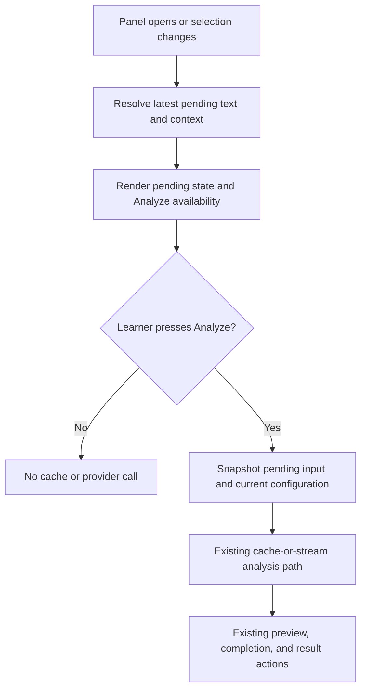

# Explicit Analysis Confirmation - Plan

## Goal Capsule

- **Objective:** Learners decide when a selected Japanese passage is sent for analysis.
- **Means:** Keep incoming selections as pending side-panel input and begin the existing analysis path only from an explicit Analyze control. (KTD1)
- **Execution profile:** Client-side Chrome extension change with behavior and markup regression coverage before extension-wide verification.
- **Stop conditions:** Do not change the selection relay, provider APIs, callable-stream protocol, persistence format, result rendering, or saved-analysis behavior.

---

## Product Contract

### Summary

The side panel will show the latest valid page selection as pending work and require the learner to press Analyze before any managed or personal-provider analysis starts.
Opening the panel, receiving a selection update, and changing analysis configuration will not submit the selected text.

### Problem Frame

The current side panel invokes analysis whenever it initializes with stored selection data or receives a selection update.
That submits text without a learner’s final confirmation and makes selection changes unexpectedly consume an analysis request.

### Key Decisions

- **Explicit confirmation gates every analysis request.** Pending selection changes and configuration changes only prepare future analysis; the Analyze control is the sole client-side request trigger. Governs R1, R2, R4.
- **A pending selection is distinct from a completed analysis.** It must not replace a completed analysis or rebind its result actions to pending input before the learner explicitly starts a replacement. Governs R3, R5.
- **Existing personal-provider safety invalidation remains authoritative.** Revocation or clearing of a personal provider can still cancel and invalidate unsafe personal-result access; this is not an automatic submission path. Governs R6.

### Requirements

**Pending selection and confirmation**

- R1. When the side panel opens or receives selected text and surrounding-context updates, it records the latest pending selection without calling either managed or personal-provider analysis.
- R2. The panel provides an accessible learner-facing Analyze control that is enabled only for a valid pending selection and validates the 2–500-character boundary again when activated.
- R3. Activating Analyze snapshots the current pending text and normalized context, resolves the current prompt and provider configuration within one confirmed request, then uses the existing streaming and completed-result path unchanged.
- R4. Changing the analysis mode, provider mode, provider profile, model catalog, or pending selection configures the next Analyze activation but never submits text itself.

**Result and safety behavior**

- R5. A new pending selection does not interrupt an active confirmed analysis or replace its completed result; Copy, Save As, and Save for Later continue to address the last completed analysis until a learner starts a replacement.
- R6. Existing provider-identity safety behavior remains in force: a mode, profile, or revision change cancels and invalidates the affected confirmed analysis without submitting a replacement, and an unavailable personal provider blocks a later Analyze attempt.
- R7. A confirmed replacement preserves existing cancellation, stale-callback, cache, streaming-preview, error, and terminal-completion semantics.

### Key Flows

- F1. Prepare pending selection
  - **Trigger:** The panel opens with stored selection data, or the page produces a new selection/context update.
  - **Steps:** Read the newest selection identity, update the pending-selection UI and Analyze availability, and leave all provider services untouched.
  - **Outcome:** The learner sees analyzable text but no request has started.
  - **Covers:** R1, R2, R5.

- F2. Confirm analysis
  - **Trigger:** The learner presses Analyze.
  - **Steps:** Validate and snapshot the pending identity plus current configuration, then enter the existing cache-or-stream analysis lifecycle.
  - **Outcome:** Only deliberate confirmation can produce an LLM request or cached-result restoration.
  - **Covers:** R2, R3, R6, R7.

### Acceptance Examples

- AE1. Open with a valid selection
  - **Given:** Stored page selection and context are valid when the side panel opens.
  - **When:** Initialization completes.
  - **Then:** Analyze is available, the selection is pending, and neither provider nor cache-restoration path is called.

- AE2. Update selection while the panel is open
  - **Given:** The panel has an existing completed analysis or an active confirmed stream.
  - **When:** A different selection or context arrives.
  - **Then:** The pending input changes without starting or cancelling provider work; completed-result actions retain their completed-analysis binding.

- AE3. Confirm a valid selection
  - **Given:** A valid pending selection and an enabled Analyze control.
  - **When:** The learner presses Analyze.
  - **Then:** Exactly one existing managed or personal-provider analysis flow begins with that selection and its context.

- AE4. Change configuration before confirmation
  - **Given:** A valid pending selection.
  - **When:** The learner changes analysis mode or provider configuration.
  - **Then:** No replacement analysis begins; the next Analyze activation uses the new configuration, while an existing confirmed request follows the current provider-identity cancellation boundary.

### Success Criteria

- Opening or updating selection state produces zero analysis-service calls until Analyze is activated.
- The confirmed analysis retains the current callable-stream chunk and terminal-result contract.
- The extension suite and production build remain green.

### Scope Boundaries

- No backend, Firebase callable, content-script, background-relay, storage-schema, or webapp changes are part of this work.
- This work does not add editing, history, queued selections, automatic retry, keyboard shortcuts, or a new cached-result policy.

#### Deferred to Follow-Up Work

- Editing selected text in the side panel before confirmation.
- Allowing learners to manage a history or queue of pending selections.

### Sources and Research

- `japanese-alchemy-chrome-extension/src/sidepanel/sidepanel.js` owns panel initialization, storage/message selection intake, current analysis state, and managed/personal streaming invocation.
- `japanese-alchemy-chrome-extension/src/sidepanel/sidepanel.html` provides the existing top controls and cancellation-control accessibility pattern.
- `japanese-alchemy-chrome-extension/tests/sidepanel.analysisModeBehavior.test.js` models streaming, stale callbacks, selection changes, cache behavior, and analysis-mode changes.
- `docs/solutions/CALLABLE_STREAMING_MIGRATION.md` defines the supported callable-stream client contract that this UI-only change must preserve.
- `CONCEPTS.md` defines the completed cached analysis result as context-bound state rather than pending selection state.

---

## Planning Contract

### Key Technical Decisions

- KTD1. **Split pending input from confirmed analysis state.** Introduce a side-panel pending-selection projection containing normalized text and context, and make selection intake update only that projection. Keep `analizingSelectedText()` as the confirmed execution boundary so its provider, cache, streaming, and terminal-result semantics remain concentrated in one path. Governs R1, R3, R5, R7.
- KTD2. **Make configuration changes future-facing.** Prompt and provider controls persist/render their selections but do not force re-analysis; Analyze resolves the currently selected configuration within its confirmed request. Existing provider-identity changes retain their cancellation/invalidation safety boundary without retrying. Governs R3, R4, R6.
- KTD3. **Guard asynchronous pending updates by newest identity.** Panel-start storage reads and storage/message events can arrive out of order, so update pending UI only when the resolved selection/context is still current. Reuse normalized context and existing identity conventions rather than introducing a second cache key. Governs R1, R5.
- KTD4. **Preserve security and confirmed-lifecycle exceptions.** Ordinary pending updates never cancel a confirmed stream. Existing provider-identity cancellation and readiness safeguards stay intact without submitting a replacement, and a subsequent explicit Analyze uses current cancellation and request-ID protection to replace work. Governs R5, R6, R7.

### High-Level Technical Design

### Implementation Constraints

- Treat storage and runtime message data as stale-capable input; validate selection at activation even when the control appears enabled.
- The same text with different surrounding context is a distinct pending identity.
- Synchronously lock Analyze at click time, before any asynchronous setup, and restore its availability only when the owning request reaches a terminal state; existing Stop analysis remains the cancellation mechanism.
- Do not call `restoreCompletedAnalysis()` before explicit confirmation, because a panel open or selection update must not enter the analysis lifecycle.
- Preserve `textSelectedChanged` message handling as a compatibility intake path even though the current background relay writes storage.

---

## Implementation Units

### U1. Add pending-selection confirmation controls and state

- **Goal:** Let the side panel expose current pending text and an accessible Analyze action without treating the selection as a request.
- **Requirements:** R1, R2, R5, AE1, AE2.
- **Dependencies:** None.
- **Files:** `japanese-alchemy-chrome-extension/src/sidepanel/sidepanel.html`, `japanese-alchemy-chrome-extension/src/sidepanel/sidepanel.js`, `japanese-alchemy-chrome-extension/tests/sidepanel.analysisModeMarkup.test.js`, `japanese-alchemy-chrome-extension/tests/sidepanel.analysisModeBehavior.test.js`.
- **Approach:**
  1. Add a learner-facing Analyze button near existing panel controls with disabled, accessible invalid/pending states.
  2. Add side-panel helpers that store and render normalized pending text/context independently from completed-analysis and active-request state.
  3. Wire the new DOM reference and click listener so only the handler invokes the existing confirmed-analysis routine.
- **Patterns to follow:** The hidden `cancelAnalysisButton` control and its DOM wiring; `isValidSelection()` for UI and activation boundary validation.
- **Test scenarios:**
  - Covers AE1. A valid panel-open selection displays as pending, enables Analyze, and makes zero service or cache-restoration calls.
  - An empty, too-short, and too-long pending selection leaves Analyze unavailable and produces no service call even if activation is invoked directly.
  - Markup exposes the visible Analyze label, button semantics, and an initial disabled state without disturbing existing controls.
- **Verification:** A valid selection can be prepared without an LLM request, and invalid input cannot enter analysis.

### U2. Route every automatic intake path through pending state

- **Goal:** Convert panel initialization, storage changes, and legacy runtime selection messages into safe latest-pending updates.
- **Requirements:** R1, R5, R6, AE1, AE2.
- **Dependencies:** U1.
- **Files:** `japanese-alchemy-chrome-extension/src/sidepanel/sidepanel.js`, `japanese-alchemy-chrome-extension/tests/sidepanel.analysisModeBehavior.test.js`, `japanese-alchemy-chrome-extension/tests/sidepanel.personalProviderBehavior.test.js`.
- **Approach:**
  1. Replace direct calls from `loadSelectedText()`, the selection-related storage listener, and `textSelectedChanged` message handling with the common pending-state update path.
  2. Ensure delayed initialization reads and duplicate message/storage notifications cannot overwrite a newer pending identity.
  3. Keep completed analysis and active confirmed streams untouched by ordinary pending updates; retain existing provider-identity cancellation/invalidation behavior without starting a replacement request.
- **Patterns to follow:** `normalizeContext()`, `analysisRequestId` stale-work protection, and provider-state checks in `handleSidepanelStorageChanges()`.
- **Test scenarios:**
  - Covers AE2. A storage text or context update changes pending input but neither calls `generateResponseStream()` nor cancels an active confirmed request.
  - The legacy runtime message updates pending input and makes no provider call.
  - A delayed panel-open read cannot overwrite a newer selection received through storage or message delivery.
  - Equal text with changed surrounding context becomes a new pending identity.
  - A completed result remains copyable and saveable after a different pending selection arrives.
  - A provider mode, profile, or revision change retains the existing cancellation/invalidation behavior without creating an analysis request.
- **Verification:** All automatic selection sources converge on the same no-submit pending state, including races.

### U3. Make Analyze the only transition into analysis

- **Goal:** Start existing cache-or-stream behavior only from a deliberate learner confirmation and prevent settings from bypassing it.
- **Requirements:** R2, R3, R4, R6, R7, AE3, AE4.
- **Dependencies:** U1, U2.
- **Files:** `japanese-alchemy-chrome-extension/src/sidepanel/sidepanel.js`, `japanese-alchemy-chrome-extension/tests/sidepanel.analysisModeBehavior.test.js`, `japanese-alchemy-chrome-extension/tests/sidepanel.personalProviderBehavior.test.js`.
- **Approach:**
  1. Snapshot pending text/context and synchronously acquire request ownership in the Analyze handler before calling `analizingSelectedText()`; let the confirmed lifecycle resolve the current prompt/provider configuration under its existing request-ID guard.
  2. Remove the forced analysis transition from analysis-mode changes and keep provider-mode/profile transitions future-facing.
  3. Keep the existing confirmed request’s cache, direct-provider, callable-stream, cancellation, stale-callback, error, and completion behavior intact after activation.
- **Patterns to follow:** Existing `analizingSelectedText()` request identity/cancellation lifecycle, `handleAnalysisModeChange()` preference persistence, and callable-stream handling in `JaAlchemyApiService`.
- **Test scenarios:**
  - Covers AE3. One Analyze activation starts exactly one managed request with the latest pending text and context.
  - A ready personal provider is selected only at Analyze time and receives the same snapshot through the existing direct-provider route.
  - Covers AE4. Changing analysis mode or provider configuration with pending text starts zero requests; a later Analyze uses the changed selection.
  - Two immediate Analyze activations before prompt/provider setup resolves create at most one request, and Stop analysis continues to cancel it.
  - A pending text/configuration change during a confirmed stream cannot relabel its chunks, cache, or completed actions; an explicit later Analyze replaces it through the existing stale-callback guard.
  - A provider identity change during setup invalidates the confirmed activation without silently retrying under a different provider; a later Analyze is required.
  - An unavailable personal provider fails at Analyze time without submitting data or making an unrelated completed result unsafe.
- **Verification:** The only new path into analysis is the Analyze control, while all existing post-confirmation lifecycle coverage continues to pass.

---

## Verification Contract

| Gate | Applies to | Evidence |
| --- | --- | --- |
| Focused behavior tests | U1–U3 | `cd japanese-alchemy-chrome-extension && npm test -- sidepanel.analysisModeBehavior.test.js sidepanel.personalProviderBehavior.test.js --runInBand` passes. |
| Focused markup tests | U1 | `cd japanese-alchemy-chrome-extension && npm test -- sidepanel.analysisModeMarkup.test.js --runInBand` passes. |
| Extension regression suite | U1–U3 | `cd japanese-alchemy-chrome-extension && npm test -- --runInBand` passes. |
| Production build | U1–U3 | `cd japanese-alchemy-chrome-extension && npm run build` completes successfully. |
| Manual smoke check | U1–U3 | Open with a selection, change selection and analysis mode, confirm once, then verify no request starts before confirmation and existing streaming/cancellation behavior works after it. |

---

## System-Wide Impact

- **Learner experience:** Selection becomes a deliberate two-step action, preventing unintended managed or personal-provider requests.
- **Privacy and cost:** Text remains local until Analyze is pressed; the existing provider route and payload are unchanged after confirmation.
- **Compatibility:** Content-script-to-background storage relay and Firebase callable streaming remain unchanged; the side panel alone changes when it invokes them.
- **Personal-provider safety:** Permission and readiness gates continue to protect personal-provider analysis independently of the new confirmation control.

---

## Risks and Dependencies

- Selection message and storage delivery can race panel initialization. Mitigation: one guarded pending-state projection with ordering tests.
- Existing settings handlers currently force analysis. Mitigation: remove only their trigger behavior while retaining preference persistence and rendering coverage.
- Completed result actions can be confused with a new pending selection. Mitigation: keep pending and confirmed state explicitly separate and test their bindings.
- Personal-provider state changes have security implications. Mitigation: preserve the current readiness/revocation invalidation boundary and extend its regression coverage.

---

## Definition of Done

- U1–U3 satisfy their listed verification outcomes.
- No panel-open, storage-update, runtime-message, prompt-mode, or provider-mode path starts an analysis request or cache restoration.
- Analyze is accessible, validates pending input, and is the only path that starts managed or personal-provider analysis.
- Pending selections do not interrupt confirmed analysis or misbind completed result actions; personal-provider revocation safety remains intact.
- Existing callable-stream chunks, direct-provider behavior, completion caching, cancellation, and stale-callback protection are preserved after confirmation.
- Focused tests, the extension test suite, and production build are green.
- No abandoned automatic-trigger or duplicate pending-state code remains in the final change.
