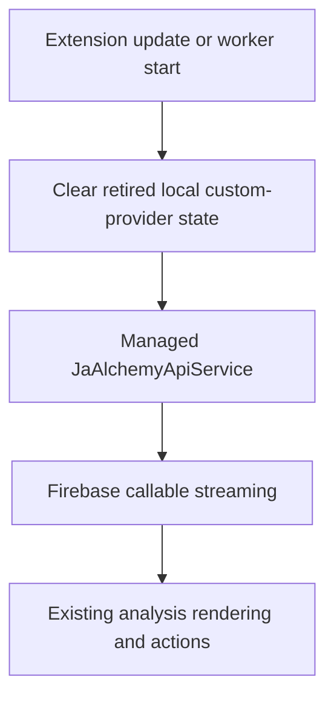

# Remove Custom LLM Provider - Plan

## Goal Capsule

- **Objective:** Give Japanese learners one simple, supported managed analysis experience without requiring them to understand LLM providers, API keys, or models.
- **Means:** Retire the Chrome extension's learner-configured LLM provider capability.
- **Product authority:** This work owns the Chrome extension's custom-provider experience and its locally stored data. Managed backend provider operations and the webapp are outside its authority.
- **Open blockers:** None.

---

## Product Contract

### Summary

The Chrome sidepanel will offer managed J-Buddy analysis as its only provider experience.
It will remove custom-provider setup, selection, direct analysis, and their locally retained data.

### Problem Frame

Japanese learners should be able to focus on reading and learning, not on choosing a provider or supplying API credentials.
The custom-provider experience makes the core sidepanel unnecessarily technical and presents a second, unsupported product path.

### Key Decisions

- **Managed analysis is the sole learner-facing provider experience.** The product favors a kind, simple learning flow over retaining a bring-your-own-provider fallback. Governs R1, R2, R5.
- **An update removes custom-provider data.** Existing credentials and related local state must not remain after the feature is retired. Governs R3. (session-settled: user-directed — chosen over retaining saved custom-provider configuration: no custom-provider data should remain.)
- **Managed provider operations remain a backend concern.** Learners do not choose them in the sidepanel. Governs R4, R6.

### Actors

- A1. **Japanese learner:** selects text and receives a managed J-Buddy analysis without provider setup.
- A2. **Chrome extension:** presents the managed analysis experience and removes retired local custom-provider data.
- A3. **J-Buddy managed service:** supplies the analysis through the existing managed route.

### Requirements

**Learner experience**

- R1. The sidepanel must present managed J-Buddy analysis as the only LLM-provider experience.
- R2. The extension must not expose controls or messaging for a learner-supplied API URL, API key, protocol, model, provider mode, or model catalog.
- R3. An extension update must remove a prior custom provider's saved profile, API key, selected mode, cached model information, and related cleanup state without waiting for the learner to open the sidepanel.

**Analysis behavior and support boundary**

- R4. Every sidepanel analysis must use the existing managed analysis route.
- R5. Removing custom-provider support must preserve the existing managed analysis result experience, including progressive output and its existing result actions.
- R6. The extension must no longer retain direct custom-provider transport or permissions that exist only for learner-configured provider origins.

**Documentation and regression coverage**

- R7. Current extension-facing documentation and automated coverage must describe and verify managed-only analysis rather than a learner-configurable provider path.

### Key Flows

- F1. Managed analysis after retirement
  - **Trigger:** A learner asks the sidepanel to analyze selected Japanese text.
  - **Actors:** A1, A2, A3.
  - **Steps:** The extension sends the request through the managed route and renders the returned analysis with existing progressive-result behavior.
  - **Outcome:** The learner receives an analysis without selecting or configuring an LLM provider.
  - **Covered by:** R1, R4, R5.

- F2. Update for a previous custom-provider user
  - **Trigger:** A learner opens an updated extension that previously held custom-provider configuration.
  - **Actors:** A1, A2.
  - **Steps:** The extension removes all retired custom-provider data before presenting the ready sidepanel.
  - **Outcome:** The sidepanel is managed-only and no old learner API key or custom-provider state remains.
  - **Covered by:** R1, R3, R6.

### Acceptance Examples

- AE1. **Covers R1, R2, R4.** Given a new learner opens the sidepanel, when they inspect settings and analyze text, then they encounter no provider-selection or credential UI and the analysis uses the managed route.
- AE2. **Covers R3, R6.** Given a prior extension installation contains a custom provider and its cached metadata, when the updated extension initializes, then the retired values are removed and no custom-origin permission remains needed for the feature.
- AE3. **Covers R5.** Given a learner analyzes text after retirement, when managed analysis streams a result, then the sidepanel continues to render the progressive result and retain its existing actions.

### Scope Boundaries

- The managed backend's provider configuration, credentials, and provider-selection policy are not changed.
- The webapp's saved-item and review experience is not changed.
- A replacement learner-configurable provider or fallback path is not introduced.
- Historical plans and architectural records remain as history; current documentation must not represent custom-provider analysis as supported behavior.

### Sources / Research

- `docs/plans/2026-08-09-001-feat-extension-personal-provider-analysis-plan.md` documents the retired direct personal-provider path and its extension-only boundary.
- `japanese-alchemy-chrome-extension/src/sidepanel/sidepanel.js` selects direct versus managed analysis and renders custom-provider settings.
- `japanese-alchemy-chrome-extension/src/scripts/personalProvider.js` holds local custom-provider state and credential lifecycle behavior.
- `japanese-alchemy-chrome-extension/src/scripts/directLlmApiService.js` implements direct learner-provider requests.
- `japanese-alchemy-chrome-extension/src/scripts/jaAlchemyApiService.js` is the existing managed Firebase callable route.
- `japanese-alchemy-hosting/functions/src/config.ts` and `japanese-alchemy-hosting/functions/src/services/llmService.ts` establish that managed backend provider configuration is independent of the extension feature.

---

## Planning Contract

### Key Technical Decisions

- KTD1. **Perform an idempotent retirement migration from the extension update lifecycle.** Run the cleanup from the background worker on update and retry it from worker startup when needed, so deletion does not depend on opening the sidepanel. Covers R3, R4, R6.
- KTD2. **Delete the custom-provider subsystem instead of leaving dormant compatibility code.** Remove the state module, direct client, UI bindings, optional-origin permission need, and focused tests as one boundary. Covers R1, R2, R6, R7.
- KTD3. **Keep the managed client contract unchanged.** Its callable streaming behavior is the supported analysis path and remains covered by its existing service tests. Covers R4, R5.

### High-Level Technical Design

### Implementation Constraints

- Preserve the existing analysis-mode controls; they choose prompt variants, not LLM providers.
- The removal must not change Firebase Functions provider configuration or webapp behavior.
- Cleanup must be safe for both a fresh profile and a profile that holds legacy custom-provider storage or granted origin permissions.

### Risks and Mitigations

- Chrome can report a storage or optional-origin removal failure. Retry the idempotent cleanup on subsequent worker starts; do not mark retirement complete until storage removal succeeds.
- Removing a large sidepanel branch can accidentally disturb result rendering. Preserve managed-service integration tests and add managed-only regression coverage around initialization and analysis selection.

---

## Implementation Units

### U1. Retire persisted custom-provider state during extension updates

- **Goal:** Remove legacy custom-provider storage and origin permissions when an upgraded extension initializes, while leaving the sidepanel in managed mode.
- **Requirements:** R3, R6; Covers F2 and AE2.
- **Dependencies:** None.
- **Files:** `japanese-alchemy-chrome-extension/src/scripts/background.js`, `japanese-alchemy-chrome-extension/src/scripts/retirePersonalProvider.js`, `japanese-alchemy-chrome-extension/tests/background.providerStorage.test.js`, `japanese-alchemy-chrome-extension/tests/retirePersonalProvider.test.js`.
- **Approach:** Add a small, idempotent migration that the existing MV3 update lifecycle invokes. It removes every fixed legacy storage key and all catalog-prefix records, resets the legacy mode, and releases saved custom origins. Retry failed storage removal from the next background-worker start; sidepanel startup is not the trigger or owner of the migration.
- **Patterns to follow:** The existing `chrome.runtime.onInstalled` registration in the background worker and the current `clearPersonalProvider` permission-release behavior.
- **Test scenarios:**
  - Covers AE2. An update with a legacy profile, API key, catalog records, and personal mode removes those values without opening the sidepanel.
  - A legacy origin permission is released as part of the update migration before the manifest no longer declares the optional-host capability.
  - A failed storage removal is retried on the next worker start and cannot make the direct route available.
- **Verification:** The update lifecycle removes every retired storage key and catalog record, and worker-start retry covers a reported cleanup failure.

### U2. Simplify the sidepanel to managed analysis

- **Goal:** Remove custom-provider settings, conditional analysis routing, and direct-service wiring while preserving the managed analysis and result flow.
- **Requirements:** R1, R2, R4, R5; Covers F1, AE1, and AE3.
- **Dependencies:** U1.
- **Files:** `japanese-alchemy-chrome-extension/src/sidepanel/sidepanel.html`, `japanese-alchemy-chrome-extension/src/sidepanel/sidepanel.js`, `japanese-alchemy-chrome-extension/tests/sidepanel.analysisModeMarkup.test.js`, `japanese-alchemy-chrome-extension/tests/sidepanel.analysisModeBehavior.test.js`, `japanese-alchemy-chrome-extension/tests/jaAlchemyApiService.test.js`.
- **Approach:** Remove provider-switching markup, custom form controls, startup element queries, storage listeners, and event handlers. Make the established managed service the sole analysis dependency, retaining prompt-variant analysis modes and progressive result handling.
- **Patterns to follow:** The current managed branch of `analizingSelectedText` and `JaAlchemyApiService` callable-streaming behavior.
- **Test scenarios:**
  - Covers AE1. A fresh sidepanel contains no custom-provider or credential controls and analyzes through the managed service.
  - Prompt-variant analysis modes remain available and do not expose provider selection.
  - Covers AE3. A managed streamed response still updates the rendered result and preserves existing result actions.
- **Verification:** Sidepanel tests prove managed-only routing and existing managed result behavior.

### U3. Remove direct-provider artifacts and update project surfaces

- **Goal:** Eliminate code, permissions, tests, and current documentation that describe a learner-configured provider as supported.
- **Requirements:** R6, R7.
- **Dependencies:** U1, U2.
- **Files:** `japanese-alchemy-chrome-extension/src/scripts/personalProvider.js`, `japanese-alchemy-chrome-extension/src/scripts/directLlmApiService.js`, `japanese-alchemy-chrome-extension/src/scripts/directAnalysisContract.js`, `japanese-alchemy-chrome-extension/src/scripts/modelCatalog.js`, `japanese-alchemy-chrome-extension/src/manifest.json`, `japanese-alchemy-chrome-extension/tests/personalProvider.test.js`, `japanese-alchemy-chrome-extension/tests/directLlmApiService.test.js`, `japanese-alchemy-chrome-extension/tests/directAnalysisContract.test.js`, `docs/adr/0001-personal-provider-protocols.md`, `docs/solutions/runtime-errors/window-fetch-illegal-invocation.md`, `CONCEPTS.md`.
- **Approach:** Delete the now-unreachable custom-provider modules and their dedicated tests only after U1 owns legacy cleanup. Remove the optional-host permission after update cleanup has had the chance to release existing grants. Mark current architecture/vocabulary material as retired or historical without rewriting prior implementation plans.
- **Patterns to follow:** Existing manifest permission conventions and the repository's durable-document format.
- **Test scenarios:**
  - The extension manifest has no optional host permission solely supporting learner-configured provider origins.
  - The extension build succeeds without direct-provider modules or tests.
  - Documentation no longer represents a personal provider as a supported current capability.
- **Verification:** Repository search finds no runtime custom-provider implementation or learner-facing current documentation, while historical plans remain intact.

---

## Verification Contract

| Check | Evidence |
| --- | --- |
| Extension unit suite | `cd japanese-alchemy-chrome-extension && npm test` passes, including managed analysis regression coverage. |
| Production bundle | `cd japanese-alchemy-chrome-extension && npm run build` succeeds without removed modules or obsolete manifest permissions. |
| Focused discovery | Repository search confirms no remaining runtime import, UI control, or direct request path for a learner-supplied provider. |
| Managed-path regression | The managed callable-service tests continue to pass and sidepanel behavior uses only that path. |

---

## Definition of Done

- U1, U2, and U3 are complete and their referenced test scenarios pass.
- The extension exposes only managed LLM analysis to learners.
- Existing custom-provider credentials and associated local data are removed during upgrade initialization.
- No direct learner-provider transport or feature-specific origin permission remains in the shipped extension.
- The extension test suite and production build pass.
- The diff contains no abandoned compatibility code or stale current-support documentation.
