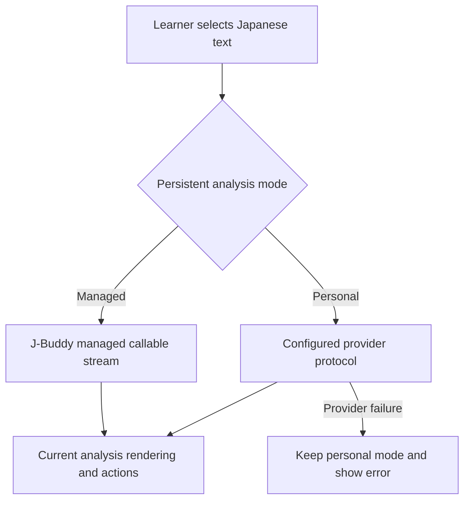
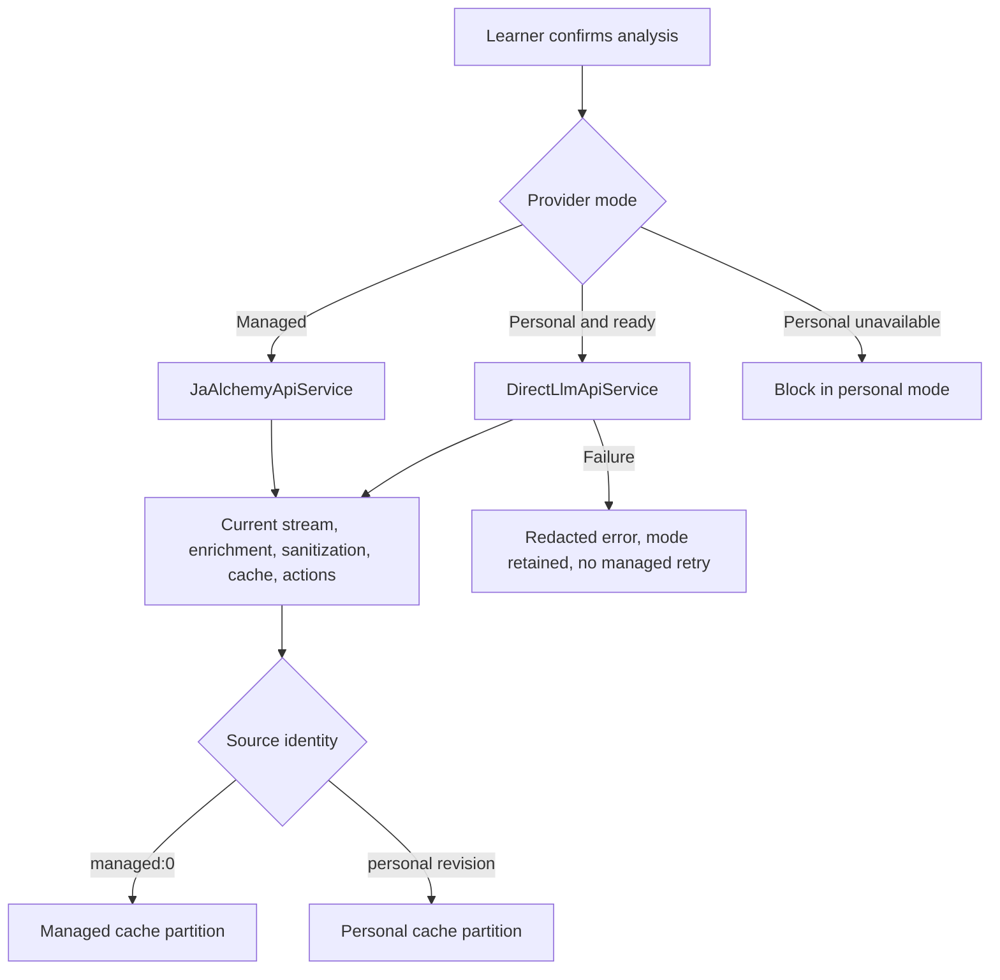
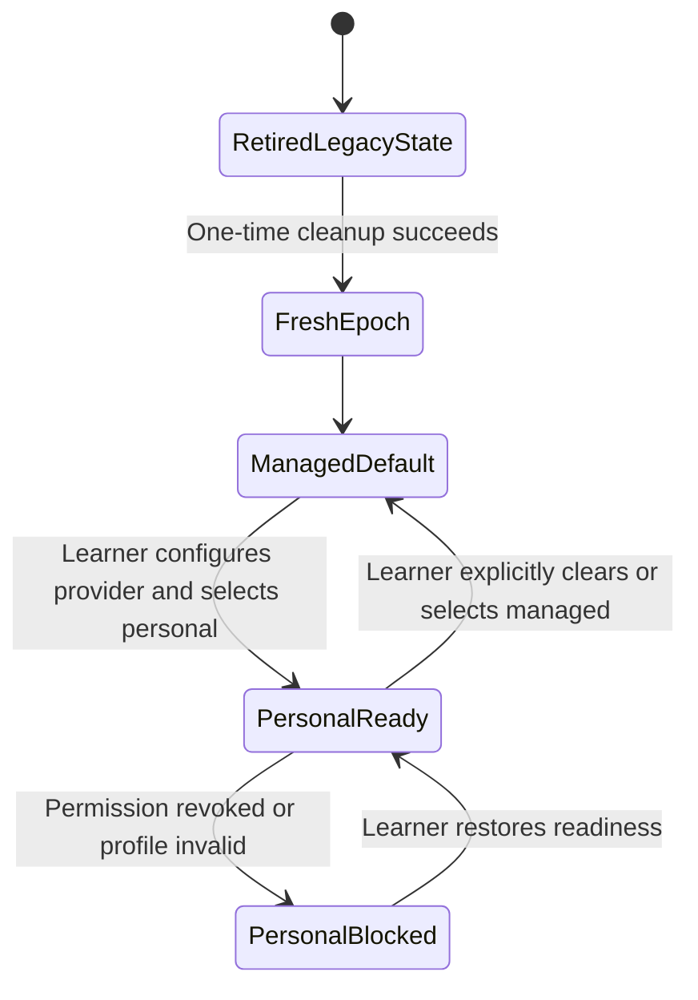

# Restore Custom LLM Provider - Plan

## Goal Capsule

- **Objective:** Give Chrome-extension learners the former choice between J-Buddy's managed analysis and a locally configured personal LLM provider, while preserving the managed route's current behavior.
- **Means:** Restore the full pre-removal personal-provider capability and integrate it with the current extension analysis flow rather than reverting current `main`.
- **Product authority:** This work owns the Chrome extension's personal-provider setup, provider selection, direct analysis route, and local provider data. Managed backend provider operations, webapp configuration, and account-level provider settings are outside its authority.
- **Open blockers:** None.

---

## Product Contract

Product Contract preservation: restructured, no scope change — R7 clarified to preserve the pre-removal protocol-specific model behavior required by the full-parity decision.

### Summary

The Chrome extension will restore the former personal LLM provider experience: one local provider profile, Chat Completions and Responses protocols, model discovery with cached and manual models, per-origin permissions, direct streaming analysis, and explicit managed/personal mode selection. The restored feature will coexist with the current managed callable-streaming route and current analysis modes.

### Problem Frame

Removing the personal provider simplified the default learner experience, but it removed a working path for learners who already pay for an LLM provider or need a provider that J-Buddy does not operate. Those learners cannot use their preferred provider for J-Buddy analysis. Restoring the prior capability returns that choice without changing the managed route that remains the default.

### Key Decisions

- **Restore full prior capability** rather than a reduced technical-user path. The prior feature's protocols, model handling, permissions, direct transport, and mode switching are all part of the requested release. (session-settled: user-directed — chosen over a narrower technical-user path: the former capability is the product target.)
- **Integrate with current `main`** rather than perform an exact Git revert. Current managed-provider and analysis improvements must survive the restoration. (session-settled: user-directed — chosen over exact restoration: preserve current managed behavior while restoring the former personal-provider experience.)
- **Require fresh personal-provider setup** rather than recover credentials or cached models that survived the removal update. (session-settled: user-directed — chosen over restoring surviving data: fresh setup avoids relying on partially deleted state.)
- **Keep the prior routing contract** — managed is the first-run default, personal mode is an explicit persistent choice, and personal-provider failures do not silently switch to managed analysis. Governs R9, R11.
- **Use current analysis contracts** for direct-provider prompts. The restored route must follow the extension's current prompt variants, surrounding context, output format, and downstream parsers rather than the frozen pre-removal contract. Governs R10.

### Requirements

**Provider setup and data**

- R1. The Chrome extension must provide settings for one personal provider with an API URL, API key, protocol, and model.
- R2. Personal-provider settings, credentials, selected mode, model selection, and cached catalog data must remain in protected browser-profile local storage and must not be synced, saved to Firestore, or sent to Firebase.
- R3. Setup must clearly disclose that the selected provider receives the analysis request, surrounding context, and API usage may incur provider charges.
- R4. Setup must accept only a valid HTTPS provider base URL, request permission for that provider origin before the profile becomes usable, and remove permission for an origin when it is no longer active.
- R5. Restored installations must start with no personal-provider profile or cached model data; the restoration must not attempt to recover data removed by the retirement update.

**Protocols and models**

- R6. The personal-provider path must support both Chat Completions-compatible and Responses-compatible protocols.
- R7. Model discovery must be explicit, must retain the last successful catalog locally, must allow Responses-compatible manual model entry when discovery is unavailable, and must retain a saved Chat Completions model as a saved-only option.
- R8. A cached catalog must remain usable only while its protocol, provider URL, and credential identity match the catalog request.

**Analysis routing and behavior**

- R9. Managed J-Buddy analysis must remain the first-run default; after setup, the learner must be able to persistently choose managed or personal-provider analysis as the default.
- R10. Personal-provider analysis must send requests directly from the extension to the selected provider, preserve the selected analysis mode and surrounding context, render progressive output when the protocol supports streaming, and otherwise render a complete compatible response.
- R11. If the selected personal provider fails, the extension must keep personal mode selected, report the provider failure, and must not automatically retry through managed analysis.
- R12. Personal-provider output must use the current structured analysis contract and pass through the same sanitization and rendering protections as managed output, preserving saving, caching, copying, and export behavior.
- R13. The restored managed route must preserve the current callable-streaming behavior, current prompt modes, and current backend provider-chain behavior.

### Actors

- A1. **Learner:** configures a personal provider, selects managed or personal analysis, and receives analysis results.
- A2. **Chrome extension:** stores provider state locally, requests provider-origin permission, routes analysis according to the selected mode, and renders results.
- A3. **Personal provider:** receives direct requests from the extension and returns model catalogs or analysis responses.
- A4. **J-Buddy managed service:** continues to provide the existing managed callable-streaming analysis route.

### Key Flows

- F1. First-run managed analysis
  - **Trigger:** A learner analyzes text before configuring a provider.
  - **Actors:** A1, A2, A4.
  - **Steps:** The extension uses the managed route and renders the streamed result.
  - **Outcome:** The default experience remains managed analysis without provider setup.
  - **Covered by:** R9, R13.

- F2. Personal-provider setup
  - **Trigger:** A learner enters provider settings and saves a profile.
  - **Actors:** A1, A2, A3.
  - **Steps:** The extension validates the URL, stores the profile locally, requests origin permission, and obtains or accepts a model selection.
  - **Outcome:** The learner can select personal-provider mode with an actionable setup error if configuration cannot complete.
  - **Covered by:** R1, R2, R3, R4, R6, R7.

- F3. Personal streaming analysis
  - **Trigger:** A learner analyzes text while personal-provider mode is selected.
  - **Actors:** A1, A2, A3.
  - **Steps:** The extension sends the current prompt and context directly to the configured protocol, renders progressive output when available, and processes the completed result with existing rendering and actions.
  - **Outcome:** The learner receives a personal-provider analysis without exposing the API key to J-Buddy.
  - **Covered by:** R2, R6, R10, R12.

- F4. Personal-provider failure
  - **Trigger:** The selected provider cannot complete a catalog or analysis request.
  - **Actors:** A1, A2, A3.
  - **Steps:** The extension reports the provider failure and leaves the selected mode unchanged.
  - **Outcome:** The learner decides whether to retry, change provider settings, or explicitly switch to managed analysis.
  - **Covered by:** R11.

### Acceptance Examples

- AE1. **Covers R1, R4, R6, R7.** Given a learner configures an HTTPS provider, when they choose Chat Completions or Responses and request models, then the extension saves the profile only after required permission is granted and supports catalog or manual model selection.
- AE2. **Covers R2, R10, R12.** Given personal mode is ready, when the learner analyzes selected Japanese text with surrounding context, then the request goes directly to the configured provider and the completed output remains compatible with current rendering, saving, copying, and export.
- AE3. **Covers R8.** Given a cached model catalog, when the API URL, protocol, or credential identity changes, then the extension does not present that catalog as applicable to the new connection.
- AE4. **Covers R9, R11.** Given personal mode is selected and the provider fails, when the extension reports the error, then personal mode remains selected and no managed analysis is sent automatically.
- AE5. **Covers R13.** Given the learner remains in managed mode after update, when they analyze text, then the current managed streaming route and analysis-mode behavior remain unchanged.

### Success Criteria

- A restored installation presents no preexisting personal-provider profile or catalog.
- Dedicated extension tests cover setup, permission changes, both protocols, catalog/manual models, mode persistence, direct streaming, sanitization, failure behavior, and managed-mode regression.
- The extension test suite and production build pass after the feature is restored.

### Scope Boundaries

- No backend proxy for personal-provider requests and no Firebase storage or processing of learner API keys.
- No webapp configuration UI for personal providers.
- No multi-provider profiles, Chrome Sync, provider export/import, or account-level provider settings in this restoration.
- No automatic managed fallback after a personal-provider failure.
- No change to the managed backend provider chain or its provider selection.

### Dependencies / Assumptions

- The pre-removal implementation remains available as implementation evidence in Git history.
- Providers accessible from a Chrome extension can support the required direct-request and permission model.
- Current managed analysis remains available while personal-provider analysis is restored alongside it.

### Sources / Research

- `docs/plans/2026-08-09-001-feat-extension-personal-provider-analysis-plan.md` — original personal-provider product contract.
- `docs/plans/2026-08-17-0035-feat-personal-provider-model-cache-plan.md` — model and catalog-cache behavior.
- `docs/plans/2026-09-03-2114-refactor-remove-custom-llm-provider-plan.md` — retirement and local-data deletion requirements.
- `docs/adr/0001-personal-provider-protocols.md` — superseded protocol decisions, retained as historical evidence.

---

## Planning Contract

### Key Technical Decisions

- KTD1. **Restore dedicated subsystems from `9e8e741^`, merge shared surfaces selectively.** The provider state, catalog, direct contract, and direct transport modules were cohesive before removal; the current background and sidepanel contain later behavior that a wholesale revert would lose. Governs R1 through R13.
- KTD2. **Use a one-time restoration epoch for fresh setup.** Legacy provider data is ignored and discarded once, while a saved current-epoch profile survives worker restarts. Governs R4 and R5.
- KTD3. **Keep managed and personal transports isolated at the sidepanel dispatch seam.** The selected mode chooses exactly one service; neither route can call the other as an implicit fallback. Governs R9 through R13.
- KTD4. **Partition completed analysis caches by provider source and a bounded non-secret configuration identity.** Managed results use `managed:0`; personal results are identified by restoration epoch plus profile revision/configuration generation, protocol, endpoint, model, prompt variant, selected text, and context. Only bounded, canonicalized derived analysis output is cached—never SSE frames, provider envelopes, headers, raw errors, or uncanonicalized payloads—and personal cache access remains blocked when exact-origin permission is unavailable. Governs R8 and R12.
- KTD5. **Guard browser-side prompt parity against the current backend source.** The restored browser-safe prompts currently match `main`, but automated checks must fail when backend prompts or context formatting change without updating the direct contract. Governs R10 and R12.
- KTD6. **Extract a narrow provider-aware dispatch preparation path before routing.** Move source identity, readiness, service selection, and callback dispatch out of the sidepanel's high-complexity orchestration while leaving DOM rendering and toolbar state in place. Governs R10 through R13.
- KTD7. **Use a persisted provider-store epoch as the stale-work boundary.** Cache lookup, dispatch, completion, and persistence accept a result only when the request's epoch, mode, profile revision, prompt variant, and selected text still match the current snapshot. Governs R8 through R12.

### High-Level Technical Design

### Assumptions

- The restoration release updates every installation to a fresh provider epoch; clean installs need no migration work beyond initializing managed defaults.
- If protected local storage or optional host permissions are unavailable, managed analysis remains available and personal setup reports a capability error.
- A failed provider setup preserves the last usable committed profile; newly granted but unused origin permissions are released.
- Provider response bodies, credentials, authorization headers, and raw endpoint details remain excluded from learner-facing errors and logs.
- A completed personal response enables actions only after the current structured parser accepts it; invalid or empty terminal output fails without caching or managed fallback.
- Managed daily-allowance exhaustion suppresses managed analysis only; personal analysis remains available in personal mode.
- Current cancellation and supersession behavior applies to both routes: incomplete output is never cached, saved, copied, or exported.
- The managed cache partition intentionally keeps the extension's current `managed:0` identity; changing managed policy identity for invisible backend provider changes is separate work.

### Implementation Constraints

- Use `9e8e741^` as the source for the removed dedicated modules and tests, not as a branch-state target.
- Do not alter managed request construction, Firebase callable handlers, backend provider selection, or the webapp.
- Keep API keys out of model-catalog payloads, analysis-cache identities, Firebase requests, logs, and error messages.
- Normalize provider base URLs to HTTPS while preserving their safe base paths; reject embedded credentials, query strings, and fragments, omit ambient credentials, reject cross-origin redirects, derive exact-origin permissions from the URL, and send the authorization header only to the verified configured origin.
- Render personal streaming, completed, cached, and saved output through DOMPurify with no regex fallback when sanitization is unavailable.
- Bound model-catalog payloads and direct-request streaming by body, line, output, idle, and total-duration limits; malformed or non-terminal protocol frames fail closed.
- Recheck exact-origin permission immediately before every model-discovery and personal-analysis request.
- Keep model catalogs generation-owned and bounded; catalog records must not supply a destination URL or persist a credential.
- Preserve the receiver-sensitive browser `fetch` binding and its tests.
- Keep `analizingSelectedText()` changes surgical; the current function is already high-complexity and should not be replaced wholesale.
- Do not share runtime provider-service code with Functions; only the prompt and message semantics are parity-tested.
- Do not move prompt files into a shared package because that would turn an extension restoration into a coupled Functions deployment.

### System-Wide Impact

- **Extension boundary:** Provider state, prompt/request builders, protocol adapters, dispatch, and DOM orchestration remain separate; protocol adapters never import Firebase, Firestore, allowance, cache, or sidepanel state.
- **Data lifecycle:** The provider epoch invalidates old profiles, catalogs, and personal completed-analysis cache entries without recovering deleted credentials; permission cleanup remains retryable until Chrome confirms the exact validated origin.
- **Managed surface:** Request-body construction, callable streaming, backend provider selection, Firestore persistence, and webapp behavior remain unchanged.
- **Release unit:** The restoration ships as extension-only; Functions tests are contract neighbors, not a deployment requirement.

### Risks & Dependencies

- **High-merge-risk sidepanel:** Extract current request preparation and completion behavior first and keep DOM responsibilities in the sidepanel; regression tests must pass before personal routing is enabled.
- **Provider heterogeneity:** Unsupported streaming, malformed SSE, empty output, and provider-specific errors remain terminal personal failures; no broad retry or managed fallback is added.
- **Chrome capability variance:** Missing trusted-storage or optional-host APIs disable personal setup while managed analysis remains available.
- **Prompt-copy drift:** Backend prompt or context changes must fail the extension parity test before release.
- **Stale async writers:** Every continuation rechecks the persisted provider epoch and request snapshot before rendering, completing, caching, or cleaning up.
- **Permission review:** Arbitrary HTTPS learner endpoints depend on declared optional host capability and exact-origin runtime requests; documentation must make that boundary visible.

---

## Implementation Units

### U1. Restore provider state and fresh epoch

- **Goal:** Restore protected provider storage, model-catalog state, exact-origin permission handling, and a one-time fresh-setup lifecycle.
- **Requirements:** R1 through R8; advances AE1 and AE3.
- **Dependencies:** None.
- **Files:** `japanese-alchemy-chrome-extension/src/scripts/personalProvider.js`, `japanese-alchemy-chrome-extension/src/scripts/modelCatalog.js`, `japanese-alchemy-chrome-extension/src/scripts/background.js`, `japanese-alchemy-chrome-extension/src/scripts/retirePersonalProvider.js`, `japanese-alchemy-chrome-extension/src/manifest.json`, `japanese-alchemy-chrome-extension/tests/personalProvider.test.js`, `japanese-alchemy-chrome-extension/tests/background.providerStorage.test.js`, `japanese-alchemy-chrome-extension/tests/webpack.config.test.js`.
- **Approach:**
  1. Restore the pre-removal provider-state and catalog modules, then add a current-epoch guard that ignores pre-restoration profiles and catalogs.
  2. Replace recurring retirement with one-time legacy cleanup and trusted-context storage restriction while preserving the current selection/context worker behavior.
  3. Remove the obsolete retirement module after its cleanup responsibility moves to the epoch initialization.
  4. Restore optional HTTPS host capability in the manifest while runtime code continues normalizing, rechecking, and requesting only the exact provider origin.
- **Patterns to follow:** `9e8e741^:japanese-alchemy-chrome-extension/src/scripts/personalProvider.js`, `9e8e741^:japanese-alchemy-chrome-extension/src/scripts/modelCatalog.js`, and the current background worker's selection/context relay.
- **Test scenarios:**
  - Covers AE1. First run persists managed mode, stores no profile or catalog, and exposes no unearned provider-origin permission.
  - Pre-restoration profile, mode, revision, catalog, and origin data are discarded once and do not reappear after restart.
  - A profile saved in the restoration epoch survives repeated worker starts and browser restarts.
  - Local storage is restricted to trusted extension contexts while selection relay storage remains usable.
  - Permission denial, replacement, revocation, storage failure, and cleanup failure preserve the last safe committed state and retry obsolete-origin cleanup.
  - Catalog records reject malformed, oversized, duplicated, misleading, cross-generation, destination-URL-bearing, and credential-bearing data.
  - Model discovery rechecks exact-origin permission immediately before each request and cannot read a catalog cache when that permission has been revoked.
  - The packaged manifest retains optional HTTPS host capability without granting a specific provider origin by default.
- **Verification:** Provider-state, background, and webpack suites pass; repeated initialization cannot delete a current-epoch profile.

### U2. Restore direct contracts and transport

- **Goal:** Restore current-contract direct requests for both protocols, hardened model discovery, streaming parsing, and safe failure behavior.
- **Requirements:** R2, R3, R6 through R8, R10, and R11; advances F2, F3, AE1, AE2, and AE4.
- **Dependencies:** U1.
- **Files:** `japanese-alchemy-chrome-extension/src/scripts/directAnalysisContract.js`, `japanese-alchemy-chrome-extension/src/scripts/directLlmApiService.js`, `japanese-alchemy-chrome-extension/tests/directAnalysisContract.test.js`, `japanese-alchemy-chrome-extension/tests/directLlmApiService.test.js`, `japanese-alchemy-hosting/functions/src/models/systemPromptV1.ts`, `japanese-alchemy-hosting/functions/src/models/systemPromptV2.ts`, `japanese-alchemy-hosting/functions/src/models/analysisMessage.ts`.
- **Approach:**
  1. Restore the browser-safe prompt, message, Chat Completions, and Responses request builders from the pre-removal implementation.
  2. Extend contract tests to compare the browser copies with generated versioned fixtures derived from the current backend prompt and context-message sources, without adding a runtime package dependency between extension and Functions.
  3. Restore both direct transports, bounded model discovery, complete-response support, SSE parsing, abort handling, redirect rejection, and redacted provider errors under body, line, output, idle, and total-duration caps.
  4. Preserve the single non-streaming retry only after a clear pre-content 4xx refusal of streaming.
- **Patterns to follow:** `9e8e741^:japanese-alchemy-chrome-extension/src/scripts/directAnalysisContract.js` and `9e8e741^:japanese-alchemy-chrome-extension/src/scripts/directLlmApiService.js`.
- **Execution note:** Establish contract parity and transport failure tests before wiring the sidepanel route.
- **Test scenarios:**
  - Covers AE2. V1 and V2 direct requests use the current backend prompts, context wrapping, delimiter sanitization, and selected analysis variant.
  - Chat Completions and Responses requests use their derived HTTPS endpoints, correct authorization header, protocol-specific body, and provider-storage opt-out where applicable.
  - Direct requests omit ambient credentials, send authorization only to the exact normalized configured origin, and reject any cross-origin redirect.
  - Model-discovery requests contain no selected text or surrounding context.
  - OpenAI SSE and Responses SSE streams reassemble fragmented CRLF and UTF-8 data and emit progressive text.
  - Malformed, non-terminal, oversized, or endless SSE input fails closed without a completion callback.
  - A clear pre-content unsupported-stream 4xx retries once without streaming; partial or ambiguous streams never retry or complete.
  - Empty, malformed, non-terminal, or incompatible output invokes the error callback without `onDone`.
  - Network, HTTP, quota, credential, URL, catalog, and malformed-response errors stay redacted and classify into actionable user-facing categories.
  - Abort signals cancel model loading and analysis without reporting a provider failure.
  - Receiver-sensitive `fetch` invocation is retained and covered.
- **Verification:** Direct-contract and direct-transport suites pass; backend prompt or context changes can fail the extension parity test.

### U3. Restore provider settings experience

- **Goal:** Restore the full provider setup surface, mode selection, model controls, disclosure, and state projection without displacing current sidepanel controls.
- **Requirements:** R1 through R9 and R11; advances F1 through F4 and AE1.
- **Dependencies:** U1 and U2.
- **Files:** `japanese-alchemy-chrome-extension/src/sidepanel/sidepanel.html`, `japanese-alchemy-chrome-extension/src/sidepanel/sidepanel.js`, `japanese-alchemy-chrome-extension/tests/sidepanel.personalProviderBehavior.test.js`, `japanese-alchemy-chrome-extension/tests/sidepanel.analysisModeMarkup.test.js`.
- **Approach:**
  1. Restore the provider settings disclosure, form, managed/personal toggle, model picker, manual-model control, status and error regions, and confirmation-based clear action.
  2. Add visible operation-specific disclosure: model discovery sends the API key directly to the chosen provider, while personal analysis sends the API key, selected text, and surrounding context directly to that provider and may incur charges.
  3. Restore masked-key editing, staged catalogs, protocol-specific model controls, permission-gesture handling, cleanup warnings, and latest-projection storage listeners.
  4. Initialize and wire provider controls alongside current analysis-mode, FAQ, website, allowance, cancellation, and auth controls.
- **Patterns to follow:** `9e8e741^:japanese-alchemy-chrome-extension/src/sidepanel/sidepanel.html` and the old provider settings helpers, merged into the current element and listener structure.
- **Test scenarios:**
  - Covers F2. First run shows managed as selected, explains personal setup, and does not expose a usable personal route until a profile is ready.
  - Saving requires valid URL, key, protocol, model, and exact-origin permission; denial stores no credentials.
  - A saved provider displays its active model and masked key without exposing the key.
  - Catalog reload preserves the last known good list on failure, rejects stale results after form or profile changes, and releases temporary unused permission.
  - Responses supports manual entry when discovery fails; Chat Completions retains a saved model as saved-only rather than expanding manual entry.
  - Provider identity or mode changes cancel and invalidate an affected active analysis; catalog-only changes do not.
  - Clearing requires confirmation, commits safe state before switching to managed, and leaves retryable cleanup warnings when origin or catalog cleanup fails.
  - Out-of-order storage projections cannot overwrite a newer provider-settings render.
  - Markup exposes required disclosure and accessible status/error semantics while preserving the current analysis-mode top bar.
- **Verification:** Provider settings and markup suites pass; current analysis-mode, FAQ, link, and auth controls remain present.

### U4. Integrate routing with current analysis lifecycle

- **Goal:** Route managed and personal analyses through exactly one service while preserving current confirmation, streaming, cancellation, cache, allowance, sanitization, and result behavior.
- **Requirements:** R2, R8 through R13; advances F1, F3, F4, and AE2 through AE5.
- **Dependencies:** U1, U2, and U3.
- **Files:** `japanese-alchemy-chrome-extension/src/sidepanel/sidepanel.js`, `japanese-alchemy-chrome-extension/src/scripts/surroundingContext.js`, `japanese-alchemy-chrome-extension/tests/sidepanel.analysisModeBehavior.test.js`, `japanese-alchemy-chrome-extension/tests/sidepanel.context.test.js`, `japanese-alchemy-chrome-extension/tests/sidepanel.dailyAllowance.test.js`, `japanese-alchemy-chrome-extension/tests/jaAlchemyApiService.test.js`.
- **Approach:**
  1. Extract current request preparation and completion persistence from `analizingSelectedText()` without changing managed behavior.
  2. Load provider readiness after the current prompt variant and use separate `managed:0` and bounded restoration-epoch-bearing `personal:<configuration-generation>` cache identities covering profile revision, protocol, endpoint, model, prompt variant, text, and context.
  3. Include the resolved provider snapshot in active-request freshness so a mode or profile change for the same selection cannot be suppressed as a duplicate.
  4. Block personal cache restoration and analysis when permission or profile readiness is missing; never substitute managed output.
  5. Select only `JaAlchemyApiService` in managed mode and only `DirectLlmApiService` in personal mode.
  6. Feed direct callbacks into the current enrichment, structured normalization, sanitization, cache projection, copy, save, and export path.
  7. Make daily-allowance suppression mode-aware and refresh availability after provider-mode changes.
- **Patterns to follow:** Current `analizingSelectedText()` request-ID and cancellation flow; old provider source identity and readiness gates.
- **Execution note:** Add routing and cache characterization coverage before changing availability logic.
- **Test scenarios:**
  - Covers AE5. Managed mode preserves the current callable stream, request body, prompt mode, confirmation, cancellation, allowance behavior, and result actions.
  - Covers AE2. Personal mode passes selected text, context, and prompt variant directly to the selected provider and never initializes the managed analysis service.
  - Managed mode never calls the configured provider.
  - Managed and personal completed results use separate cache partitions; only canonical analysis output is cached, and a revoked personal permission cannot restore its matching cache.
  - Seeded pre-restoration personal cache projections remain permanently unreachable even when a new profile revision or cache identifier collides; cleanup may delete them, but identity alone prevents restoration.
  - Personal stream output renders progressively and completes only through DOMPurify, the current parser, enrichment, and action pipeline; sanitizer unavailability fails closed.
  - Invalid or empty terminal personal output disables completion actions and writes no cache.
  - Covers AE4. Personal network, HTTP, quota, malformed-output, and permission failures keep personal mode selected and never invoke managed analysis.
  - Stop before or after the first personal chunk leaves no completable, cacheable, exportable, or saveable result.
  - A replacement selection aborts an older stream; duplicate non-forced selections do not restart; stale callbacks cannot overwrite newer UI state.
  - A provider mode or profile revision change for the same text and context is treated as a new request and cannot reuse the old active-request identity.
  - A delayed direct callback, cache write, or cleanup action after epoch, profile, mode, or prompt change is rejected.
  - Adversarial output containing scripts, event handlers, unsafe URI schemes, malformed ruby, oversized fields, malformed SSE, or an endless stream cannot reach DOM, cache, persistence, or result actions.
  - Managed allowance exhaustion disables managed analysis but not personal analysis; returning to managed restores the stored allowance state.
- **Verification:** Routing, context, allowance, managed-service, and sidepanel behavior suites pass together.

### U5. Restore documentation and release packaging

- **Goal:** Make the restored capability accurately represented in current documentation and produce a versioned extension package.
- **Requirements:** R1 through R13; advances all acceptance examples through documented behavior.
- **Dependencies:** U1 through U4.
- **Files:** `CONTEXT.md`, `CONCEPTS.md`, `docs/adr/0001-personal-provider-protocols.md`, `japanese-alchemy-chrome-extension/RELEASE.md`, `japanese-alchemy-chrome-extension/src/manifest.json`.
- **Approach:** Restore the protocol ADR to accepted status, align current context with the restoration, document fresh setup and privacy boundaries, and add a `1.5.0` restoration release note.
- **Patterns to follow:** Existing release-note formatting and ADR status conventions.
- **Test expectation:** none — documentation and packaging only; packaging correctness is covered by U1 and the Verification Contract.
- **Verification:** Current documentation no longer describes the feature as retired, and the packaged manifest reports the restoration version.

---

## Verification Contract

| Check | Scope | Command or evidence |
| --- | --- | --- |
| Provider-state suite | U1 | `cd japanese-alchemy-chrome-extension && npm test -- --runTestsByPath tests/personalProvider.test.js tests/background.providerStorage.test.js tests/webpack.config.test.js` |
| Direct-contract and transport suite | U2 | `cd japanese-alchemy-chrome-extension && npm test -- --runTestsByPath tests/directAnalysisContract.test.js tests/directLlmApiService.test.js` |
| Settings and markup suites | U3 | `cd japanese-alchemy-chrome-extension && npm test -- --runTestsByPath tests/sidepanel.personalProviderBehavior.test.js tests/sidepanel.analysisModeMarkup.test.js` |
| Routing and managed regression suites | U4 | `cd japanese-alchemy-chrome-extension && npm test -- --runTestsByPath tests/sidepanel.analysisModeBehavior.test.js tests/sidepanel.context.test.js tests/sidepanel.dailyAllowance.test.js tests/jaAlchemyApiService.test.js` |
| Full extension suite | U1 through U5 | `cd japanese-alchemy-chrome-extension && npm test -- --runInBand` |
| Production build and package | U1 and U5 | `cd japanese-alchemy-chrome-extension && npm run build && npm run package` |
| Managed contract neighbors | U4 | `cd japanese-alchemy-hosting/functions && npm test -- --runTestsByPath test/models/analysisMessage.test.ts test/v1/explainStreamCallableHandler.test.ts && npm run build` |
| Workspace hygiene | All units | `git diff --check` and review for credentials or raw provider telemetry |
| Browser QA | End-to-end | Load the extension, verify managed first-run analysis, personal Chat Completions or Responses analysis, mode persistence, permission revocation, cancellation, save/copy/export, managed exhaustion, personal failure without managed retry, and capability-unavailable failure paths |

---

## Definition of Done

- U1 through U5 are complete and each unit's verification evidence passes.
- The extension exposes the full former personal-provider experience with fresh setup and current managed behavior preserved.
- Managed and personal analysis remain mutually isolated; no credential, provider response body, or authorization detail reaches Firebase, Firestore, logs, analysis cache, or learner-facing errors.
- Repeated extension startup does not delete a current-epoch provider profile or catalog.
- The full extension suite, production build, package, managed contract-neighbor tests, and browser QA pass.
- Documentation and release notes describe the restored current capability without rewriting historical plans.
- The final diff contains no retired cleanup path, dead compatibility branch, abandoned experiment, credential fixture, or stale managed-only assertion.
