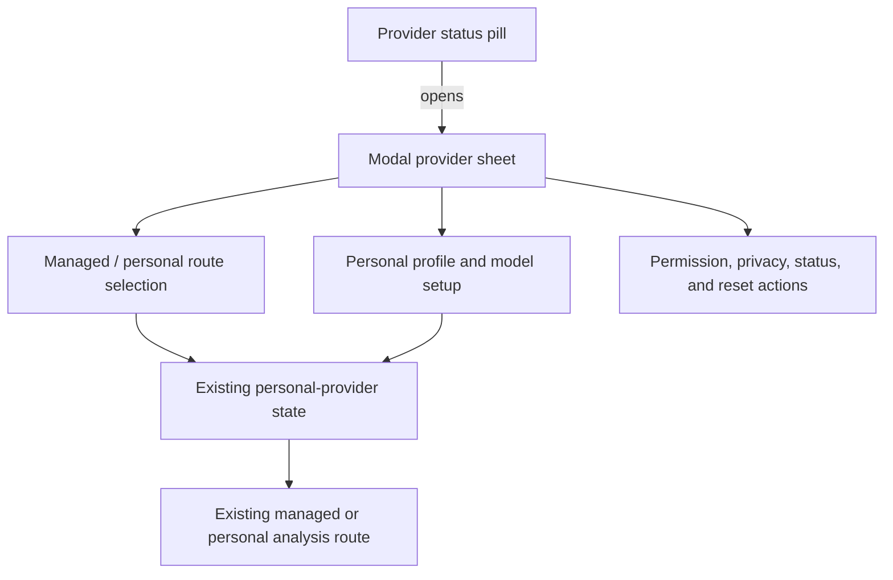

# Enhance LLM API Provider UI - Plan

## Goal Capsule

- **Objective:** Make the active analysis provider continuously visible and move personal-provider customization into a focused sidepanel sheet that does not displace the learner's analysis workspace.
- **Means:** Add a persistent provider status pill and consolidate route selection, setup, permissions, privacy disclosure, and maintenance into one overlay sheet.
- **Product authority:** This work owns the Chrome sidepanel's provider-status and provider-setup presentation. It does not change managed/personal analysis routing, provider persistence, direct-provider transport, backend providers, or webapp settings.
- **Open blockers:** None.

---

## Product Contract

Product Contract unchanged: enriched from requirements-only to implementation-ready in place.

### Summary

The Chrome sidepanel will show a compact, always-available provider status pill in its primary header. Opening it reveals a focused provider sheet for route selection and personal-provider customization, while the selected text, analysis controls, and analysis result remain in place.

### Problem Frame

The restored provider settings are already collapsible, but the affordance reads as another form section rather than a provider control. When expanded, the long inline form and privacy text push the learner's working context down the sidepanel. A learner therefore may not recognize that provider setup exists, understand which route is active, or customize a personal provider without disrupting the analysis workspace.

### Key Decisions

- K1. **Use a header status pill plus focused provider sheet.** The pill provides persistent route context; the sheet isolates setup from the analysis workspace. (session-settled: user-directed — E1 was chosen after rejecting four inline-direction alternatives and reviewing the current screenshots.)
- K2. **The status pill opens the provider sheet; it does not directly switch routes.** This prevents accidental routing changes while keeping one entry point for status and customization. (session-settled: user-directed — chosen over a quick menu or always-visible segmented control.)
- K3. **Managed remains active when an incomplete personal provider is requested.** Personal becomes active only after a complete profile is saved and usable. Governs R5, R11.
- K4. **Preserve the existing provider contract while changing only its presentation.** Managed is the first-run default; personal credentials stay local; exact-origin permission remains explicit; personal failures never silently fall back to managed.

### Requirements

**Provider status**

- R1. The sidepanel must present a persistent, visually obvious provider control in its primary header whenever provider state is available.
- R2. The provider control must identify the active route as either managed or personal, include a clear setup affordance, and distinguish ready, incomplete, unavailable, and state-unknown conditions without exposing the API URL, API key, or credential identity.
- R3. For personal mode, the control must identify the selected model; for managed mode, it must identify J-Buddy's managed route. A saved personal profile that is not active must not be presented as the route that will analyze the current selection.

**Provider sheet**

- R4. Activating the provider control must open one focused provider sheet. The control must not toggle an inline form in the main analysis flow.
- R5. The provider sheet must contain the managed/personal route selection, personal-provider setup, model selection, permission state, status and error messaging, privacy-and-cost disclosure, and confirmation-based clear action.
- R6. Opening, closing, or interacting with the provider sheet must preserve the learner's selected text, analysis controls, streaming state, and completed-analysis actions in their existing positions.
- R7. The provider sheet must be reachable by pointer and keyboard, communicate opened/closed state, manage focus predictably, and allow explicit dismissal without saving invalid changes.
- R8. Provider status and errors must be announced to assistive technology and remain actionable without relying only on color.

**Setup and routing safety**

- R9. Personal-provider setup must continue to accept an HTTPS API URL, API key, protocol, and model; an omitted protocol may default to Chat Completions-compatible behavior.
- R10. Model discovery must remain an explicit learner action. Setup, route changes, and status refreshes must not make billable analysis requests.
- R11. If the learner requests personal mode before a usable profile exists, the sheet must present setup while the managed route remains active; personal mode becomes active only after the required profile and exact-origin permission are complete.
- R12. If previously selected personal mode becomes unavailable, the UI must show the unavailable state and block personal analysis without silently using managed analysis.
- R13. The provider sheet must retain the existing privacy and cost disclosure: model discovery sends the API key directly to the selected provider, while personal analysis sends the API key, selected text, and surrounding context directly to that provider and may incur provider charges.
- R14. Clearing a personal provider must continue to require explicit confirmation and must make the consequence clear before credentials, model data, and provider permission are removed.

### Acceptance Examples

- AE1. **Covers R1 through R4.** A learner sees `代管` or `個人 · <model>` in the header; selecting the pill opens the provider sheet without expanding an inline form above the analysis workspace.
- AE2. **Covers R5 through R8.** From one sheet, the learner can switch routes, complete or edit a personal provider, inspect permission and privacy state, clear the provider, and dismiss the sheet with keyboard or pointer interaction.
- AE3. **Covers R9 through R11.** With no personal provider configured, choosing `個人` opens setup and leaves managed active; after saving a complete HTTPS profile, granting exact-origin permission, and selecting a model, personal becomes active and the header identifies that model.
- AE4. **Covers R10, R13.** Opening the sheet or changing routes does not call the provider for analysis; model discovery remains an explicit button and the direct-data and possible-cost disclosure remains visible before use.
- AE5. **Covers R12, R13.** A saved personal route that loses permission or otherwise becomes unusable shows an explicit unavailable state and does not silently analyze with J-Buddy's managed provider.
- AE6. **Covers R6, R14.** While a completed analysis is displayed, opening the provider sheet and clearing the personal provider after confirmation leaves that completed result readable and does not expose the removed API key.

### Success Criteria

- A learner can identify the active provider without opening settings.
- A learner can discover and complete personal-provider customization without the form displacing selected text, analysis controls, or results.
- An incomplete personal setup never changes the active analysis route.
- Provider presentation changes introduce no credential leakage, silent route change, or unintended billable request.

### Scope Boundaries

- In scope: Chrome sidepanel provider status, provider sheet layout, setup interaction, state presentation, accessibility, and provider UI tests.
- Out of scope: changing managed/personal routing semantics, direct provider protocols, provider persistence or encryption, backend managed-provider selection, webapp provider settings, multiple personal profiles, and new provider integrations.
- Out of scope: final visual styling; the implementation plan may choose exact icons, dimensions, animation, and component structure.

### Sources / Research

- GitHub issue #59, “feat: enhance LLM API Provider UI.”
- Current sidepanel provider disclosure, form, and status behavior in the Chrome extension.
- Prior provider plans: `docs/plans/2026-08-09-001-feat-extension-personal-provider-analysis-plan.md` and `docs/plans/2026-09-09-2256-feat-restore-custom-llm-provider-plan.md`.
- Canonical vocabulary in `CONCEPTS.md` for managed provider, personal provider, and provider restoration epoch.

---

## Planning Contract

### Key Technical Decisions

- KTD1. Use a native `<dialog>` opened with modal semantics for the provider sheet. Chrome's top layer, close request handling, and focus behavior provide the needed overlay foundation without introducing Bootstrap modal state or a custom focus-trap system.
- KTD2. Preserve the existing provider element IDs, provider-state handlers, and route semantics while introducing a small sheet controller. This limits the change to presentation and interaction wiring and reduces regression risk across the existing Jest element seams.
- KTD3. Make sheet open and close side-effect-free. Opening the sheet must not refresh provider storage, request permissions, discover models, or start analysis; closing must not save invalid edits.
- KTD4. Make the sheet status-review-only, except for its close action, while analysis is active in the same sidepanel document. Route buttons, profile fields, model discovery, save, and clear are disabled with an analysis-in-progress message; closing returns the learner to the workspace cancel control.
- KTD5. Revalidate personal-provider permission through non-mutating browser permission change events. A permission loss updates the persistent status without changing the selected route or falling back to managed analysis.
- KTD6. Continue an already-started model discovery, save, or clear after the sheet closes. The triggering controls remain disabled, existing generation/cancellation guards still apply, and completion updates safe status; reopening shows the resulting state.

### High-Level Technical Design

The provider surface separates persistent status from focused configuration:

The pill is rendered from the existing provider-state result and is not a route control. The dialog owns all provider configuration actions. Workspace DOM remains untouched except for removing the old inline disclosure; the dialog overlays it and closes without changing analysis state.

### Assumptions

- Chrome sidepanel runtime supports native `<dialog>` modal behavior; automated tests may mock dialog methods, but browser QA must verify the real top layer and Escape behavior.
- A stream is considered active in the current sidepanel document until the existing completion, cancellation, or failure path clears it. Concurrent sidepanel documents are not given a new cross-document analysis lock; a provider identity changed from another document continues through the existing storage-change cancellation semantics.
- Unsaved form values remain in-memory sidepanel drafts after the sheet closes and are neither persisted nor logged. Save remains the only commit action, and reopening projects saved state without discarding a draft unless the saved profile itself changes.
- Existing provider storage, protocol normalization, model catalogs, permissions, direct transport, and managed callable transport remain unchanged.

### Implementation Constraints

- Keep personal credentials in browser-profile local storage and out of logs, Firestore, managed requests, status text, and the provider sheet's accessible name.
- Do not change `DirectLlmApiService` request execution, receiver-bound browser `fetch`, URL construction, streaming parsers, or error redaction.
- Do not reintroduce the retired managed SSE route or alter Firebase callable streaming.
- Respect the provider restoration epoch; do not recover pre-restoration profiles, cached catalogs, or permissions.

---

## Implementation Units

### U1. Provider sheet controller

- **Goal:** Add a focused controller for opening and closing the provider sheet without provider or analysis side effects.
- **Requirements:** R4, R6, R7, R8, R10.
- **Files:** `japanese-alchemy-chrome-extension/src/sidepanel/providerSheet.js`, `japanese-alchemy-chrome-extension/tests/sidepanel.providerSheet.test.js`.
- **Approach:** Implement a small controller around the pill and dialog elements. It updates `aria-expanded`, opens the dialog modally, handles explicit close and cancel requests, restores focus to the pill, and exposes no provider mutators. Keep it independent of provider storage and analysis services.
- Label the dialog from its heading, focus the first route control on normal open, focus the first invalid field for validation errors, leave asynchronous status updates in live regions without stealing focus, and return focus to the pill after explicit close, Escape, or cancel.
- Maintain a credential-safe live status region outside the dialog so managed, personal, ready, incomplete, unavailable, and state-unknown transitions remain announced while the sheet is closed. Detailed recovery guidance stays inside the sheet.
- **Test scenarios:**
  - Opening the sheet calls the modal-open method, marks the pill expanded, and leaves provider storage and analysis controls untouched.
  - Explicit close and dialog cancel close the sheet, mark the pill collapsed, and restore focus to the pill.
  - A repeated open request is idempotent, and a close request while already closed is idempotent.
  - Opening and closing do not invoke model loading, permission requests, provider setters, direct transport, managed callable transport, or analysis callbacks.
  - Closing during an already-started discovery, save, or clear does not cancel or commit that operation; its controls remain disabled and the eventual result updates safe status.
  - Closing with a partially entered profile preserves the in-memory draft, does not persist or log it, and reopening does not expose a saved API key.
  - Status changes inside the dialog are exposed through live/error regions without moving focus away from the active sheet control except when an error requires learner attention.
- **Verification:** `cd japanese-alchemy-chrome-extension && npm test -- --runTestsByPath tests/sidepanel.providerSheet.test.js`.

### U2. Header status pill and provider dialog integration

- **Goal:** Replace the inline provider disclosure with a persistent header pill and a modal sheet containing the existing provider controls.
- **Requirements:** R1 through R9, R11, R13, R14.
- **Files:** `japanese-alchemy-chrome-extension/src/sidepanel/sidepanel.html`, `japanese-alchemy-chrome-extension/src/sidepanel/sidepanel.js`, `japanese-alchemy-chrome-extension/tests/sidepanel.analysisModeMarkup.test.js`, `japanese-alchemy-chrome-extension/tests/sidepanel.personalProviderBehavior.test.js`.
- **Approach:** Add the pill to the primary header and reuse the existing provider summary state as its visible label. Move the existing disclosure body into a native `<dialog>`, preserving existing IDs and handlers for route selection, form fields, model controls, status/error regions, privacy disclosure, and reset. Wire the pill and close control through U1. Style only enough to establish overlay behavior, sidepanel width, scrolling, backdrop, focus visibility, and state affordances.
- Subscribe to browser permission added/removed events and perform a non-mutating provider-state refresh when exact-origin permission changes. Report `狀態未知` on initialization or storage-read failure instead of asserting managed or personal is active.
- **Test scenarios:**
  - Markup contains a persistent status pill, a native provider dialog, the managed/personal controls, all existing provider fields, and the privacy-and-cost disclosure.
  - The old inline `details` provider section is absent, and the analysis controls/results remain outside the dialog.
  - Managed first-run state labels the pill as managed; ready personal state labels it personal with the selected model; unavailable and incomplete states are distinguishable without exposing credentials or the API URL.
  - Initialization or storage-read failure labels the pill as state-unknown, keeps it actionable, and later restores the accurate route after a successful state read.
  - Permission loss while the sheet is closed or open updates the persistent status and pill to unavailable without changing the selected route or invoking managed analysis.
  - Requesting personal mode without a usable profile opens or focuses setup, leaves managed active, and does not expose the API key.
  - Saving a complete profile and granting exact-origin permission activates personal mode and updates the pill.
  - Confirmation-based clear removes the profile and returns to managed mode without exposing removed credentials.
  - Keyboard users can open the sheet, operate all controls, dismiss it, and return to the pill.
- **Verification:** `cd japanese-alchemy-chrome-extension && npm test -- --runTestsByPath tests/sidepanel.analysisModeMarkup.test.js tests/sidepanel.personalProviderBehavior.test.js tests/sidepanel.providerSheet.test.js`.

### U3. Routing and active-analysis safety

- **Goal:** Preserve managed/personal routing, direct transport, permissions, and active analysis behavior across the presentation change.
- **Requirements:** R6, R10 through R14.
- **Files:** `japanese-alchemy-chrome-extension/src/sidepanel/sidepanel.js`, `japanese-alchemy-chrome-extension/src/sidepanel/providerSheet.js`, `japanese-alchemy-chrome-extension/tests/sidepanel.analysisModeBehavior.test.js`, `japanese-alchemy-chrome-extension/tests/directLlmApiService.test.js`, `japanese-alchemy-chrome-extension/tests/jaAlchemyApiService.test.js`.
- **Approach:** Add only integration guards needed by the new sheet. While analysis is active, make the sheet status-review-only except for close; disable route buttons, profile fields, model discovery, save, and clear with an analysis-in-progress message that explains how to close the sheet and use the workspace cancel control. Keep existing no-fallback, permission, and receiver-bound direct-transport tests unchanged in intent.
- **Test scenarios:**
  - Opening the sheet during managed or personal streaming leaves the active stream, selected text, analysis controls, and result actions unchanged.
  - Route buttons, profile fields, model discovery, save, and clear are unavailable during an active stream and become available after completion, cancellation, or failure.
  - A provider identity change originating in another sidepanel document retains the existing storage-change cancellation behavior rather than silently rerouting the older stream.
  - Personal permission, credential, network, quota, malformed-output, and transport failures never invoke managed analysis.
  - Personal analysis continues to call `DirectLlmApiService` with the saved profile; managed analysis continues to call the existing Firebase callable stream.
  - Exact-origin permission remains required for a new provider origin and is not inherited from another origin.
  - The receiver-sensitive direct-transport fetch stub still rejects detached native `fetch` invocation.
  - Existing provider restoration epoch and cache isolation tests continue to pass.
- **Verification:** `cd japanese-alchemy-chrome-extension && npm test -- --runTestsByPath tests/sidepanel.analysisModeBehavior.test.js tests/directLlmApiService.test.js tests/jaAlchemyApiService.test.js tests/sidepanel.providerSheet.test.js`.

---

## Verification Contract

| Check | Scope | Command or evidence |
| --- | --- | --- |
| Provider sheet suite | U1 | `cd japanese-alchemy-chrome-extension && npm test -- --runTestsByPath tests/sidepanel.providerSheet.test.js` |
| Provider UI suites | U1, U2 | `cd japanese-alchemy-chrome-extension && npm test -- --runTestsByPath tests/sidepanel.analysisModeMarkup.test.js tests/sidepanel.personalProviderBehavior.test.js tests/sidepanel.providerSheet.test.js` |
| Routing and transport neighbors | U3 | `cd japanese-alchemy-chrome-extension && npm test -- --runTestsByPath tests/sidepanel.analysisModeBehavior.test.js tests/directLlmApiService.test.js tests/jaAlchemyApiService.test.js` |
| Full extension suite | U1 through U3 | `cd japanese-alchemy-chrome-extension && npm test -- --runInBand` |
| Production build | U1 through U3 | `cd japanese-alchemy-chrome-extension && npm run build` |
| Browser QA | All units | Load `dist/` in Chrome; verify pill status, modal open/close, keyboard and Escape behavior, incomplete personal setup, managed analysis, personal analysis, active-stream safety, permission changes, clear/reset, and completed-result preservation. |
| Workspace hygiene | All units | `git diff --check` and review the diff for credentials, raw provider telemetry, provider URL leakage, or accidental provider-contract changes. |

## Definition of Done

- U1 through U3 are complete and all verification rows pass.
- The provider status pill is continuously visible, reports only safe route state, and opens the focused provider sheet without switching routes.
- The old inline provider disclosure is removed, and provider setup no longer displaces selected text, analysis controls, streaming state, or results.
- Opening and closing the sheet has no storage, permission, network, analysis, or route side effects; explicit route/profile changes are blocked during an active stream.
- Managed/personal routing, credentials, permissions, protocol behavior, model catalogs, restoration epoch, direct transport, and callable streaming preserve their existing contracts.
- Accessibility behavior is verified in a real Chrome sidepanel, including focus restoration and Escape dismissal.
- The final diff contains no custom modal experiment, duplicate provider entry point, dead disclosure markup, credential fixture, or unintended provider/transport refactor.
