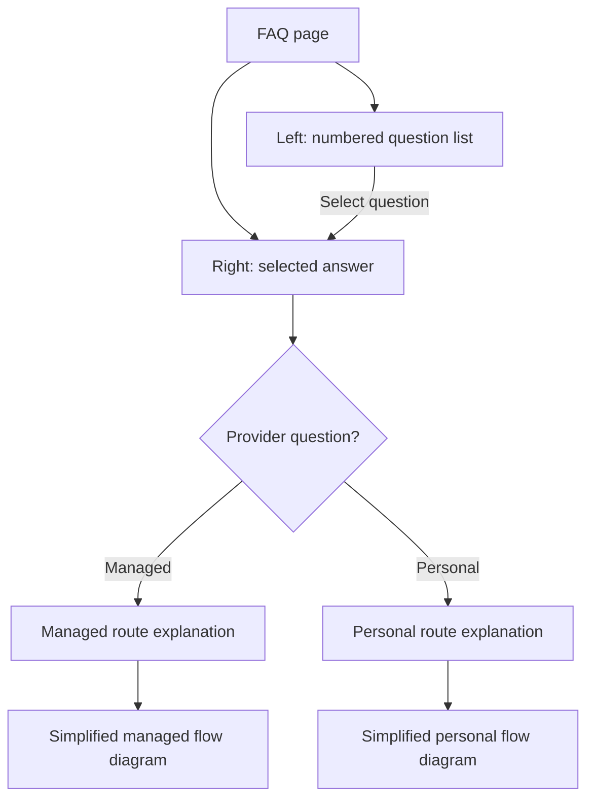

# FAQ Provider Layout - Plan

## Goal Capsule

- **Objective:** Learners can scan every FAQ question and read a focused, numbered answer with a clear provider-mode explanation and simplified supporting diagram.
- **Product authority:** This plan owns the `/faq` presentation and FAQ content only. Provider routing, setup UI, credentials, permissions, and backend behavior are context, not active scope.
- **Open blockers:** None.

## Product Contract

### Summary

Redesign the FAQ as a question/detail layout: on wide screens, numbered questions sit on the left and the selected answer sits on the right; on small screens, the same question-and-answer relationship stacks vertically. Preserve the existing Gemini quota question as question 1 and add clear Traditional Chinese explanations for managed and personal LLM API providers, each supported by a simplified flow diagram rather than a UI screenshot.

### Problem Frame

The current FAQ is a single-column disclosure list with only one answer, so it does not scale visually as more questions are added and does not explain the two provider modes that affect where an analysis request goes and where API credentials remain. Learners encountering quota errors or choosing between provider modes need to compare the concepts without inferring them from extension settings.

### Key Decisions

- **Selected-question detail panel:** A visible question list paired with one focused answer was chosen over continuous scrolling and over standalone disclosures because it directly supports scanning and comparison. Governs R1, R2.
- **Continuous numbering:** Questions are numbered once across the FAQ, beginning at 1, so learners and support conversations can cite a stable question number. Governs R3.
- **Simplified diagrams:** Q2 and Q3 use simplified flow diagrams instead of actual UI screenshots because the concepts are data-flow distinctions rather than interface locations; this also avoids brittle screenshot maintenance. Governs R6, R7.

### Requirements

**Layout and interaction**

- R1. On wide screens, the FAQ presents all questions in a left column and the selected question's answer in a right column.
- R2. On small screens, the FAQ stacks the question list and selected answer while preserving which question is selected.
- R3. FAQ questions are visibly numbered from 1 continuously through the complete list.
- R4. Selecting a question updates the answer panel without introducing a provider-mode change, navigation away from `/faq`, or loss of page context.
- R5. The existing Gemini `Too Many Requests` question remains question 1 and retains its current meaning.

**FAQ content**

- R6. The FAQ includes question 2, “什麼是 LLM API 提供者「代管」？”, with a Traditional Chinese explanation that says the extension uses the J-Buddy-managed analysis route and shared provider configuration.
- R7. The FAQ includes question 3, “什麼是 LLM API 提供者「個人」？”, with a Traditional Chinese explanation that says the extension calls the learner-configured provider directly from the browser, keeps credentials in the current browser profile, and never silently falls back to managed analysis after a personal-provider failure.
- R8. The managed and personal explanations make the security and routing distinction clear without exposing or requesting provider credentials.
- R9. Questions 2 and 3 each include a simplified, accessible flow diagram that reinforces where the analysis request goes and where provider credentials remain.

### Key Flows

- **Trigger:** A learner opens `/faq`. **Steps:** The page presents the numbered questions with question 1 selected by default. **Outcome:** The learner sees question 1's answer first and can select another question from the list.
- **Trigger:** A learner selects question 2 or 3. **Steps:** The selected state moves to that question and the right answer panel changes to the matching provider explanation and diagram. **Outcome:** Only the selected question's answer is highlighted as current, and no analysis-provider mode changes. Covers R1 through R4, R6 through R9.
- **Trigger:** A learner views the FAQ on a small screen. **Steps:** The question list and selected answer stack vertically while retaining the selected-question relationship. **Outcome:** The learner can still identify and switch to any numbered question. Covers R2 through R4.

### Visualizations

### Acceptance Examples

- AE1. **Covers R1, R3, R5.** Given the FAQ is viewed on a wide screen, when it renders, then questions 1 through 3 appear as a numbered left list and question 1's quota answer appears on the right.
- AE2. **Covers R2, R3, R4.** Given the FAQ is viewed on a small screen, when question 3 is selected, then the layout stacks vertically and its answer remains associated with question 3.
- AE3. **Covers R6, R9.** Given question 2 is selected, when the answer renders, then it explains the J-Buddy-managed route and shared provider configuration and displays the simplified managed flow.
- AE4. **Covers R7, R8, R9.** Given question 3 is selected, when the answer renders, then it explains direct browser calls, local browser-profile credentials, and no silent managed fallback, and displays the simplified personal flow without asking for credentials.

### Scope Boundaries

- No change to actual managed/personal provider routing, fallback behavior, permissions, API key storage, backend services, or provider setup UI.
- No actual Chrome extension screenshots or captured UI assets; provider-mode visuals remain simplified diagrams.
- No FAQ search, categorization, analytics, or additional questions.
- No localization beyond the existing Traditional Chinese FAQ presentation.

### Sources / Research

- `japanese-alchemy-webapp/app/faq/page.tsx` — current single-column FAQ and sole Gemini quota question.
- `japanese-alchemy-webapp/app/faq/page.test.tsx` — existing FAQ behavior and Traditional Chinese content coverage.
- `CONCEPTS.md` — canonical definitions of Managed provider and Personal provider, including direct browser calls, credentials not reaching J-Buddy's backend, and no silent fallback.
- `docs/plans/2026-09-12-0022-feat-llm-provider-ui-plan.md` — prior provider UI contract and active managed/personal terminology.

## Planning Contract

### Key Technical Decisions

- KTD1. **Reuse the existing Radix Tabs wrapper with vertical semantics for question selection.** The webapp already depends on and styles Radix Tabs through `japanese-alchemy-webapp/components/ui/tabs.tsx`; using that wrapper with vertical orientation supplies selected-state semantics and ArrowUp/ArrowDown keyboard navigation without a new dependency or custom tab behavior. Governs R1 through R4. (session-settled: user-directed — chosen over continuous scrolling and standalone disclosures: a visible question list paired with one focused answer better supports scanning and comparison.)
- KTD2. **Render provider diagrams as semantic step lists.** Each flow is a visually separated numbered list with text labels, not an image, screenshot, or client-side diagram engine; this keeps the explanation accessible, localizable, and stable as the extension UI changes. Governs R6 through R9. (session-settled: user-approved — chosen over actual UI screenshots: simplified flow diagrams match the data-flow concept and avoid brittle screenshot maintenance.)
- KTD3. **Keep the FAQ page self-contained.** Place the client-side FAQ state in `japanese-alchemy-webapp/app/faq/page.tsx` rather than adding a provider service or shared FAQ abstraction; the current page has no extracting pressure and only three questions are in scope. Governs R1 through R9.
- KTD4. **Verify initial render statically and interaction in the browser.** Preserve the existing server-render test style for content and default selection, then use browser QA for click switching, keyboard navigation, and responsive stacking without adding a new testing dependency for this small page. Governs R1 through R9.

### Implementation Constraints

- Preserve the Traditional Chinese questions and explanations, including the established terms 「代管」 and 「個人」.
- Use existing Tailwind tokens and the existing shadcn-style Tabs wrapper; do not add a UI dependency.
- Keep the page public and do not read provider state, credentials, Firebase data, or Chrome extension storage.
- Keep `japanese-alchemy-chrome-extension/RELEASE.md` out of this work; it is already modified for unrelated reasons.

## Implementation Units

### U1. FAQ question/detail presentation and provider content

- **Goal:** Replace the single `
` FAQ with a numbered question list, selected answer panel, and two provider-mode explanations.
- **Requirements:** R1 through R9.
- **Files:** `japanese-alchemy-webapp/app/faq/page.tsx`.
- **Approach:** Make the page a client component and model the three questions as ordered data with number, question, answer paragraphs, and optional flow steps. Render the list through the existing Tabs primitives with vertical tab semantics and full-width, wrappable triggers: stacked by default, then a two-column left/right layout at the project's large-screen breakpoint. Question 1 is the default value. Render managed and personal flows as styled, textual ordered steps; keep visual arrows or separators decorative so screen-reader users receive the numbered text.
- **Content:** The managed answer explains that analysis travels through the J-Buddy backend and uses the service's shared provider configuration. The personal answer explains that the extension reads the learner's provider profile from the current browser profile, calls that provider directly, never sends those credentials to J-Buddy's backend, and does not silently fall back to managed analysis after failure.
- **Test Scenarios:**
  - Initial static render contains the page heading, all three visibly numbered questions, and only question 1's quota answer.
  - Initial static render marks question 1 as selected through the Tabs accessibility state.
  - All three questions appear in ascending numbered order and no `
` element remains.
  - Managed content names the J-Buddy backend/shared configuration and its flow shows the managed route.
  - Personal content names direct browser calls, current-browser-profile credentials, no credentials sent to J-Buddy's backend, and no silent managed fallback.
  - Provider flow text remains available without relying on decorative arrow icons.
- **Verification:** `cd japanese-alchemy-webapp && npm test -- app/faq/page.test.tsx`.

### U2. Regression and browser-quality coverage

- **Goal:** Prove the redesigned FAQ remains stable across automated checks and real browser interaction.
- **Requirements:** R1 through R9.
- **Files:** `japanese-alchemy-webapp/app/faq/page.test.tsx`.
- **Approach:** Extend the existing Vitest suite in its current static-markup style. Keep assertions focused on stable learner-facing text and accessibility structure rather than exact Tailwind class strings. The initial static-render test must cover all question labels plus question 1's answer; do not force inactive Radix panels to mount merely to test their content. Verify questions 2 and 3 after selecting them during browser QA.
- **Test Scenarios:**
  - The existing Gemini quota regression continues to pass.
  - Initial static markup contains all three question labels and question 1's answer without forcing inactive panels to mount.
  - Static markup exposes no credential input or provider API key field.
  - Browser QA loads `/faq`, clicks questions 1 through 3, and confirms each selected question's provider distinction and only the selected answer remain visible.
  - Browser QA uses ArrowDown and ArrowUp to move among questions and confirms focus and the selected answer stay aligned, without relying on ArrowLeft or ArrowRight.
  - Browser QA checks a narrow viewport and confirms the question list stacks above the selected answer.
- **Verification:** `cd japanese-alchemy-webapp && npm test`, followed by `npm run lint` and `npm run build`; then browser-test `/faq` for click, keyboard, and narrow-viewport behavior.

## Verification Contract

| Check | Scope | Command or evidence |
| --- | --- | --- |
| FAQ unit tests | U1, U2 | `cd japanese-alchemy-webapp && npm test -- app/faq/page.test.tsx` |
| Full webapp tests | U1, U2 | `cd japanese-alchemy-webapp && npm test` |
| Webapp lint | U1, U2 | `cd japanese-alchemy-webapp && npm run lint` |
| Production build | U1, U2 | `cd japanese-alchemy-webapp && npm run build` |
| Browser QA | U1, U2 | Load `/faq`; verify default selection, all question switches, ArrowUp/ArrowDown navigation, narrow-viewport stacking, and absence of credential inputs |
| Diff hygiene | U1, U2 | Review the final diff for provider-behavior changes and confirm unrelated `japanese-alchemy-chrome-extension/RELEASE.md` changes are excluded |

## Definition of Done

- U1 and U2 are complete and every Verification Contract row passes.
- The FAQ renders as a numbered left question list and right answer panel on wide screens, stacks meaningfully on small screens, and defaults to the Gemini quota question.
- Questions 2 and 3 clearly distinguish managed and personal provider routing, credential locality, and the no-silent-fallback rule.
- Provider explanations include accessible simplified flow steps and no actual screenshots.
- No provider routing, credentials, permissions, backend behavior, or extension setup UI changes.
